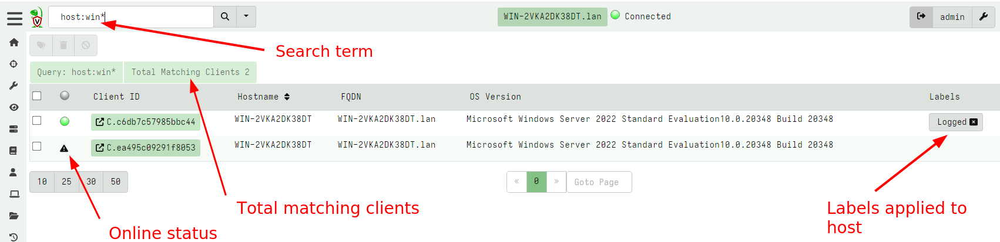
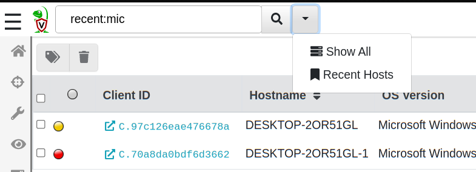
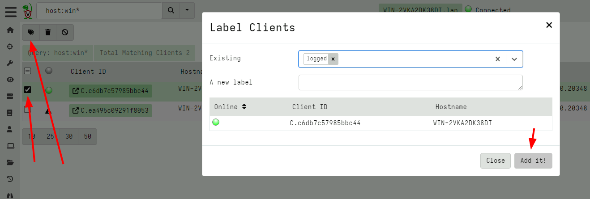
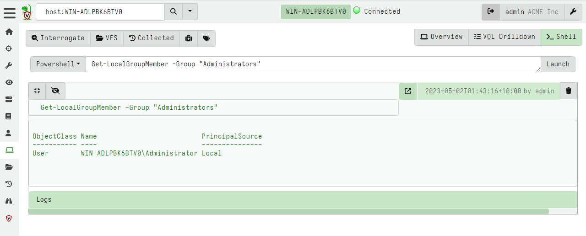

Velociraptor clients are endpoints with the Velociraptor agent
running on them. Since Velociraptor maintains a persistent connection
to the server, each endpoint is immediately available to interact
with.

Typically we begin our investigation by searching for a client,
selecting it, and interactively collecting artifacts from it.

## Searching for a client

To work with a specific client, search for it using the
search bar at the top of the Admin GUI. Click the Search or Show All icon
to see all the clients.



{}
You can use the following prefixes as well:

* `all`: show all clients
* `label:` to search clients with a label
* `host:` to search for hostnames.
* `ip`: to search based on IP address
* `mac`: to search based on MAC addresses
* `recent`: see all the recent clients this user interacted with.


Clicking on the `online status` column header toggles the search
between all clients and only those that are currently online.

{}

The search function uses a client index so can quickly
identify clients by hostname in the GUI. More complex search
requirements should be done in a notebook using full VQL syntax.

The results from the search are shown as a table.

The table contains five columns:

1. The **online state** of the host is shown as a color icon. A green
   dot indicated that the host is currently connected to the server, a
   an exclamation icon indicates the host is not currently connected
   but was connected between 15 minutes and 24 hours ago. A warning
   triangle indicates that the host has not been seen for 24 hours or
   more.

2. The **client ID** of the host is shown. Clients have a unique ID
   starting with `C.`. Internally, the client ID is considered the
   most accurate source of endpoint identity. Velociraptor always
   refers to the client ID rather than the hostname because hostnames
   can change. A client ID is derived from the client's cryptographic
   key and is stored on the endpoint in the client `writeback
   file`. Clicking on the client id will take you to the host
   information screen.

3. The **hostname** and **Fully Qualified Domain Name** reported by
   the host.

4. The **operating system version**. This indicates if the host is a
   Windows/Linux/MacOS machine and its respective version.

5. Any **labels** applied to the host. Clicking on a label removes the
   label from this host.

{}

Once you view a particular host, the GUI will automatically remember it in a most recently used list (MRU). You can view your recent searches easily by selecting it from the gui.



{}


## Labels

Hosts may have labels attached to them. A label is any name associated
with a host. Labels are useful when we need to hunt for a well defined
group of hosts. We can restrict the hunt to one or more labels to
avoid collecting unnecessary data or accessing machines we should not
be.

It is possible to manipulate the labels via the search screen. Simply
select the hosts in the GUI and then click the "add labels" button.



### Manipulating labels via VQL

Although it is possible to manipulate labels via the GUI, It is
usually easier to use VQL queries to add or remove labels via the
`label()` plugin.

For example, let's say we wanted to label all machines with the local
user of `mike`. I would follow the following steps:

1. Launch a hunt to list all user accounts on all endpoints using the
`Windows.Sys.Users`.
2. When enough results are returned, I click the `Notebook` tab in the
   hunt manager to access the hunt's notebook.
3. Applying the query below I filter all results with the user `Mike`
   and apply the label function to that host.

Note that `HuntId` is automatically set to the hunt id inside the hunt notebook:

```vql
SELECT Name, label(client_id=ClientId,
                   labels="Mikes Box",
                   op="set")
FROM hunt_results(hunt_id=HuntId,
                  artifact="Windows.Sys.Users")
WHERE Name =~ "mike"
```

{}

Labels applied to clients essentially form groups. Many features in
Velociraptor apply to these groups and it is possible to move clients
in and out of these during the course of an investigation.

For example, client event monitoring queries are controlled via client
labels. This allows you to assign a detection rule to a group of
machines then simple add or remove machines from the group.  Similarly
it is possible to restrict a hunt to a label group then simply add
clients to the label group in order to automatically add them to the
hunt.

{}


### Built-in Labels

While one can add labels to machines using the GUI this is not
practical for labeling very large numbers of client, for example
belonging to a particular Active Directory Organizational Unit
(OU). It is reasonable to want to quickly select those machines
belonging to a particular OU.

We can use labels to identify machines installed by a specific group
policy. For example, suppose we have a particular OU called
`Sales`. We want to ensure that Velociraptor clients in the Sales team
are specifically marked by the `Sales` label.

Simply modify the client's configuration file to contain the Sales
label, and this label will be automatically applied when the client is
enrolled:

```yaml
Client:
  labels:
  - Sales
```

Then we apply the Group Policy Object only on the Sales OU which will
result in those clients being enrolled with the Sales label
automatically.


## Selecting a client

Click on any client in the search screen to view information relevant
to the selected client.

You can easily tell which client we are dealing with as the name of
the host, and the last time we connected with it are shown:


Velociraptor maintains some basic information about the host, such as
its hostname, labels, last seen IP, and last seen time. This is shown
in the `Host View` pane. Velociraptor uses this information to make it
possible to search for this host and target it for further
investigation. Velociraptor gathers this information constantly from
the endpoint and upon first enrollment, so this information should be
relatively up to date. You can refresh this information at any time by
clicking the `Interrogate` button.

Each client has arbitrary metadata so you can integrate it easily into
your procedures. You can use this metadata to implement more complex
procedures using VQL artifacts.

Ultimately, interrogation simply collects the `Generic.Client.Info`
artifact from the endpoint. The `VQL Drilldown` page shows more
information about the client, including telemetry of the client's
footprint on the endpoint and more information about the endpoint.

{}

You can quarantine a host from this screen. Quarantining a host will
reconfigure the hosts's network stack to only allow it to communicate
with the Velociraptor server. This allows you to continue
investigating the host remotely while preventing the host from making
other network connections.

Quarantining is implemented using an event monitoring query which
means it persists across client reboots. A quarantined client will
gain the label `Quarantine` so you can easily search for all
quarantined hosts using the label search feature above.

Removing the quarantine label from a host will immediately
unquarantine the host. Read further how to automatically apply and
remove labels based on various events - this allows you to
automatically quarantine a host too!

{}

### VQL drilldown

Selecting the `VQL drilldown` screen will display an overview of
information about a host.


### Table GUI Widgets

A common UI element in the Velociraptor GUI is the table widget. Since
Velociraptor deals with VQL queries and all queries simply return a
list of rows, the GUI presents a lot of results in a table form.

All Velociraptor tables have some common tools available as can be
seen above:

1. The Column Selector - allows users to show/hide columns. This is
   useful when there are many columns and the table takes up a lot of
   horizontal real estate, or when some columns provide too much
   details

2. View Raw JSON - All VQL queries simply return a result set encoded
   as a list of JSON objects. For more complex tables it is sometimes
   easier to see the precise JSON returned, and clicking on this
   button displays the raw json in a dialog box.


3. Export table as CSV or JSON - Clicking on the export table button
   simply exports the **visible** columns as a CSV file. This is a
   great way of filtering out uninteresting columns and producing more
   targeted CSV files for post processing in e.g. Excel.


### Remote shell commands

Usually Velociraptor encourages users to collect `Artifacts` which are
curated VQL queries. However, sometimes it is necessary to run
arbitrary commands on the endpoint in a dynamic incident response
operation.

The advantage of collecting artifacts is that they are generally better tested and controlled than just typing arbitrary Powershell or Bash commands in the GUI - remember, a single typo can ruin your day!

We recommend that arbitrary shell commands only be used as a last
resort and instead shell commands be run with the VQL `execve()`
plugin within the context of an artifact.

Velociraptor allows running arbitrary shell commands on the endpoint
using `Powershell`/`Cmd`/`Bash` or adhoc `VQL`.



{}

Only Velociraptor users with the administrator role are allowed to run
arbitrary shell commands on remote endpoints!

{}

You can prevent clients from running arbitrary shell commands
by setting `Client.prevent_execve` to true. This limits your DFIR
efficacy because many artifacts depend on being able to launch
external programs.
