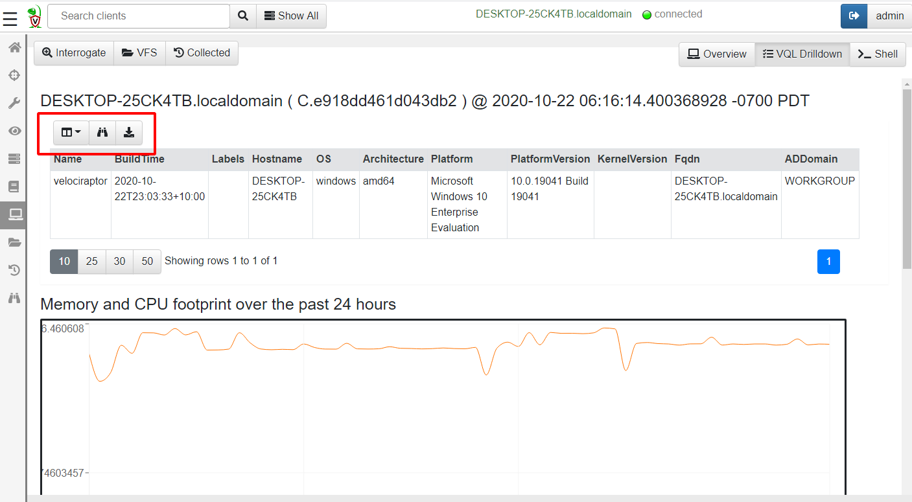
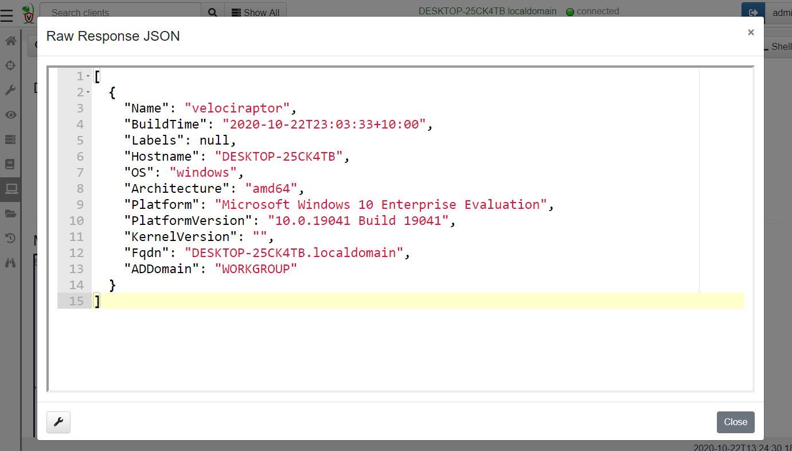

Velociraptor clients are endpoints with the Velociraptor agent
running on them. Since Velociraptor maintains a persistent connection
to the server, each endpoint is immediately available to interact
with.

Typically we begin our investigation by searching for a client,
selecting it, and interactively collecting artifacts from it.

## Searching for a client

To work with a specific client, search for it using the
search bar at the top of the Admin GUI. Click the Search or Show All icon
to see all the clients.


{}
You can use the following prefixes as well: `label:` to search clients with a label or `host:` to search for hostnames.
{}

The search function uses a client index so can quickly
identify clients by hostname in the GUI. More complex search
requirements should be done in a notebook using full VQL syntax.

The results from the search are shown as a table.


The table contains five columns:

1. The **online state** of the host is shown as a color icon. A green dot
   indicated that the host is currently connected to the server, a
   yellow icon indicates the host is not currently connected but was
   connected less than 24 hours ago. A red icon indicates that the
   host has not been seen for 24 hours or more.

2. The **client ID** of the host is shown. Clients have a unique ID
   starting with “C.”. Internally, the client ID is considered the most
   accurate source of endpoint identity. Velociraptor always refers
   to the client ID rather than the hostname because hostnames can change. A
   client ID is derived from the client's cryptographic key and is
   stored on the endpoint in the client `writeback file`.

3. The **hostname** reported by the host.

4. The **operating system version**. This indicates if the host is a
   Windows/Linux/OSX machine and its respective version.

5. Any **labels** applied to the host.

## Labels

Hosts may have labels attached to them. A label is any name associated
with a host. Labels are useful when we need to hunt for a well defined
group of hosts. We can restrict the hunt to one or more labels to
avoid collecting unnecessary data or accessing machines we should not
be.

It is possible to manipulate the labels via the search screen. Simply
select the hosts in the GUI and then click the "add labels" button.


Although it is possible to manipulate labels via the GUI, It is
usually easier to use VQL queries to add or remove labels via the
`label()` plugin.

For example, the following query labels all machines that the user
"mike" ever logged into (Where HuntId is set to a
`Windows.Sys.Users` artifact collector hunt ID:

```sql
SELECT Name, label(client_id=ClientId,
                   labels="Mikes Box",
                   op="set")
FROM hunt_results(hunt_id=HuntId,
                  artifact="Windows.Sys.Users")
WHERE Name =~ "mike"
```


### Built-in Labels

While one can add labels to machines using the GUI this is not
practical for labeling very large numbers of client, for example
belonging to a particular Active Directory Organizational Unit
(OU). It is reasonable to want to quickly select those machines
belonging to a particular OU.

We can use labels to identify machines installed by a specific group
policy. For example, suppose we have a particular OU called
`Sales`. We want to ensure that Velociraptor clients in the Sales team
are specifically marked by the `Sales` label.

Simply modify the client's configuration file to contain the Sales
label, and this label will be automatically applied when the client is
enrolled:

```yaml
Client:
  labels:
  - Sales
```

Then we apply the Group Policy Object only on the Sales OU which will
result in those clients being enrolled with the Sales label
automatically.


## Selecting a client

Click on any client in the search screen to view information relevant to the
selected client.

You can easily tell which client we are dealing with as the name of
the host, and the last time we connected with it are shown:


Velociraptor maintains some basic information about the host, such as
its hostname, labels, last seen IP, and last seen time. This is shown
in the `Host View` pane. Velociraptor uses this information to make it
possible to search for this host and target it for further
investigation. Velociraptor gathers this information during the
`Interrogate` operation. Interrogation normally occurs when the client
first enrolls, but you can interrogate any client at any time by
clicking the `Interrogate` button.

Each client has arbitrary metadata so you can integrate it easily into
your procedures. You can use this metadata to implement more complex
procedures using VQL artifacts.

Ultimately, interrogation simply collects the `Generic.Client.Info`
artifact from the endpoint. The `VQL Drilldown` page shows more
information about the client, including telemetry of the client's
footprint on the endpoint and more information about the endpoint.




A common UI element in the Velociraptor GUI is the table widget. Since
Velociraptor deals with VQL queries and all queries simply return a
list of rows, the GUI presents a lot of results in a table form.

All Velociraptor tables have some common tools available as can be
seen above:

1. The Column Selector - allows users to show/hide columns. This is
   useful when there are many columns and the table takes up a lot of
   horizontal real estate, or when some columns provide too much
   details

2. View Raw JSON - All VQL queries simply return a result set encoded
   as a list of JSON objects. For more complex tables it is sometimes
   easier to see the precise JSON returned, and clicking on this
   button displays the raw json in a dialog box.



3. Export table as CSV - Clicking on the export table button simply
   exports the **visible** columns as a CSV file. This is a great way
   of filtering out uninteresting columns and producing more targeted
   CSV files for post processing in e.g. Excel.


### Remote shell commands

Usually Velociraptor encourages users to collect `Artifacts` which are
curated VQL queries. However, sometimes it is necessary to run
arbitrary commands on the endpoint in a dynamic incident response
operation.

Velociraptor allows running arbitrary shell commands on the endpoint
using Powershell/Cmd/Bash or ad hoc VQL.


{}
Only Velociraptor users with the administrator role are allowed to run arbitrary shell commands on remote endpoints!
{}

You can prevent clients from running arbitrary shell command
by setting `Client.prevent_execve` to true. This limits your DFIR
efficacy because many artifacts depend on being able to launch
external programs.
