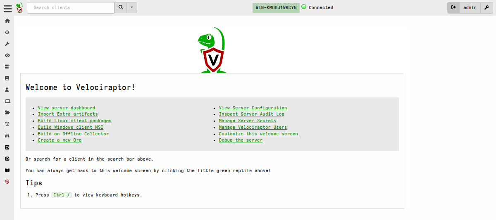
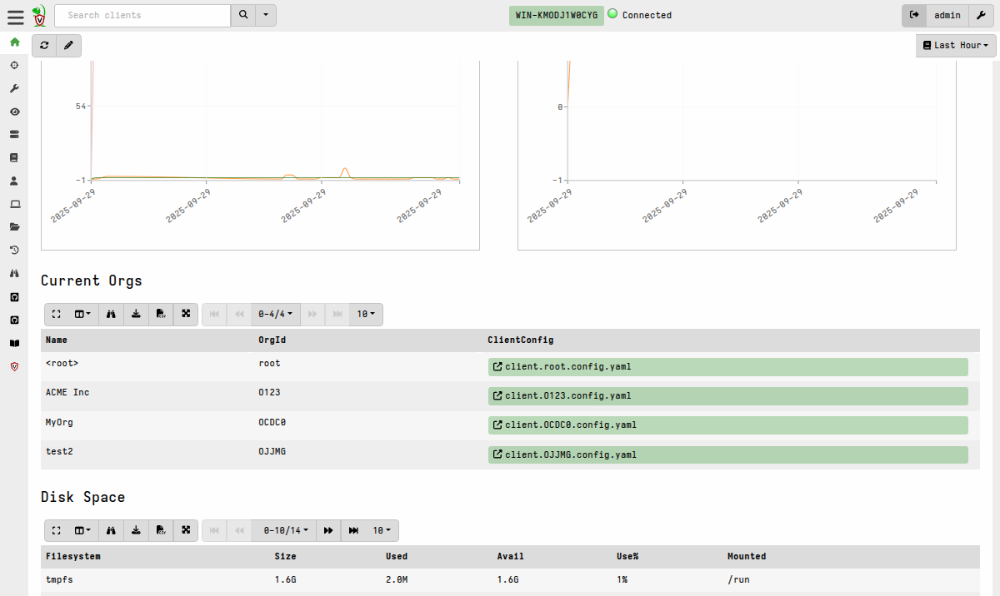
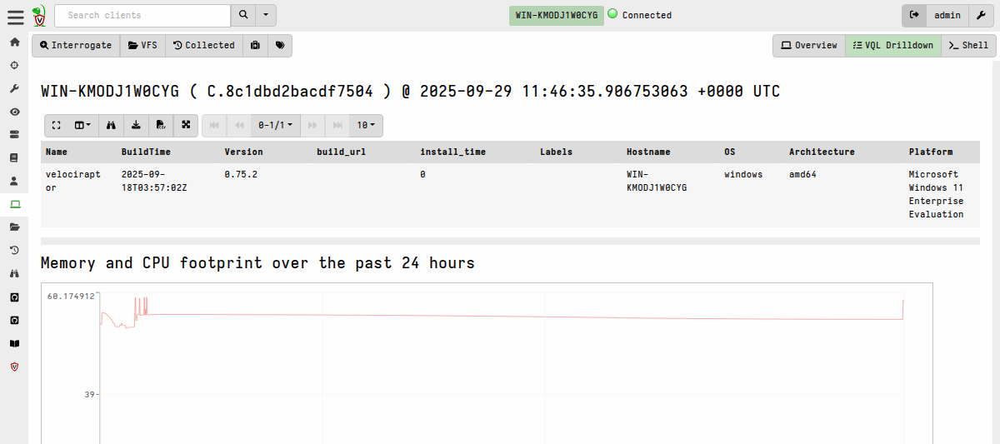
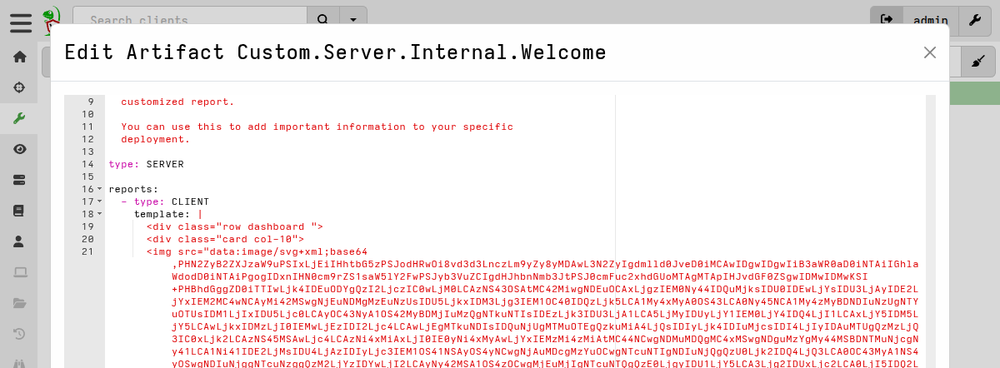
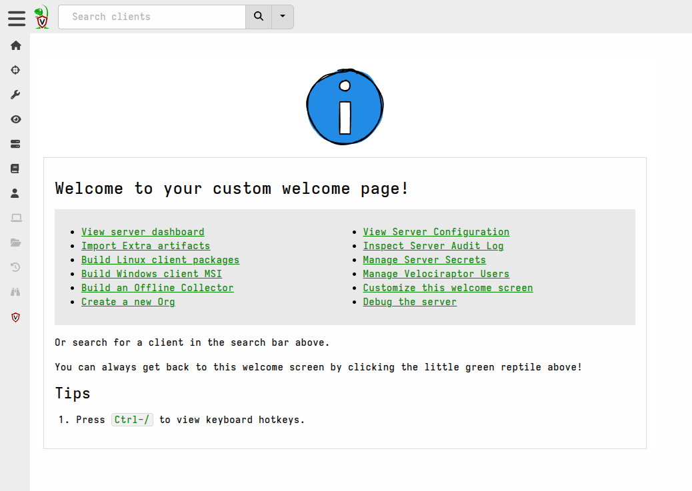
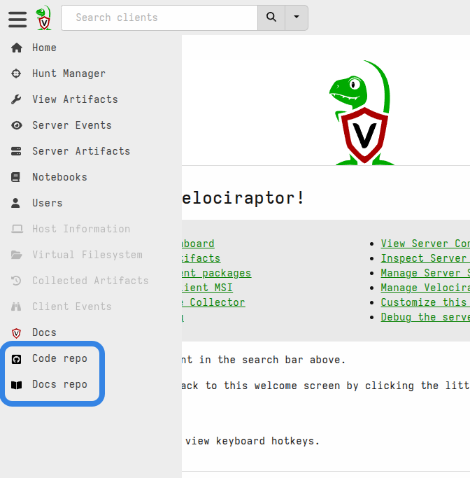
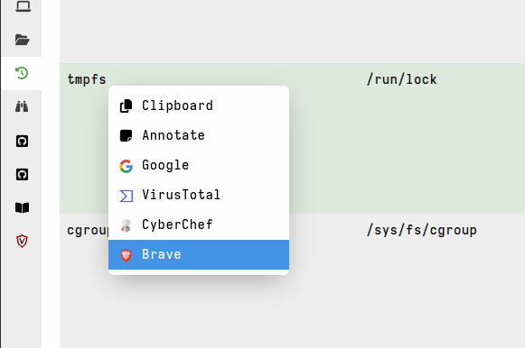

Certain pages in the GUI allow for customization. The layout and content of
these pages are defined in corresponding Velociraptor
[artifacts]().
These artifacts contain templates written in
[Go's templating language](https://pkg.go.dev/text/template)
that then produce the HTML that the user ultimately sees and interacts with.

The artifact specifies a template containing markdown plus elements written in
the Go Template Language. This allows you to also include VQL queries
(server-side only, since this is where the templates are run!) in your template,
and display the results in tabular or various graphical formats.

{}

Customizing GUI content does require a reasonable degree of understanding of
HTML as well as of Go's templating language. Typically customization amounts to
small tweaks where you might make a change to the layout or customize specific
elements that you don't like, although extensive customization can be done if
you really need to.

There are many excellent guides to templating and HTML available on the internet
and for that reason this is not intended to be a tutorial on those topics.

If this is all new to you, you can still experiment by changing one small thing
at a time. Because the customization is done via a custom artifact, if you mess
it up you can always delete the custom artifact and Velociraptor will then
revert to using the default built-in one!

{}

## Which pages can be customized?

Currently there are 3 pages in the GUI that support full customization.

These, and their corresponding artifacts, are:

- `Server.Internal.Welcome` - The Welcome page
  

- `Server.Monitor.Health` - The Server Dashboard page
  

- `Generic.Client.Info` - The VQL Drilldown page which shows data about any
  selected client.
  

#### Including image content

The GUI is not served from disk which means that, by default, you cannot place
images on disk and expect them to be picked up and served like a typical web
server. Images that the GUI uses are compiled into the binary as static web
assets and then served from memory.

So what do you do if you want to include custom images? Well there are a few
options to consider:

1. It is possible to include links to images from external locations using the
   `` HTML tag, although this may be problematic if there is proxying or
   content filtering in your network environment, or if the external image
   hosting is unreliable or slow.

2. If you are doing extensive customization or customization that requires
   compiling your own server binary then these images can be included in the
   source tree under `gui/velociraptor/src/public` which will then serve these
   as static assets.

3. The config allows for serving static files from a disk location using the
   [GUI.reverse_proxy.url]()
   setting. For example, to serve the image located at `/opt/www/foo.png` so
   that it's available using `` you can add the
   following to your server config:

   ```yaml
   GUI:
   reverse_proxy:
       - route: /images/
         url: file:///opt/www/
         require_auth: true
   ```

4. For inclusion of one or two small images it is possible to add them to
   the artifact itself, which can be done by encoding them and embedding them as
   data URIs inside the template section of the artifact. The benefit of doing
   so is that the custom artifact is then self-contained and portable. The
   downside is that the embedded images may take up a quite a bit of space in
   the artifact and therefore might not be very visually pleasing. Here is an
   example of what that would look like:

   

   As mentioned, this approach is generally better for small images for example
   SVGs which are more compact than their equivalent raster format
   representations. However all image formats that modern browsers support
   should work as data URIs. There are online tools that will help you create a
   data URI from an image and wrap it in an `<imag>` tag.

Regardless of the method you choose, you will then see your image on the
customized page.




{}

For our GUI templates we use Go's text/template package, not the html/template
package. In addition some sanitization is applied to the resultant HTML for
security reasons, so not all HTML tags and features are available.

{}

## Create sidebar links and context menus for external resources

You can add custom sidebar links and context menu items for all users via the
config file, or specifically for each user via VQL.



Sidebar links are just a quick way of navigating somewhere. Usually this is to
an external website, but it can also be used for linking to a specific page
within the Velociraptor GUI.



Context links allow sending the data in any table cell to an external service.

Custom links specified per users are merged with those specified globally in the
config, plus with the default links. If you want to hide the default links, you
can add a custom link with the same `Text` as the default field and set the link
to `Disabled`.

#### Adding links for all users

Custom links can be specified globally (for all users) via the server config.
These are defined in the
[GUI.links]()
config section.

The config reference explains what fields and values can be used when creating a
GUI link. The same fields and values are used when creating links for specific
users via VQL, except that they are then formatted as a VQL dict rather than in
YAML format.

Here is an example of a custom sidebar link that will take users to the
Velociraptor repo on GitHub:

```yaml
GUI:
  links:
  - text: Velociraptor repo
    url: https://github.com/Velocidex/velociraptor/
    icon_url: data:image/svg+xml;base64,[...omitted for brevity...]
    type: sidebar
    new_tab: true
    disabled: false
```

The following example will create a context link that will send cell data to
a Brave search:

```yaml
GUI:
  links:
  - text: Brave
    url: https://search.brave.com/search
    type: context
    parameter: q
    disabled: false
    icon_url: data:image/png;base64,[...omitted for brevity...]
```

#### Adding links for specific users

Links are added for individual users using the
[user_options]() VQL function.

The `user_options` function is typically used together with the
[gui_users]() plugin, to enumerate
the user accounts and then (possibly conditionally) update their preferences.
The account used to update preferences for other users needs to be a server
administrator.

As mentioned above, user-specific links are merged with global links, including
the default ones.

{}

To include icons with your custom links they need to be added as Data URIs,
which means the image (jpeg, png, or svg) need to be base64 encoded. While there
are many online tools that can do this, conveniently we can also do this in a
notebook using VQL!

The following VQL will read an image file from the local filesystem, encode it,
and output it in the format that's needed for the YAML config.

```vql
LET icon <= SELECT "data:image/svg+xml;base64," + base64encode(string=Data) AS icon_url
            FROM read_file(filenames="/home/user/github-square.svg")
SELECT serialize(format="yaml", item=icon[0]) AS icon_url_yaml FROM scope()
```

{}

## Developing custom themes

We try to provide enough themes so that at least one will satisfy your tastes,
but if you have a very specific requirement we've built Velociraptor's GUI in
such a way that adding themes is not too difficult if you have experience with
CSS development.

Each theme is just a CSS stylesheet. The currently included theme files can
be viewed
[here](https://github.com/Velocidex/velociraptor/tree/master/gui/velociraptor/src/themes.).

## Developing custom translations

Velociraptor is designed so that additional languages can be added to the GUI
relatively easily in a modular way.

Each user is able to independently select
their preferred language in their
[user preferences](),
amongst other preferences such as theme and their local time zone.

We already support English, German, Spanish, Portuguese, French, Japanese, and
Vietnamese, but we welcome assistance in supporting other languages that we
haven't got covered yet. If you would like to contribute towards supporting
additional languages then please reach out to us on Discord.


