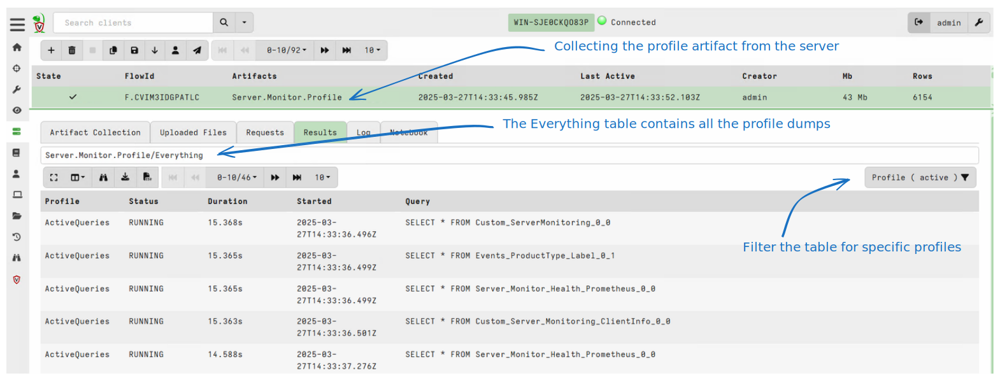
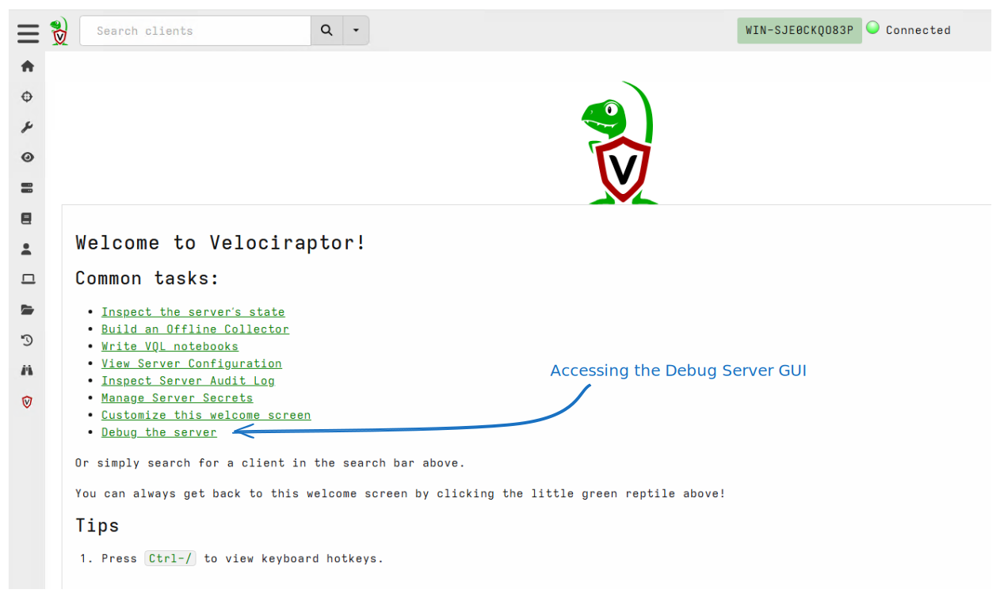
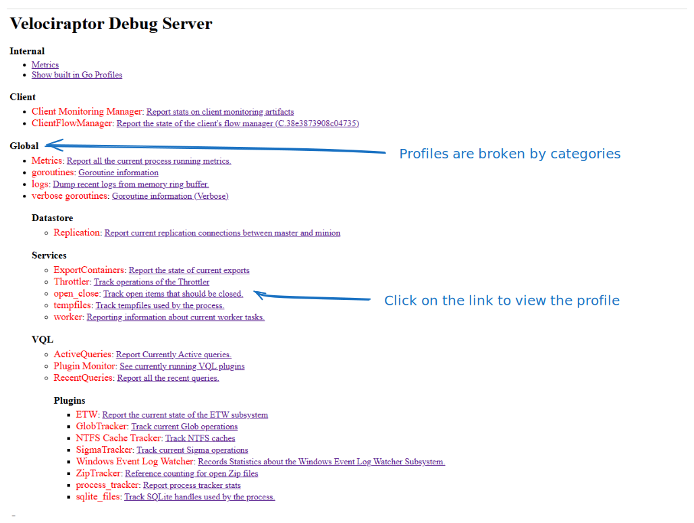

Like any piece of software, Velociraptor makes a number of engineering
tradeoffs, and may encounter some error conditions or event bugs. When
faced with the prospect of an unresponsive server or client, or high
CPU load, users often ask *"What is Velociraptor doing right now?"*

## Profiles

Without appropriate ways to ask Velociraptor what is happening inside
itself, one would need to attach with a debugger to understand what is
happening. To help users see into the black box of Velociraptor, we
have implemented extensive `Debugging Profiles` which allow us to
inspect the state of the various sub-systems inside the program.

Making Velociraptor's inner workings transparent helps to explain to
users how it actually works, what tradeoffs are made and why the
program is not behaving as it should.

`Profiles` are views into specific aspect of the code. You can collect
profiles from the local server using the `Server.Monitor.Profile`
artifact or from remote clients using `Generic.Client.Profile`.

Collecting these artifacts gives a snapshot or a dump of all profiles
in this current instance.



{}

If you encounter an issue that requires more thorough inspection, you
can seek assistance from the community on Discord or the mailing
list. In this case, you will probably be asked to attach a profile to
your request. This helps the developers to understand issues within
the system.

Simply collect the relevant artifact (either from the server or a
client) and export the collection into a zip file. You can then send
us the Zip file for analysis.

{}


### The Debug Server

While collecting profiles using an artifact is useful to take a
snapshot of the current process status, it is not very convenient when
we want to see how the process evolved over time.

To help with this, Velociraptor has a `Debug server` GUI that assists
in accessing a live view of debugging profiles.

On the server, you can access the debug server from the main welcome
page.






The client by default does not export the debug server for security
reasons. When debugging a client issue you can start the debug server
by adding the `--debug` flag (You may need to stop the service first
with `sc.exe stop velociraptor`):

```
velociraptor.exe --config "C:/Program Files/Velociraptor/client.config.yaml" -v --debug client
```

This will cause the debug server to be served over the localhost interface (by default `http://localhost:6060/` )


The below pages provide specific details on each profile type. It is
instructive to read about each profile item to understand how
Velociraptor works internally, the tradeoffs made and how to get the
best of Velociraptor in the real world.
