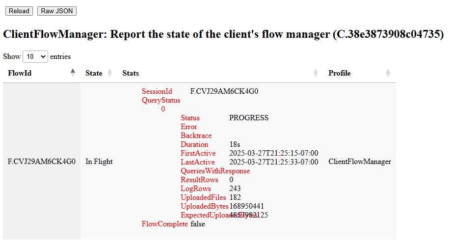

The Client Flows profile shows information about currently executing
collections on the endpoint. It is most interesting to collect when
another flow is executing on the endpoint.

The profile shows the progress of the collection on the endpoint:

1. The flow id is used to identify the flow.
2. The duration of the collection since it was last started
3. How many bytes were uploaded to the server?
4. How many rows were returned to the server?

These are generally the same stats the server keeps but are from the
point of view of the client.
