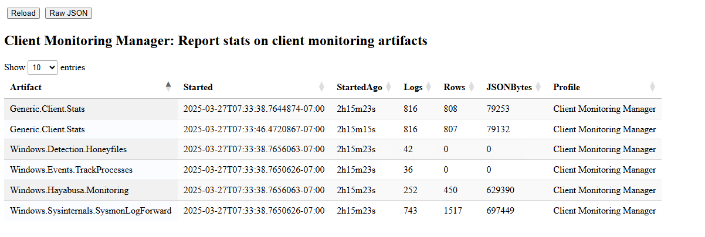
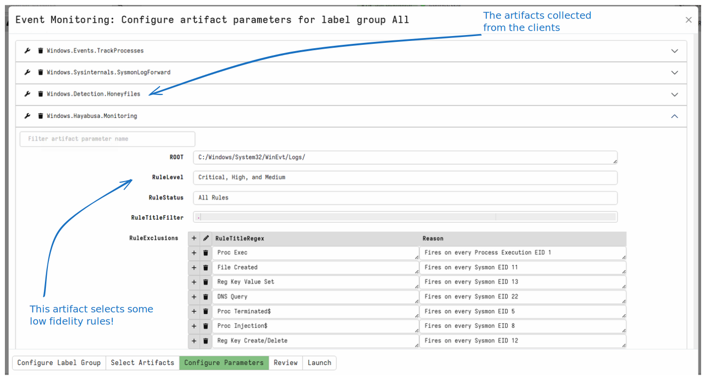

The client monitoring profile shows current information on the client
event monitoring subsystem.

Clients receive a `Client Event Table` update from the server,
instructing them on a set of `CLIENT_EVENT` artifacts to run. The
results from these artifacts are streamed back to the server over
time.

Client event queries are stored in the client's `writeback file` so
they can start immediately as soon as the client boots, even if it is
not connected to the server or offline. While offline the results are
buffered locally to a file, and then synced with the server at the
next opportunity.

The above example shows a typical output from the client monitoring
profile. We usually consider the following aspects:

1. Which client monitoring queries are actually running on the client?
2. How much data do these transfer to the server.

While it is easy to add a lot of client monitoring queries and to
forward a large number of events to the server, these do not come for
free!

Additional monitoring means additional CPU use on the end
point. Similarly forwarding more events means more network traffic and
additional storage requirements on the server.

You can examine the client monitoring queries assigned from the server.

The above example shows some poorly thought out queries as an example:

#### Example `Windows.Sysinternals.SysmonLogForward`

We see that this client is collecting the
`Windows.Sysinternals.SysmonLogForward` artifact. This artifact simply
forwards events from `Sysmon` to the server. Depending on how well the
Sysmon service is configured this can result in a lot of events. In
this case 1500 events in 2 hours resulted in forwarding about 700kb.

Is that too much? Really depends how much value you get out of these
events. It is easy to now estimate the total storage required
(e.g. 0.7Mb in 2 hours would be about 8.5mb per day, times 10,000
endpoints will require about 85gb per day). Do you have a way to
process this data? What do you do with this data? Is it useful?

You will have to make a call if the value gained is worth the storage
and network costs in your specific deployment.

#### Example `Windows.Hayabusa.Monitoring`

We see also in this example that we are collecting the
`Windows.Hayabusa.Monitoring` artifact. This artifact applies a set of
Sigma rules to the event logs to surface high valued events only.

In principle, this approach should reduce the total number of events
sent to the server, since only high level events are forwarded (those
that match the detection rules).

However in this case, the Sigma rules selected are of `Critical, High
and Medium` severity. Many of these rules have low fidelity and so end
up firing on more events than necessary (there are many false
positives!).

We can see the effect of this choice from the profile - the artifact
forwarded 450 rows totaling about 0.7mb in 2 hours. These are too
many to be considered useful for detection. A better tuned set of
rules will be more effective and transfer less data.

#### Example `Windows.Detection.Honeyfiles`

The final example is the `Windows.Detection.Honeyfiles` artifact that
places a number of juicy sounding files on the system (e.g. AWS keys,
SSH keys etc). The artifact then uses ETW to monitor any access to
these files and sends events for each file accessed. If an attacker is
simply looking for useful files to compromise they might copy or read
those files which will trip the detection.

This is an example of an effective client monitoring rule. When this
artifact sends an event, it is extremely high valued (presuming the
user of this system does not normally interact with the honey
files).

In this example, we see that this artifact did not send any events at
all and so has no storage or network overheads! When an event is
finally sent to the server it would probably require further
investigation!
