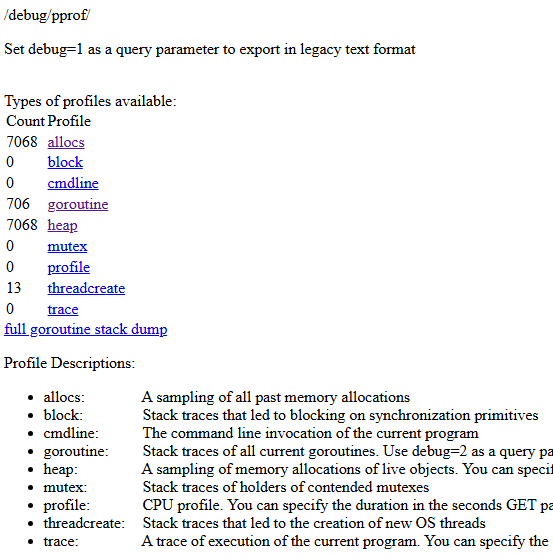
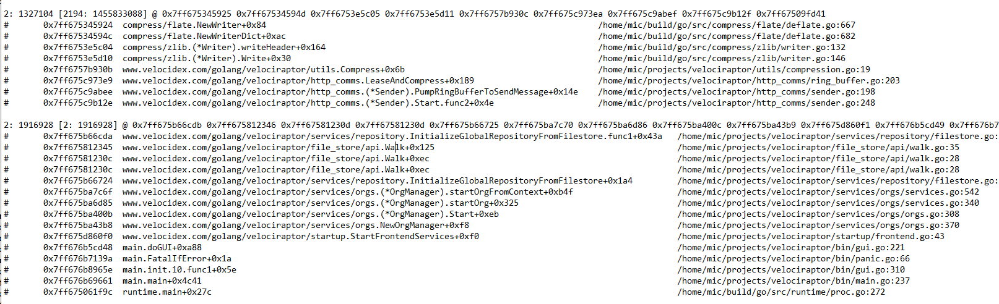
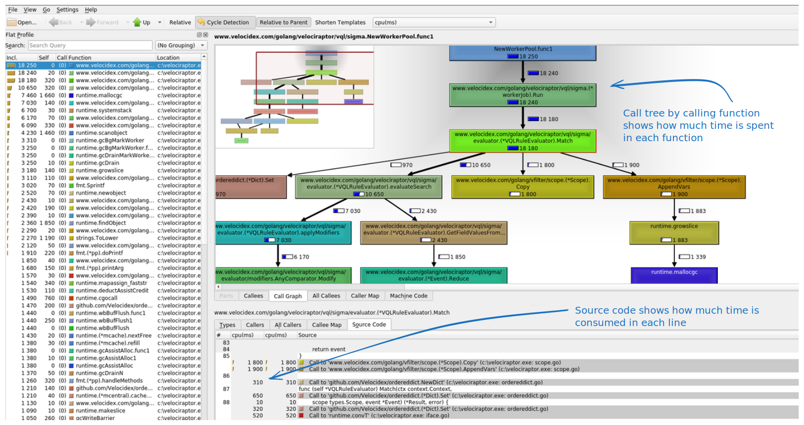

These show the built in Golang profiles provide detailed profiling and
instrumentation of the running process. They are most useful for
developers and are very important if you seek help from the
Velociraptor developer team, who will often ask for these.



Below we document the most interesting of those.

## Allocs

This profile shows the memory allocations made by Go code. It is most
interesting when memory use seems excessive.

Here is an example trace



Above we see two sample allocations. The first line shows that
currently there are 2 allocations live, worth 1.3Mb in total (which
have not been garbage collected yet). However over the life of the
program there were 2194 allocation (most have been freed and
reclaimed).

```
2: 1327104 [2194: 1455833088]
```

Next we see a trace back of where these allocations came from. We can
see that these particular allocations happen from compressing data to
be sent to the server. This helps debug where excessive memory
allocations are made.

## Goroutines

Golang uses the concept of Goroutines - a light weight managed set of
threads. A Golang program can start thousands of different goroutines
easily with very minimal performance impact.

The goroutines view is very helpful to understand what is happening in
the binary. It shows the count of goroutines collected by call stack
(i.e. similar goroutines are counted together).

Here is an example:

```
32 @ 0x7ff675096f4e 0x7ff675073f45 0x7ff6757c3577 0x7ff6769b6228 0x7ff67509fd41
#    0x7ff6757c3576    www.velocidex.com/golang/velociraptor/utils.SleepWithCtx+0x76/home/mic/projects/velociraptor/utils/sleep.go:10
#    0x7ff6769b6227    www.velocidex.com/golang/velociraptor/vql/parsers/event_logs.(*EventLogWatcherService).StartMonitoring+0x327/home/mic/projects/velociraptor/vql/parsers/event_logs/watcher.go:135
```

This example shows 32 goroutines are currently sleeping inside the
event log watcher. This implies that 32 different `parse_evtx()`
plugins are currently running waiting to their next event log scan.


## Profile

The profile link actually triggers a CPU profile capture on the
running executable. Note that you **do not** need a special debug
built to capture CPU profiles. Unlike many other languages, CPU
profiling is built into every production Go binary - this makes it
very easy to capture this information in running deployed systems
under real world workload.

The profile measure the amount of time spent in each function during a
30 second interval. When you click on that link the browser will wait
for 30 seconds and then download a binary profile file.

You can view the file using a tool like `kcachegrind` after converting
it to a suitable format:

```
go tool pprof -callgrind -output=/tmp/profile.grind /tmp/profile.bin && kcachegrind /tmp/profile.grind
```




The above shows where time is spent in the program. On the top right
pane we see a call tree, with each function calling the different
functions. Next to each node in the tree we see the total time spent
in each function. The different between time on entering the function
and the sum of all time of the called functions represents the time
"lost" inside each function.

The bottom pane shows the time used on each line inside the
function. We can see how much each operation "costs".

Developers can use this to find "hot spots" or places with very high
CPU use that can be optimized.
