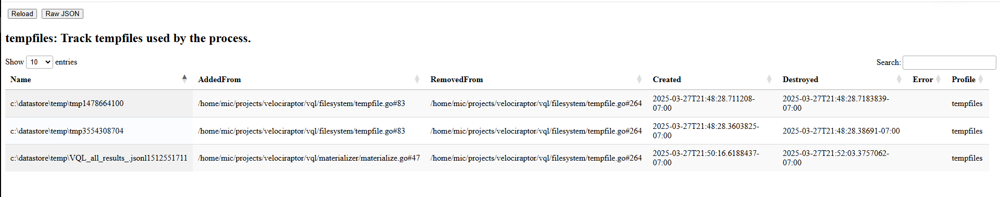
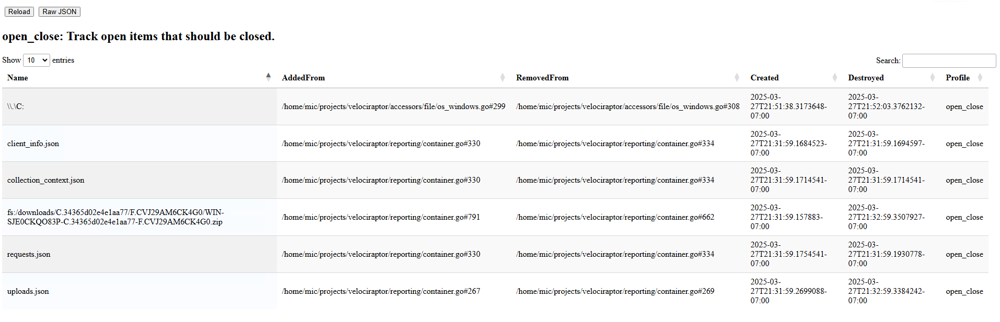

Velociraptor uses temporary files for a variety is purposes. It is
important to ensure that whenever we create a temporary file, we
suitably remove it.

The Tempfile tracker keeps track of temporary files we used.

The profile indicates:

1. Which temporary files were used.
2. Where they were created from (gives an idea why we created these files).
3. When the file was created and removed

In the above example, we see two temporary files created from the VQL
`tempfile()` function and one created by the VQL engine during a
materialize operation (e.g. expanding a `LET` ). All files were
suitably closed as determined by the non zero destroyed time.

## Open Close

Similarly it is important to know what files we have opened that
should be closed. This is tracked by the `Open Close Tracker`. The
tracker does not only track operating system files but other abstract
objects within Velociraptor that need to be closed.

We typically want to see all files being suitably closed unless they
are used currently. Some files are held open for a short time after
use, to avoid needing to re-open them if accessed soon after.

The above example shows we recently opened the raw `C:` device and
some more files used during a flow export operation.
