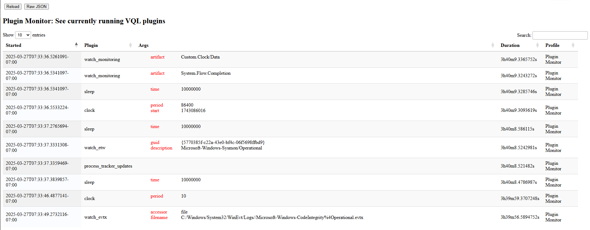

At their core VQL queries process rows emitted from VQL plugins. We
have seen previously the Active Queries tracker which provides
information of currently running queries.

However it is also useful to know what plugins are currently running
and what parameters are used within them. This gives us a really good
idea what the VQL engine is doing exactly at the moment.

The above example show the plugins currently active. We see a few
instances of `watch_monitoring()`. Another instance of `watch_etw()`
plugin is seen watching the Sysmon ETW stream. Finally we see some
instances of `watch_evtx()` watching various event logs.

Sometimes a query runs very slowly and we dont really know why. Using
the plugins profile helps us understand what operations are currently
running. For example, a common reason for slow down is when an
artifact accesses files on a network share or fuse share because those
types of access involve network transfers which may be very slow. In
that case, the query would appear to be running very slowly.
