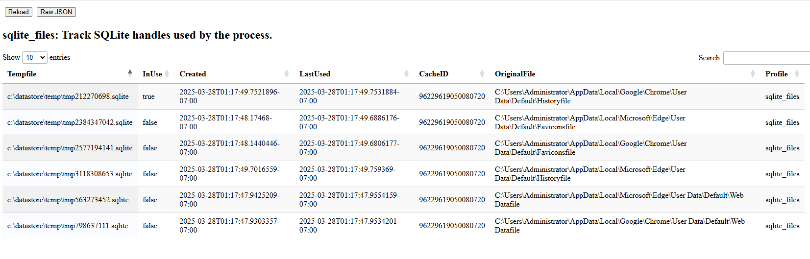

SQLite files are used widely to store data in a structured file. We
parse SQLite file using the Golang SQLite library.

Usually SQLite files implement file locking to coordinate multiple
processes accessing the same file. This poses a problem for
Velociraptor, which needs to read files currently opened by other
applications. When Velociraptor attempts to open the SQLite file with
the library, the open may fail if the file is locked. Similarly by
Velociraptor opening the file which may be in use by another
application, this may cause the other application to fail.

To avoid these complications, by default Velociraptor makes a copy of
the SQLite file and opens that file. This ensures we have exclusive
access to the file, even if it is currently in use and locked. In
practice this turns out to be a lot faster than using the original
file, due to the slow down in coordinating file locks with the program
that has the file original opened (e.g. a browser).

Since making a temporary copy is a slightly expensive operation we try
to cache the file for a duration, so that if the same file is opened
again, we can access our temporary copy again.

This algorithm can be seen in the `SQLite tracker`

