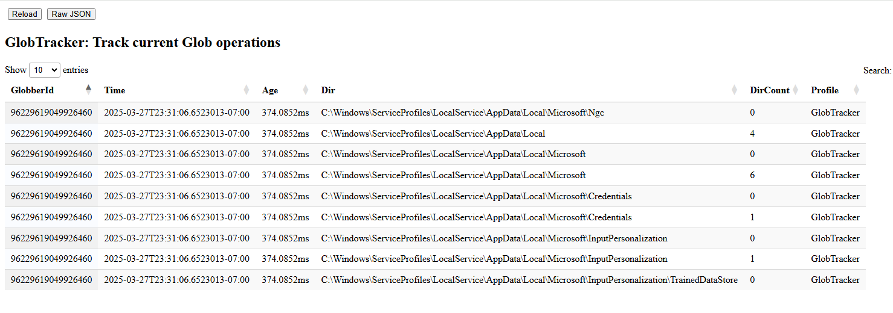

Velociraptor is often used to search for files. This is commonly done
using the `glob()` plugin. This plugin is highly optimized to speed up
searching through various filesystems.

However, sometimes it is hard to know what the plugin is doing. For
example a query such as:

```sql
SELECT * FROM glob(globs='C:/**/*.foobar')
```

Will search for a file with a `foobar` extension. However, what if no
such file exists on the disk at all? In that case, although the
`glob()` plugin will enumerate every file on the disk, no results will
be returned and the query will appear to be blocked.

If you want to see what the glob plugin is doing, use the `Glob
Profile`:



The glob profiles shows the last 10 directories the plugin inspected,
and the count of files within these directories.

A common reason for glob operations to slow down is when the plugin
accesses files on a network share or recurses through many symbolic
links (for example on Linux, if the `/proc/` filesystem is not
properly excluded, the plugin may enter a symlink cycle). Viewing the
most recent directories accessed by glob will reveal such issues.
