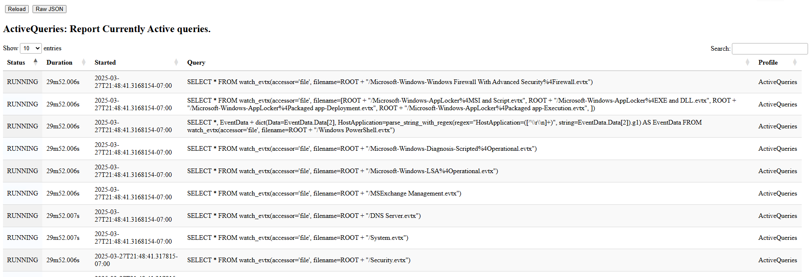

To understand what queries are currently running, we can view the
`Active Queries` profile. This shows us what queries are currently
running in the process.

The above example shows a number of queries watching a variety of
event logs on the endpoint. This is because this endpoint is running
the `Windows.Hayabusa.Monitoring` artifact, which evaluate many Sigma
rules, many referring to different log sources. Each log source relies
on parsing the event logs.

The `Recent Queries` profile similarly shows all recent queries (even
after they completed). This helps us understand what queries had run
on the endpoint previously, and how long they took to complete.
