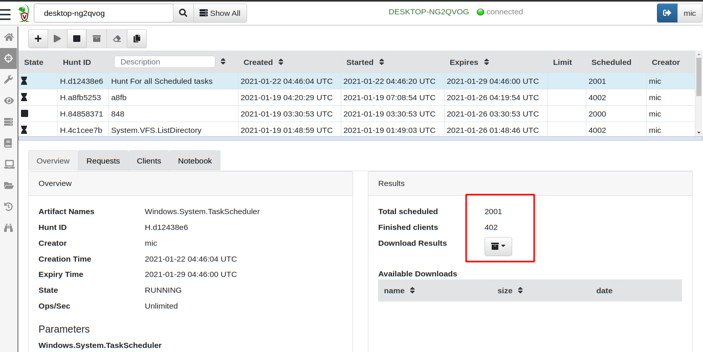

With Velociraptor, you can collect the same artifact from multiple endpoints at the same time using a `Hunt`. Hunts allow you to do the following:

* Monitor offline endpoints by scheduling hunts collecting artifacts from any
   endpoints that come back online during a certain period.

* Examine the results from all collections easily.

* Keep track of which endpoints collected the
   artifact and make sure the same artifact is not collected more than
   once on any endpoint.

## What is a hunt?

A hunt is a logical collection of a one or more artifacts from a group
of systems. The `Hunt Manager` is a Velociraptor component that is
responsible for scheduling collections of clients that met certain
criteria, then keep track of these collections inside the hunt.

The important takeaway from this is that artifacts are still collected
from endpoints the same way as we did previously, it is simply
automated using the hunt manager.

## Schedule a new hunt

To schedule a new hunt, select the "Hunt Manager" <i class="fas
fa-crosshairs"></i> from the sidebar and then select "New Hunt" button
<i class="fas fa-plus"></i> to see the `New Hunt Wizard`.

Provide the hunt with a description and set the expiration date. You can also target
machines containing the same label (A `Label Group`), or exclude the
hunt from these machines.

{}

Hunts do not complete - they expire! The total number of clients in
any real network is not known in advance because new clients can
appear at any time as hosts get provisioned, return from vacation, or
get switched on. Therefore it does not make sense to think of a hunt
as done. As new clients are discovered, the hunt is applied to them.

It is only when the hunt expires that new clients no longer receive
the hunt. Note that each client can only receive the hunt once.

{}

Next you need to select and configure the artifacts as before. Once
everything is set, click **Launch Hunt** to create a new hunt.

Hunts are always created in the `Paused` state so you will need to
click the **Start** button before they commence. Once
a hunt is started many hundreds of machines will begin collecting that
artifact, be sure to test artifact on one or two endpoints
first.

You can monitor the hunt's progress. As clients are scheduled
they will begin their collection. After a while the results are sent
back and the clients complete.

## Post-process a hunt

After collecting an artifact from many hosts in a hunt, we often need
to post-process the results to identify the results that are
important.

Velociraptor creates a notebook for each hunt where you can apply a
VQL query to the results.

Let's consider our earlier example collecting the scheduled tasks from
all endpoints. Suppose we wanted to only see those machines with a scheduled task that runs a batch script from cmd.exe and count
only unique occurrences of this command.

We can update the notebook's VQL with a `WHERE` clause and `GROUP BY`
to post-process the results.

{}

When hunting large numbers of endpoints, data grows quickly. Even
uploading a moderately sized file can add up very quickly. For example,
collecting a 100Mb file from 10,000 machines results in over 1Tb of
required storage.

Be mindful of how much data you will be uploading in total. It is
always best to use more targeted artifacts that return a few rows per
endpoint rather than fetch raw files that need to be parsed offline.

{}
