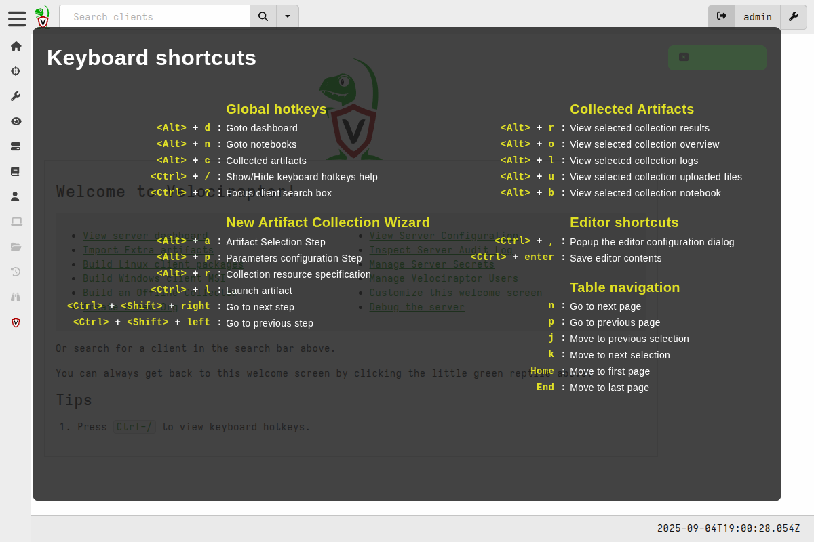

The Velociraptor GUI supports many keyboard shortcuts to navigate around
quicker. So you don't have to be slowed down by mouse clicks!

The key combination `<Ctrl>` + `/` will bring up the Keyboard Shortcuts help.

The `Esc` key or clicking anywhere on the screen will close it.

### Global hotkeys

These are available on any screen in the GUI.

|                                |   |                                                         |
|--------------------------------|---|---------------------------------------------------------|
| `<Alt>` + `d`                  | : | Goto dashboard                                          |
| `<Alt>` + `n`                  | : | Goto notebooks                                          |
| `<Alt>` + `c`                  | : | Collected artifacts (for the currently selected client) |
| `<Ctrl>` + `/`                 | : | Show/Hide keyboard hotkeys help                         |
| `<Ctrl>` + ( `<Shift>` ) + `?` | : | Move focus to the client search box                     |

### New Artifact Collection Wizard

These are available in the Collection Wizard.

|                                  |   |                                   |
|----------------------------------|---|-----------------------------------|
| `<Alt>` + `a`                    | : | Artifact Selection Step           |
| `<Alt>` + `p`                    | : | Parameters configuration Step     |
| `<Alt>` + `r`                    | : | Collection resource specification |
| `<Ctrl>` + `l`                   | : | Launch artifact                   |
| `<Ctrl>` + `<Shift>` + `<Right>` | : | Go to next step                   |
| `<Ctrl>` + `<Shift>` + `<Left>`  | : | Go to previous step               |

### Collected Artifacts

These are available when a collection is selected.

|     |   |                                         |
|-----|---|-----------------------------------------|
| `r` | : | View selected collection results        |
| `o` | : | View selected collection overview       |
| `l` | : | View selected collection logs           |
| `u` | : | View selected collection uploaded files |

### Paged Tables

These are available when any paged table has focus, for example in collection
results.

|        |   |                     |
|--------|---|---------------------|
| `n`    | : | Go to next page     |
| `p`    | : | Go to previous page |
| `j`    | : | Select next row     |
| `k`    | : | Select previous row |
| `Home` | : | Go to first page    |
| `End`  | : | Go to last page     |

### Artifact Editor

These are available in the [artifact editor]()
and Sigma editor.

The editor uses the ACE (Ajax.org Cloud9 Editor) under the hood. This means that
all the ACE keyboard shortcuts listed
[here](https://github.com/ajaxorg/ace/wiki/default-keyboard-shortcuts) are
available in the editor, many of which are common shortcuts across many popular
text editors.

In addition, the following shortcuts are available in the editor.

|                      |   |                                       |
|----------------------|:-:|---------------------------------------|
| `<Ctrl>` + `,`       | : | Popup the editor configuration dialog |
| `<Ctrl>` + `<Enter>` | : | Save editor contents                  |
