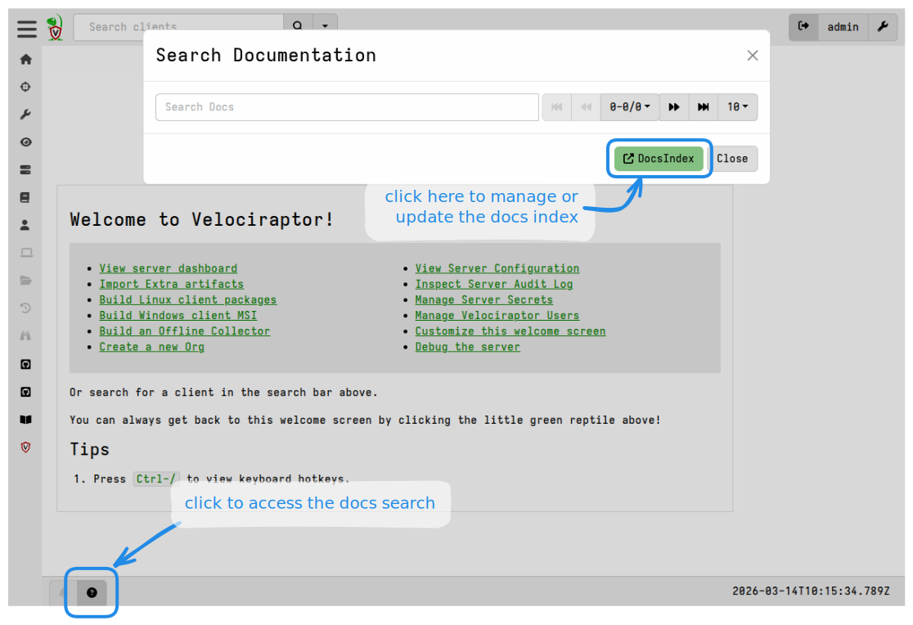
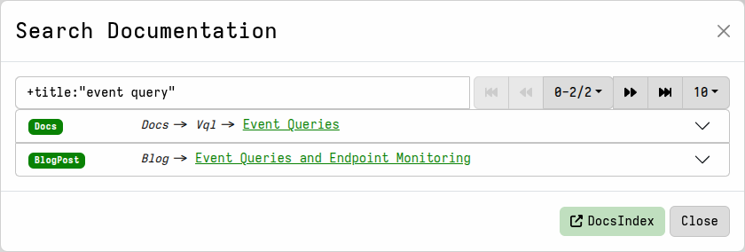
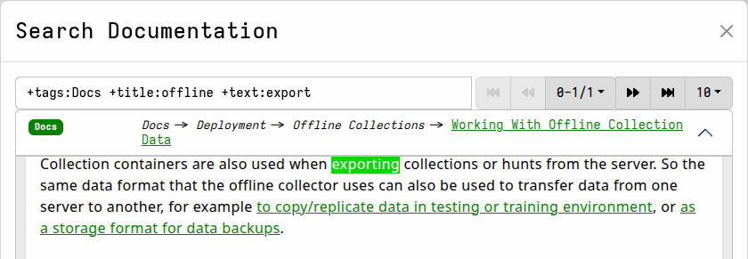
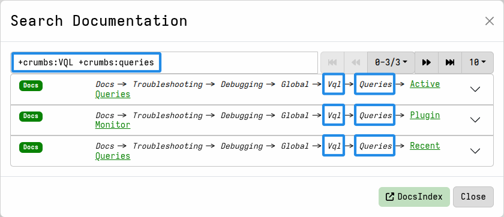
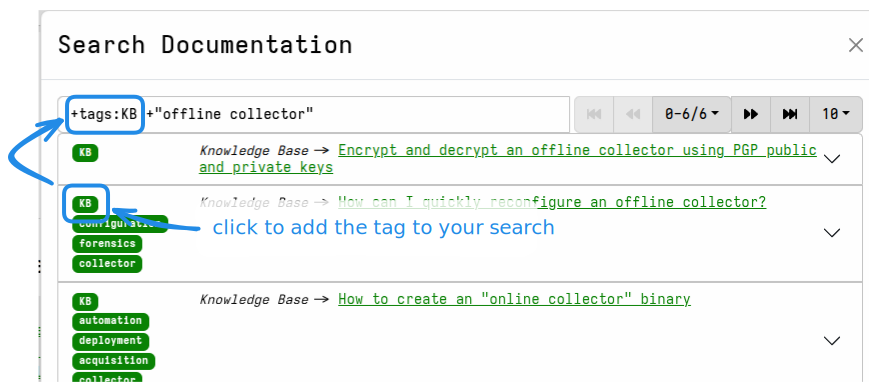

From version 0.76, the Velociraptor documentation can be searched and
previewed in the GUI.


This local search feature is designed for speed and convenience, and
can be a helpful resource when internet access is restricted or
unavailable, such as during critical security investigations in
isolated environments.

You can access the local documentation search by clicking on the
<i class="fas fa-circle-question"></i> icon in the app footer area.

{}

The local documentation is intended for quick documentation lookups,
or for use in situations where the Velociraptor documentation website
is inaccessible, perhaps when you are working from a network where
internet access is restricted or severely degraded. Such circumstances
are sometimes encountered when responding to serious security
incidents. So if you're planning to take your Velociraptor server into
a bunker, you can prepare it with local documentation before you go.

In other words this feature is intended for convenience or for unusual
situations, in a similar way to how the
[`vql list` CLI command]()
allows you to quickly look up VQL-related help when you are working on
the command line. It does not fully replicate all aspects of the
documentation website, and it's not intended to replace it.

In particular, you should be aware of the following differences:

- Links within the offline docs will send you to the documentation
  website, rather than allowing you to navigate within the local docs.
  You should avoid clicking links in the local documentation if you
  don't want to be sent to the documentation website.
- Some internal navigation links that you would see on the website
  are not shown in the offline docs.
- Images are not stored locally and will therefore not be displayed if
  access to the documentation website is unavailable.

{}

## Installing the local documentation index

The documentation index is not included in the Velociraptor binary. It
is technically managed as a
[tool]() in the `root`
[organization]() (org), and is
automatically downloaded to the server the first time any user tries
to search the local docs.

If a documentation search is done within a non-root org, the search
request is redirected to the `root` org. This ensures that
documentation is shared globally across the platform rather than
requiring every org to maintain its own copy of the docs index.



In situations where internet access is not available you can manually
download the index from
```text
https://github.com/Velocidex/velociraptor-docs/raw/refs/heads/gh-pages/docs_index/docs_index_v1.zip
```
and upload it into the tools inventory, as you would do with other
tools in an offline server situation.

If you are prepopulating the tools inventory on a server in advance of
working offline, the
[`Server.Utils.UploadTools`]()
artifact will include the docs index in the tools package that it
downloads.


## Query syntax

The full Bleve query syntax is documented on
[their documentation site](https://blevesearch.com/docs/Query-String-Query/).
Here we discuss only the most relevant query constructs.

### Terms vs Phrases

Words separated by spaces are considered **terms** and are searched
for independently of each other.

For example, the query `windows client` will return results matching
either `windows` _or_ `client`, with results that contain both terms
being ranked higher in the results.

A search **phrase** is multiple words enclosed within quotes.

For example, the query `"windows client"` (with quotes) will return
results matching that full phrase, but not the individual words
`windows` or `client`.

### Required, Optional, and Exclusion Terms

You can require that a term or phrase match by prefixing it with a
`+`. For example, the query `+"offline collector" +debug` _requires_
that both the term `debug` and the phrase `offline collector` MUST appear
in search hits.

Conversely, you can exclude a term or phrase by prefixing it with `-`,
meaning this term or phrase MUST NOT be in any of the results.

If neither `+` nor `-` are specified then the term or phrase is
considered "optional". If it does appear in any of the results then it
is used to increase the **rank** of these results.

### Field Scoping

In our documentation index, the following fields are available for
query scoping:

- **title**: the title of the page.
- **text**: the full body text.
- **tags**: classification tags.
- **crumbs**: the path components for the page.

To search in a specific field, you can add the field name as a search
operator. Usually the `+` prefix is also added so that it is
_required_ that the search term or phrase appears in that field.

For example, the query `+title:"event query"` will only search in the
page titles.



Notice that in the above example, the word `query` also matches
`queries` due to stemming, i.e. `queries` is derived from the stem
word `query`.

You can combine multiple fields in your query to produce very precise
matching, for example
`+tags:Docs +title:offline +text:export`
will search for pages with both `offline` in the title _and_ `export`
in the body.




#### Searching with crumbs

A breadcrumb or breadcrumb trail represents the path to a page, or a
set of pages within the site's navigational structure.

So if you perhaps have the URL for a page on the docs website, or just
want to limit your search to within a certain area of the website you
can apply the `crumbs` scope to your query.



#### Searching with tags

If you're not sure exactly what keywords to search for you can also
search by tag. Or you can combine tags with your terms/phrases in the
query to improve the ranking of the most relevant results.

For example

1. Do a search for your keywords. This will give you a list of all
results, regardless of tags.

2. On the list you can click on one or more tags to add them to your search
   criteria.



3. If necessary, you can now adjust your query so that it searches
   only within pages having the selected tag.

You can also use the query `+tags` to see all pages with tags, which
might help you with choosing an appropriate tag.

