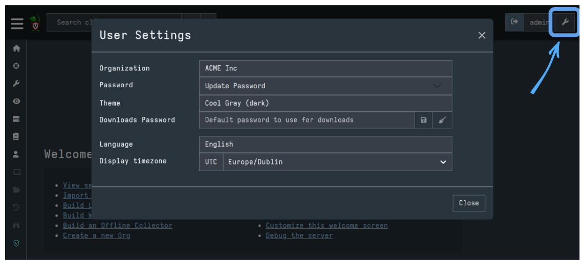

Users can set their own preferences for several GUI aspects. These are set in the
User Preferences panel, which is accessed by clicking the <i class="fas fa-wrench"></i>
button next to the user name at the top-right corner of the screen.

- **Org selector**: The Org selector allows a user to switch to a different org.
  See the [Organizations]({}) section for more
  information on multi-tenancy in Velociraptor.

- **Password**: If the deployment uses `Basic` authentication mode, this allows
  the user to change their own password. See
  [Basic Authentication]({}).

- **Theme**: Velociraptor offers a number of themes including several dark mode
  themes, light mode themes and some fun themes too. Find the look that fits you
  best!

- **Downloads Password**: In a number of places in the interface, Velociraptor
  offers the user the opportunity to download collected data. However, in many
  cases this data might contain malware or other unwanted software that
  typically triggers Antivirus or other security software. This setting allows
  you to define a password to encrypt the zip files with to avoid triggering
  such software.

- **Language**: Velociraptor's interface can be switched to a number of
  languages. If your favorite language is not there, consider
  [contributing a translation file](https://github.com/Velocidex/velociraptor/tree/master/gui/velociraptor/src/components/i8n)!

- **Display Timezone**: The GUI shows many timestamps throughout. Times
  are always shown in RFC-3339 / ISO-8601 which makes then unambiguous
  in all timezones. This setting switches the display to show all
  times in a particular timezone. This helps visual inspection but
  does not change the times in any way (just changes their
  representation). Internally all times are always serialized in UTC.

### Managing user preferences via VQL

Server administrators can also view and customize the preferences for other
users using the
[user_options]() VQL function.

The `user_options` function is typically used together with the
[gui_users]() plugin, to enumerate
the user accounts and then update their preferences.

