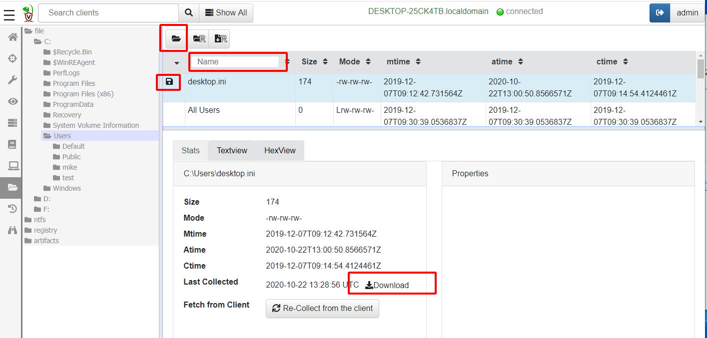
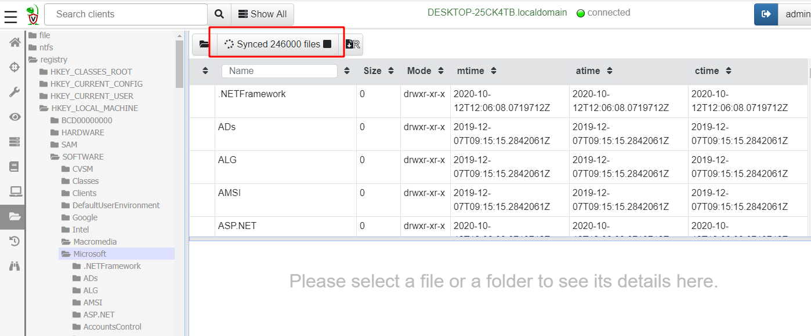
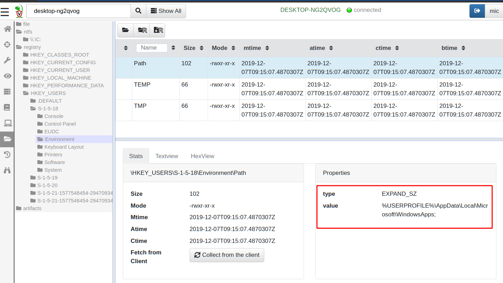

Once we selected a client, we often want to quickly look at the
client's filesystem. The Velociraptor GUI has a Virtual Filesystem
View (VFS) screen.

The VFS is simply a server side cache of the files on the endpoint. It
is merely a familiar GUI to allow inspection of the client's
filesystem.

The VFS consists of a tree view in the left pane and a file listing in
the top right pane. The tree view allows us to navigate through the
filesystem, starting at the top level. Remember that the GUI is simply
viewing data that was previously collected from the client. When
clicking on a directory in the tree view that has not been synced from
the client yet, the top right pane is blank.

Clicking on the refresh directory button <i class="fas fa-folder-open"></i>
will initiate a directory listing operation on the client, and
providing the client is currently connected, will refresh the VFS
view.

Clicking on any of the files in the directory listing, will show their
properties in bottom right pane. In particular, listing the directory
only populates file metadata, such as timestamps - it does not fetch
the file data. In the `Stats` tab we can initiate a download operation
from the endpoint by clicking the "Download from client" button <i class="fas fa-sync"></i>.

Once a file is fetched from the endpoint it is stored on the server
and we may view it in the VFS GUI. The file is also marked by a floppy
disk icon <i class="fas fa-save"></i>. You can download the collected
file from the server by clicking the download icon <i class="fas fa-download"></i>.

### Recursively operating on files

Previously we saw how we can list one directory or fetch one file from
the endpoint. In many cases it would be convenient to fetch or
download entire directories from the endpoint. Clicking on the
recursively sync directory button begins a recusive directory listing.

{}

Syncing large directories and downloading many files from the endpoint
can take a long time and transfer large amount of data. By default
resource limits are enforced that limit the operation to 10 minutes
and transferring 1Gb of data. If you accidentally initiated a download
of a very large directory you can click the button again to cancel the
operation.

{}

### VFS accessors

The top level directory in the VFS tree view represents the
`accessor`. An accessor is simply a dedicated code used to fetch
filesystem information from the endpoint.

The `file` accessor simply uses the OS's APIs to list files or
directories and fetch data. The `ntfs` accessor uses Velociraptor's
built in NTFS parser to be able to access hidden NTFS files and
Alternate Data Streams (ADS).

Similarly the `registry` accessor provides file like access to the registry.

## Interactively investigating an endpoint

Although the VFS presents a familiar interface, it is not ideal for
quickly finding the files and registry keys we are usually interested
in. One would need to know exactly which files are of interest and
then click over multiple directories searching for these files.

To automate collection it is better to write special purpose `VQL
Artifacts` to identity the information of interest.

Our next section explores what artifacts are and how we collect them
using Velociraptor.
