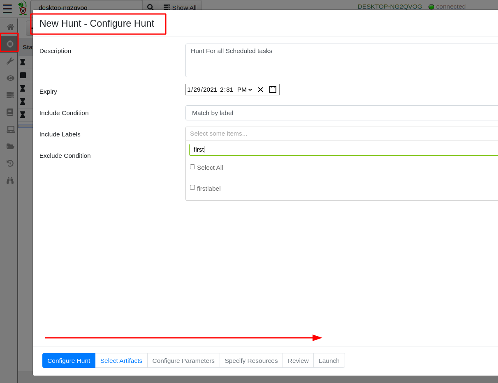
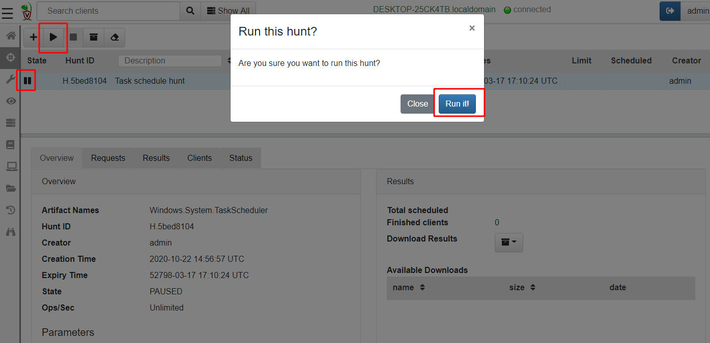
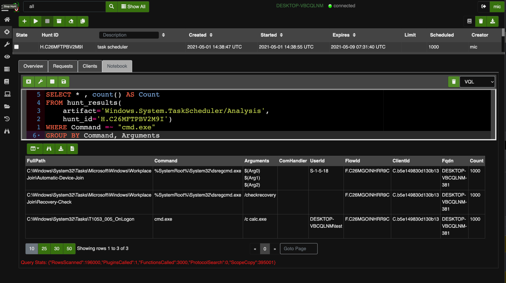
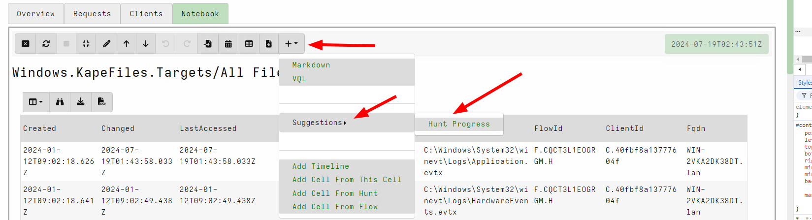
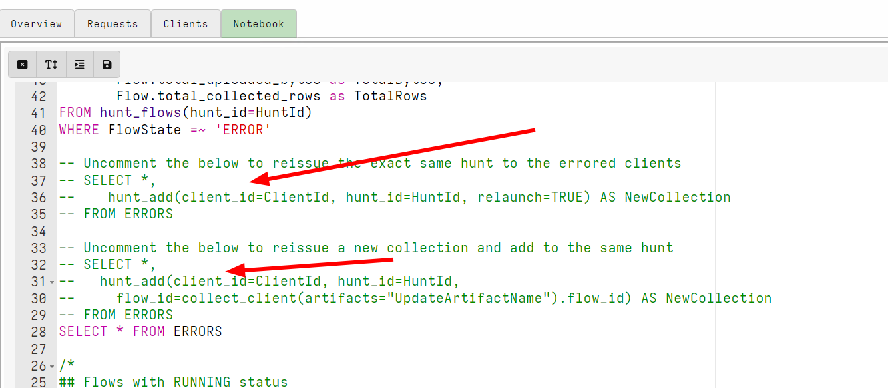

With Velociraptor, you can collect the same artifact from multiple
endpoints at the same time using a **Hunt**. Hunts allow you to do the
following:

* Monitor offline endpoints by scheduling hunts collecting artifacts
  from any endpoints that come back online during a certain period.

* Examine the results from all collections easily.

* Keep track of which endpoints collected the artifact and make sure
  the same artifact is not collected more than once on any endpoint.

## What is a hunt?

A hunt is a logical collection of a one or more artifacts from a group
of systems. The **Hunt Manager** is a Velociraptor component that is
responsible for scheduling collections of clients that met certain
criteria, then keep track of these collections inside the hunt.

The important takeaway from this is that artifacts are still collected
from endpoints the same way as we did previously, it is simply
automated using the hunt manager.

## Schedule a new hunt

To schedule a new hunt, select the **Hunt Manager** <i class="fas
fa-crosshairs"></i> from the sidebar and then select **New Hunt** button
<i class="fas fa-plus"></i> to see the **New Hunt Wizard**.

Provide the hunt with a description and set the expiration date. You
can also target machines containing the same label (A **Label Group**),
or exclude the hunt from these machines.



{}

Hunts do not complete - they expire! The total number of clients in
any real network is not known in advance because new clients can
appear at any time as hosts get provisioned, return from vacation, or
get switched on. Therefore it does not make sense to think of a hunt
as done. As new clients are discovered, the hunt is applied to them.

It is only when the hunt expires that new clients no longer receive
the hunt. Note that each client can only receive the hunt once.

{}


Next you need to select and configure the artifacts as before. Once
everything is set, click **Launch Hunt** to create a new hunt.

Hunts are always created in the `Paused` state so you will need to
click the **Start** button before they commence. Once
a hunt is started many hundreds of machines will begin collecting that
artifact, be sure to test artifact on one or two endpoints
first.



You can monitor the hunt's progress. As clients are scheduled
they will begin their collection. After a while the results are sent
back and the clients complete.


## Post-process a hunt

After collecting an artifact from many hosts in a hunt, we often need
to post-process the results to identify the results that are
important.

Velociraptor creates a notebook for each hunt where you can apply a
VQL query to the results.

Let's consider our earlier example collecting the scheduled tasks from
all endpoints. Suppose we wanted to only see those machines with a scheduled task that runs a batch script from cmd.exe and count
only unique occurrences of this command.

We can update the notebook's VQL with a `WHERE` clause and `GROUP BY`
to post-process the results.




{}

When hunting large numbers of endpoints, data grows quickly. Even
uploading a moderately sized file can add up very quickly. For example,
collecting a 100Mb file from 10,000 machines results in over 1Tb of
required storage.

Be mindful of how much data you will be uploading in total. It is
always best to use more targeted artifacts that return a few rows per
endpoint rather than fetch raw files that need to be parsed offline.

{}

## Hunts and labels

We have seen above that we can target hunts by labels. When a hunt is
targeted to a label, only hosts that have the label assigned will be
automatically scheduled by the hunt manager.

This allows you to dynamically apply the hunt to various hosts by
simply adding labels to them. This workflow is very powerful as it
allows for incremental triaging.

Lets consider an example for how this can be applied in practice.


I start the process by setting up a hunt for preserving the event logs
from clients which I consider to have been compromised. Since this
hunt will collect a lot of data, I can not really run it across the
entire network - instead I will be very selective and only schedule it
on compromised hosts.

1. I add a description for this hunt
2. Next I select to Match by Label.
3. I can search for an existing label, or if no label already exists,
   I can create a new label. In this case I will choose the new label
   `Preserve` to denote a host I want to preserve.

For this example, I choose the `Windows.KapeFiles.Targets` artifact
with the `Eventlogs` target to collect all windows event logs for
preservation.


The hunt is started but since there are no clients with the new label
yet, no clients are scheduled.


I carry on with my investigation, and at some point I find a client
which I believe is compromised! I simply go to the host overview page
and label this client.


The act of labeling the client has automatically scheduled the client
into the hunt.


Note that I can use this technique to automatically schedule clients
into various hunts using the VQL
[label()]() function. Therefore I can use
this technique to automatically add clients to various hunts based on
previous findings.

## Manually adding clients to hunts

You can think of hunts as a group of collections that we can inspect
together. For example we can see all the processes from all clients by
collecting the `Windows.System.Pslist` artifact across the entire
network in a hunt. Then we can filter across all the processes with
VQL:

```vql
SELECT * FROM hunt_results(hunt_id="H.123", artifact="Windows.System.Pslist")
```

This is very convenient - hunts are really a way to group related
collections together.

Normally the **Hunt Manager** component described above is responsible
for scheduling collections on clients depending on certain conditions
(e.g. labels or OS matches), and adding them to the hunt. However the
scheduling step is a different separate step from adding the
collection to the hunt.

It is possible to schedule the collection manually and ***then*** also
add the collection to the hunt. This method gives the ultimate
flexibility in managing hunt membership.

A common example is when a collection needs to be redone for some
reason. Normally the hunt manager ensures only a single collection
from the hunt is scheduled on the same client. However sometimes the
collection fails, or simply needs to be recollected for fresher
data to be added to the hunt.

In the above example, I redo the collection of
`Windows.KapeFiles.Targets` that the hunt scheduled previously by
navigating to the collection view in that specific client. Then I
**Copy** the collection by pressing the <i class="fas fa-copy"></i>
button. I can now update things like, timeout or change the parameters
a bit as required.


Next, I add the collection to the hunt by clicking the **Add to Hunt** <i class="fas
fa-crosshairs"></i> button.


The new collection is added to the hunt. It is up to you if you want
to keep the old collection around or just delete it.


You can add collections to a hunt using the
[hunt_add()]() VQL function which
allows unlimited automation around which flows are added to hunt (and
can also automate the relaunching of the collections).

To help you with manipulating hunts with the notebook, hunt notebooks
offer a **Cell Suggestion** to assist with managing the hunt progress.





