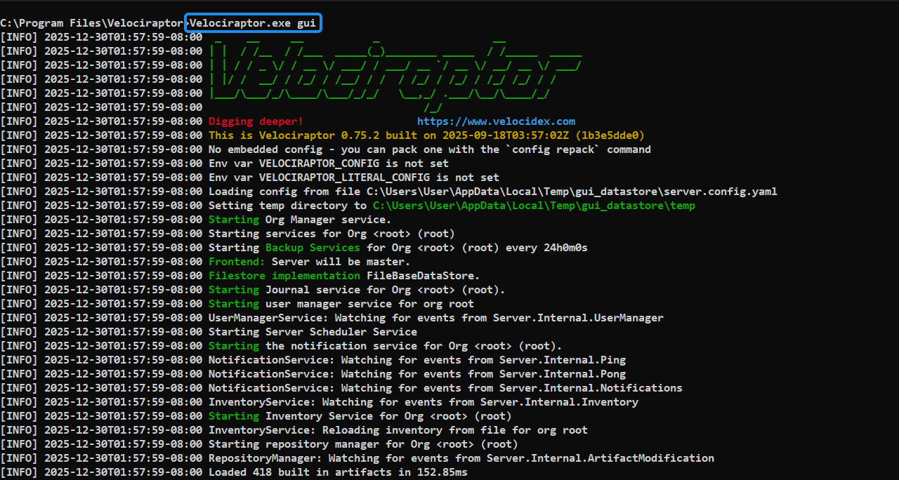
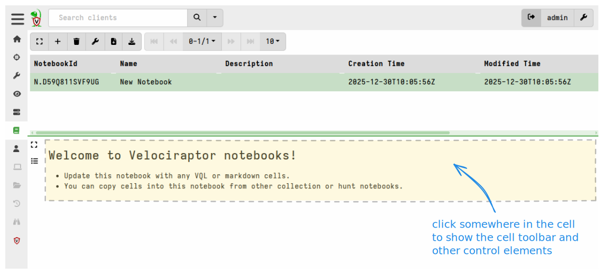
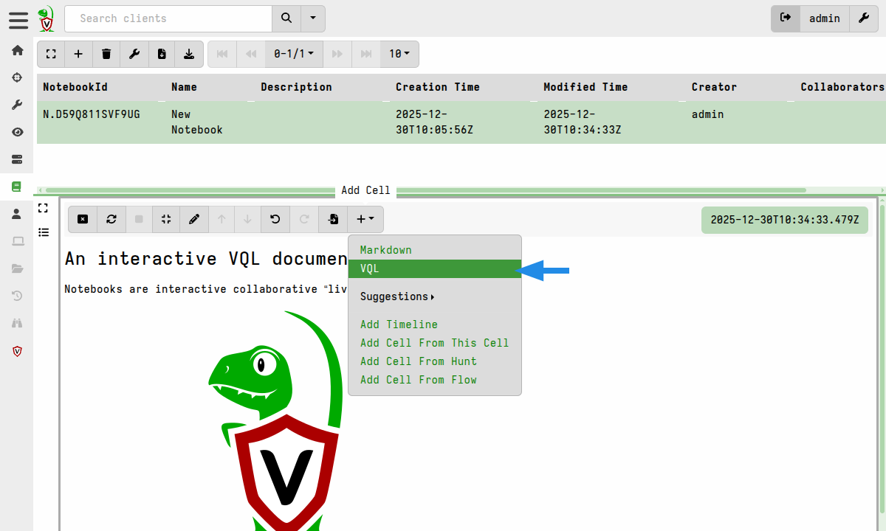
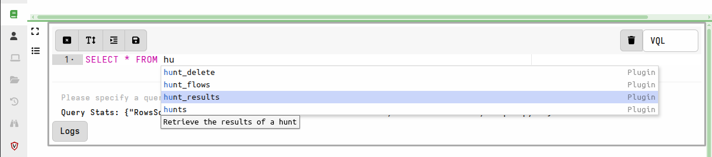
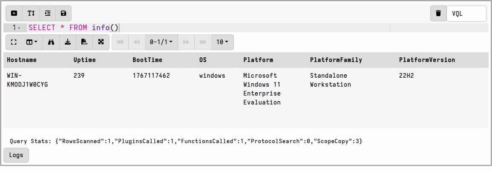
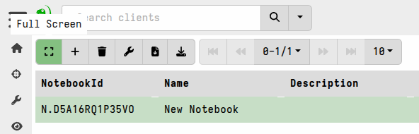
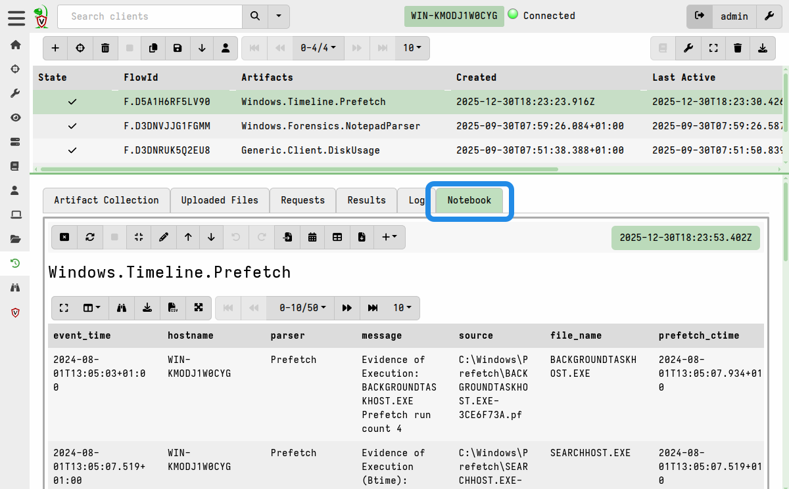

Notebooks are interactive collaborative workspaces which can
interleave markdown and VQL queries to create an interactive document.
Notebooks are typically used to track and post-process one or more
hunts or collaborate on an investigation.

Let's create a notebook to see the feature at work.

1. Start the Velociraptor GUI. You can do so easily by running
   `velociraptor.exe gui`. This will create a new server configuration
   and start a new server on the local machine. It will also start a
   local client communicating with the server.

   

2. Select Notebooks <i class="fas fa-book"></i> from the sidebar menu then "Add
   Notebook" <i class="fas fa-plus"></i>.

   

3. Give the notebook a name and a description and submit. The new
   notebook is created.

   

{}

A notebook consists of a sequence of cells which may each be edited. However,
when not in focus a cell has no decorations in order to appear as a seamless
part of a larger document. You have to click the cell into focus to be able to
see it's controls.



{}

4. Click on the cell to give it focus and the cell control toolbar
   will be shown, from here click the **Edit Cell** <i class="fas
   fa-pencil-alt"></i> button to edit the cell contents.

   

There are two types of cells: A `Markdown` cell receives markdown text
and renders HTML while a `VQL` cell can receive VQL queries. The cell
type is shown on the right hand side of the cell toolbar. You may
change cells from one type to the other at any time.

5. Let's add a new cell to the notebook. Click the **Add Cell** button
   <i class="fas fa-plus"></i> and a pull down menu appears offering
   the type of Cell that can be added. For now, select a `VQL` cell.

   

   

After clicking the **Edit Cell** button, you can type VQL directory
into the cell. As you type, the GUI offers context sensitive
suggestions about what possible completions can appear at the cursor.



Use your up and down arrow keys to navigate the suggestions, and Enter
or Tab to select a suggestion. Typing "?" will show all possible
suggestions.

{}

Suggestions are context-sensitive, so VQL plugins which can only
appear after a `FROM` clause will only be suggested when the cursor
is positioned after a `FROM`.

{}

Let's type the following VQL query into the VQL cell:

```vql
SELECT * FROM info()
```




{}

The notebook may be switched into full screen mode via the notebook toolbar,
which is useful when dealing with large tables. With this setting, the notebook
takes up the entire width of the screen.



You can switch back to the pane view by clicking on the collapse button at the
top right of the screen.

{}

Notebooks like the one we just created are sometimes referred to as
**Global Notebooks** to distinguish them from the notebooks attached
to hunts and flows, described below.

## Hunt and Flow Notebooks

Notebooks are an excellent medium to run arbitrary VQL queries. Much
of the time, these queries are used to post-process the results from
collections or hunts.

Therefore Velociraptor automatically creates a **hunt notebook** for each hunt
and a **flow notebook** for each collection.

For example, here we collected the `Windows.Timeline.Prefetch` artifact and can
view it's results in the collection (flow) notebook.



These automatically-created notebooks are always visible to all users
in the org (i.e. there is no explicit
[sharing](/docs/notebooks/sharing/) required, unlike Global Notebooks)
and they can be accessed by any user who can log into the GUI. They
can also be modified by any user who has the `NOTEBOOK_EDITOR`
permission (included in the `investigator` role and above).
