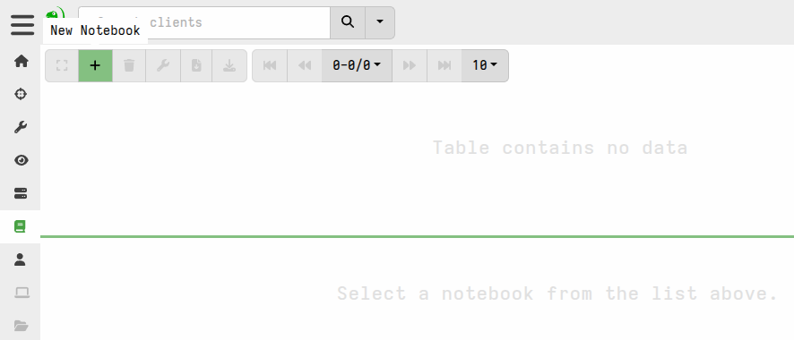
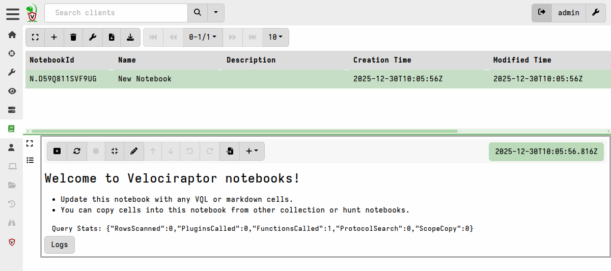
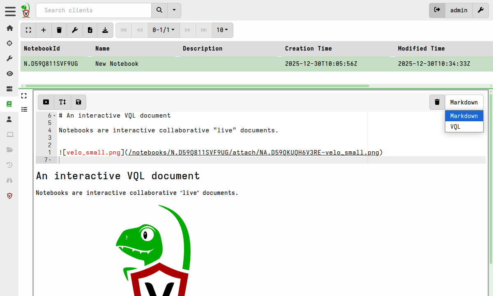
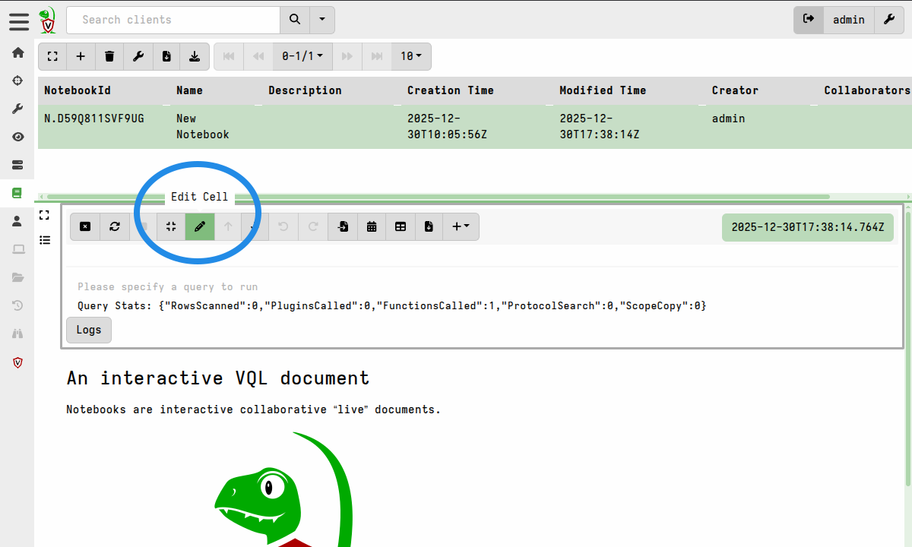

This walkthrough shows you how to create a notebook, add cells, and
run VQL queries in the Velociraptor GUI.

## Create a notebook

1. Select **Notebooks** <i class="fas fa-book"></i> from the sidebar
   menu, then select **Add Notebook** <i class="fas fa-plus"></i>.

   

2. Give the notebook a name and a description, then submit. The new
   notebook appears in the notebook list.

   

3. Click the notebook to open it. You will see a single markdown cell
   with a welcome message.

## Edit a cell

1. Click the cell to give it focus. When it has focus, the cell
   control toolbar appears above it.

   

2. Click the **Edit Cell** <i class="fas fa-pencil-alt"></i> button to
   edit the cell contents.

You can change a cell's type between `Markdown` and `VQL` at any time
using the dropdown on the right side of the cell toolbar. A Markdown
cell displays formatted text. A VQL cell runs a query and shows the
results.

{}

A notebook consists of a sequence of cells. When a cell is not in
focus it has no visible decorations, so the document appears as a
seamless whole. You must click a cell to bring it into focus before
you can see its controls.


{}

## Add a VQL cell

1. Click the **Add Cell** button <i class="fas fa-plus"></i>.
   A dropdown menu offers the types of cell you can add.

   

2. Select **VQL**. A new VQL cell appears above the current cell.

   

3. Click **Edit Cell** <i class="fas fa-pencil-alt"></i> to open the
   cell editor.

As you type, the GUI offers context-sensitive suggestions for VQL
keywords, plugins, and functions. Use the up and down arrow keys to
navigate, and press Enter or Tab to select a suggestion. Press "?" at
any time to see all possible completions.


## Run a query

Type the following VQL into the cell:

```vql
SELECT * FROM info()
```


The query returns basic information about the Velociraptor server.

{}

VQL suggestions adapt to where you are in the statement. For example,
plugins that only make sense after a `FROM` clause are suggested only
when the cursor is positioned after one.

{}

## What you have created

The notebook you just created is a **Global Notebook**. It lives in
the notebook list until you delete it. It is visible only to you
unless you share it.

From here you can:

- Add more cells and build a report
- Explore the [templates](/docs/notebooks/templates/) page to learn
  how to create your own notebook templates
- Read about [sharing](/docs/notebooks/sharing/) notebooks with other
  users
- Return to the [notebooks overview](/docs/notebooks/) for a
  conceptual explanation of the notebook system
