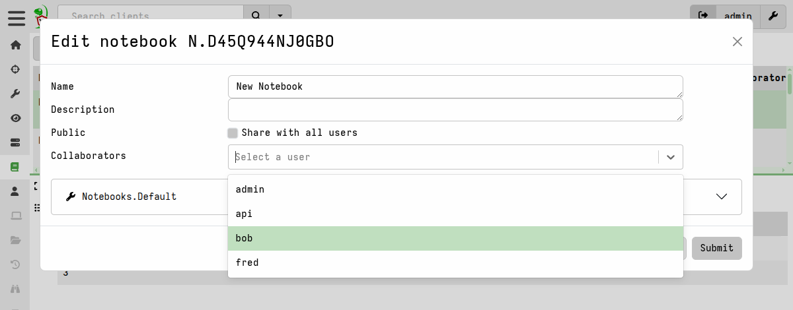

By default, notebooks are visible only to the user who created them.
When creating or editing a notebook, you can choose to share it with
all users by clicking the Public check box. You can also share it with
only certain users by selecting their names in the **Collaborators**
field.

You can edit the sharing and other properties of a notebook via the
**Edit Notebook** (<i class="fa-solid fa-wrench"></i>) button in the
notebooks toolbar.

{}

The GUI only shows users notebooks that they own or that are shared
with them. Other non-shared notebooks within the same org are not
displayed in the list views.

However, the data in non-shared notebooks within the user's org are
nevertheless available to all users in that org via VQL.

For example, any user with the `NOTEBOOK EDITOR` permission can build
or view a
[timeline]()
from private notebook cells if they know the notebook and cell IDs.
This can be useful for providing your team with data views that are
sourced from more complex queries maintained in a private notebook.

Additionally, the data from all notebooks is available for reading
using the VFS APIs and other VQL plugins.

_We do not consider notebooks to be securable from other users within
the same org._ That is, the private/public setting is not a security
feature. It is merely a convenience for controlling visibility of
notebooks within the GUI, to reduce clutter and facilitate
collaboration.

{}

