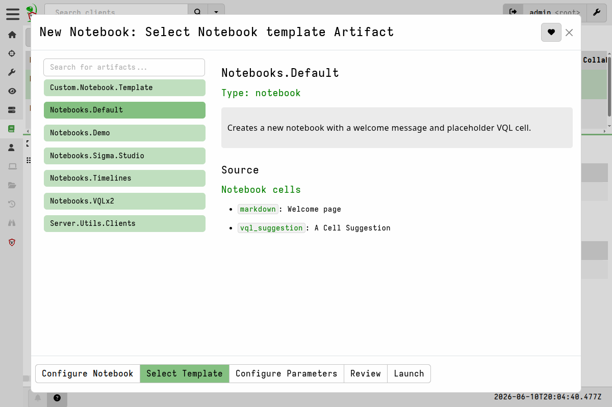
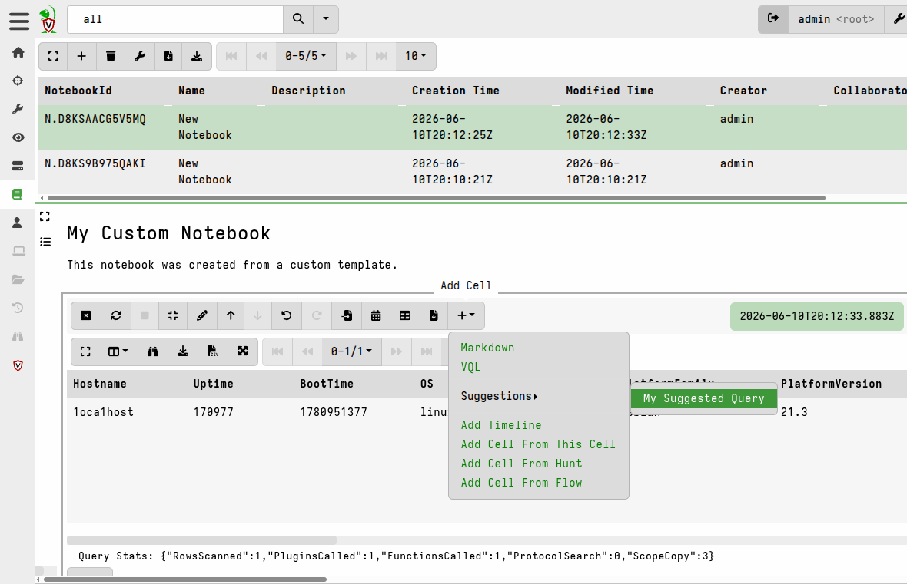
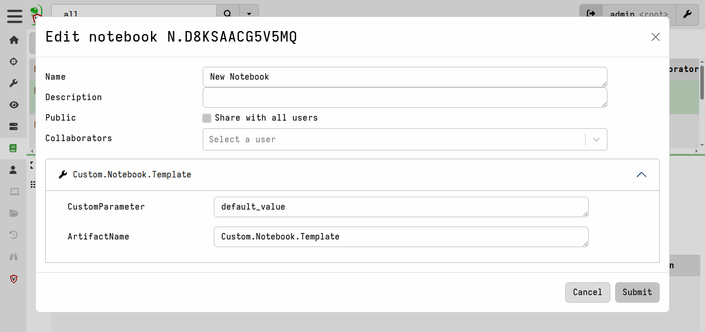

When you create a new notebook in Velociraptor, it is always based on
a **notebook template**. You can pick one of the existing templates to
set it up with some ready-made content, or you can create your own
custom templates.



A template can include VQL queries, content written in Markdown
(useful for providing the notebook user with instructions), suggested
follow-on queries, or any combination of these things.

Notebook templates _are_, in fact, just [artifacts](/docs/artifacts/)
and are therefore defined the same way as any other Velociraptor
artifacts. The only difference is that the artifact `type` is set to
`NOTEBOOK` instead of the more commonly used `CLIENT` or `SERVER`
types.

In a `NOTEBOOK` artifact definition, the notebook content itself is
specified in the artifact's [sources](/docs/artifacts/sources/).

## Cell Types

A template is made up of one or more *cells*. Each cell has a
`type` and a `template` field. These are the available cell types:

| Type | What it does |
|------|-------------|
| `markdown` or `md` | Displays formatted text. Good for headings, instructions, or notes. |
| `vql` | Runs a VQL query and shows the results as a table when the cell is calculated. |
| `vql_suggestion` | Adds a suggested VQL query that the user can select and run. Useful for optional or advanced queries that not everyone will need. |
| `none` | Produces no cell at all. This can be used to stop a default cell from being created. |

Note that there is only a `vql_suggestion` type - there is no
`markdown_suggestion` type. If you want a suggestion that displays
formatted text, the suggestion itself must contain VQL with markdown
or HTML embedded on comment blocks.

###### A markdown cell example: this just shows some text in the notebook:

```yaml
sources:
  - notebook:
    - type: markdown
      name: Welcome
      template: |
        # Welcome to Velociraptor notebooks!

        You can add VQL queries or markdown cells to this notebook.
```

###### A VQL cell example: this runs a query and shows the results:

```yaml
sources:
  - notebook:
    - type: vql
      name: Filtered Clients
      output: |
        << Filtered Clients: Click here to calculate >>
      template: |
        SELECT client_id,
               os_info.hostname AS Hostname,
               os_info.system AS OS
        FROM clients()
```

You can also add an `output` field to a VQL cell. This field holds
text or HTML that renders inside the cell before the user clicks to
run the query. It's essentially static predefined output that will be
displayed _before_ the cell is run. It's useful for providing
instructions or warnings to the notebook's user _before_ they execute
a VQL cell.

VQL suggestions are templates for creating a new VQL cell with a
predefined query. All `vql_suggestion` templates are added to the
suggestions menu for all other non-suggestion cells.



When a suggestion is selected from the menu, the notebook creates a
new VQL cell above the one that invoked the suggestion, containing the
suggestion's VQL. The VQL contained in the new cell is executed
immediately.

## Parameters

You can add [parameters](/docs/artifacts/parameters/) to a notebook
template, just like you can with all other artifact types. 

```yaml
parameters:
  - name: TimelineName
    description: Give your timeline a name
    default: Supertimeline
  - name: SearchTerm
    default: "all"
    description: A search term, for example "host:DESKTOP*"
```

When someone creates a notebook based on the template, the wizard asks
them to fill in the parameters first, which is the same thing you
would see if it was an artifact that you were about to collect.

Using parameter values inside a VQL cell is not different from using
them in the `source` of the other artifact types. You just refer to
them directly as [named variables](/docs/vql/fundamentals/#variables).

### Using parameters inside Markdown cells

To use a parameter value inside a `markdown` cell, you use Go's
templating language, for example `{{ Scope "ParameterName" }}` (note
that the parameter name is in quotes).

```markdown
# Inserts the StartDate and EndDate parameters into markdown

These query results show events between {{ Scope "StartDate" }} and {{ Scope "EndDate" }}.
```

The templating language lets you perform complex operations such as
define functions, iterate over iterables, pipe through
[Sprig](https://masterminds.github.io/sprig/) or Velociraptor-provided
templating functions, and more. See the `Notebooks.Sigma.Studio`
artifact for good examples of this.

Parameters in notebooks can be changed after creating the notebook,
unlike the parameters in the other types of artifacts.



This is accessed via the **Edit Notebook** button on the notebook
toolbar. 

## Tools

As with the other artifact types, notebook templates can specify
[tools](/docs/artifacts/tools/) that can then be used in the notebook.
Because notebooks are a server-side feature, this means that the tools
will be running on the server, so security implications should be
considered. As with other artifact types, the ability to allow tools
to be run can be controlled through a [variety of
mechanisms](/docs/artifacts/security/).

If your template needs an external tool (like a command-line
utility), you can list it under the `tools` key:

```yaml
tools:
  - name: dasel
    url: https://github.com/TomWright/dasel/releases/download/v3.11.0/dasel_linux_amd64
    expected_hash: aa422a1ba61ff1d5c7bc84bdc019394863c14a9140cfd0e0bd2000be3b297ead
    serve_locally: true
```

Because creating a notebook equates to collecting the artifact, tools
with URLs specified will be downloaded when the notebook is created.

## Column Types

You can tell the GUI how to display specific columns. For example, if
a column contains a client ID, you can set its type to `client_id`
so it becomes a clickable link:

```yaml
column_types:
  - name: client_id
    type: client_id
```

The notebook user can also change column types at any time by clicking
on the **Format Columns** toolbar button that's above each VQL cell.

Column types are explained in more detail in the
[advanced fields](/docs/artifacts/advanced_fields/#-column_types-)
documentation.

## When does the template get processed?

A notebook template is processed *at the moment the user creates a new
notebook* from it. This is what happens, step by step, during notebook
creation:

1. The user picks a template in the new-notebook wizard and fills in
   any parameters.
2. The server reads the template's cells and builds the notebook.
3. All VQL cells are calculated one at a time. The notebook waits for
   each cell to finish before starting the next one, which prevents
   overloading the calculation workers.
4. The new notebook is saved and appears in the GUI, ready to use.

Unlike client or server artifacts, a notebook template is not
evaluated at some future time - it is "collected" immediately and just
sets up the initial notebook structure and content. From there the
user interacts with the notebook, in the same way they would work with
collected results in a flow or hunt notebook.

{}

If your template includes a VQL cell that calls the `hunt()` function,
the hunt will be *created immediately* when the notebook is created -
not when the user clicks the cell. This means a user could
accidentally launch multiple hunts just by creating the notebook.
Consider using `vql_suggestion` cells instead for actions that should
require a deliberate click, or else define `output` for the cell (as
described previously) to prevent immediate execution of that specific
cell.

{}


## Sharing VQL between cells (exports and imports)

You can define helper functions in a notebook template that all cells
in the notebook can use. You can also pull in exported VQL from other
artifacts:

```yaml
export: |
  LET useful_function(x) = x * 2

imports:
  - Windows.System.VAD
```

The `export` section defines VQL functions available to every cell in
the notebook. The `imports` section imports functions that are
[exported by other artifacts](/docs/artifacts/export_imports/), which
will also then be available to all cells.


## Built-in templates

Velociraptor ships with several built-in notebook templates:

**Notebooks.Default** - The standard template that appears when no
other template is chosen. It includes a welcome message and a
suggested VQL cell.

**Notebooks.VQLx2** - Starts a notebook with two VQL cells right
away, without any introductory markdown. Good if you just want to
jump straight into running queries.

**Notebooks.Timelines** - Helps you build a "super timeline" from
time series data across collections. You give it a timeline name and
it creates a timeline that can pull data from other notebooks.

**Server.Utils.Clients** (previously called Notebooks.Clients) -
An interactive template for searching and examining client details.
It comes with a search box and displays results in a formatted table
with clickable client IDs.

**Notebooks.Demo** - Shows example notebook features including VQL
queries and tool references. Good for learning how notebook templates
work.

**Sigma Studio Notebook** - A full Sigma rule editor built as a
notebook. Provides an interactive environment for writing, testing,
and managing Sigma detection rules. It uses typed parameters
(including drop-down choices and boolean toggles) and a custom
SigmaEditor widget for rule editing.

Another one you may find useful is:  

**Notebooks.Admin.Flows** - A server-side template that lists recent
collections across all organizations. Available from the
[Velociraptor Artifact Exchange](/exchange/artifacts/pages/notebooks.admin.flows/).

Since notebook templates are artifacts, if you create useful or
interesting notebook templates then do consider sharing them with the
community [via the artifact exchange](/dev/contributing-artifacts/).

## Automatic notebooks (hunts, flows, events)

Not all notebooks are created from templates chosen by the user.
Velociraptor automatically creates notebooks in a few situations:

* **Hunt notebooks** - Created when you view the notebook tab
  inside a hunt.
* **Flow notebooks** - Created when you view the notebook tab for a
  client collection.
* **Event notebooks** - Created when you view an event monitoring
  session.

These are explained in more detail in the
[notebooks overview](/docs/notebooks/#hunt-and-flow-notebooks).

## Creating your own template

You can create a custom notebook template by writing an artifact with
`type: NOTEBOOK`. Here is a complete example:

```yaml
name: Custom.Notebook.Template
description: |
  Describe what your notebook template does here.

type: NOTEBOOK

# Optional: parameters the user fills in when creating the notebook
parameters:
  - name: CustomParameter
    description: A parameter for the notebook
    default: default_value

# Optional: external tools to download
tools:
  - name: MyTool
    url: https://example.com/tool.exe

# Optional: how to format certain columns
column_types:
  - name: some_column
    type: client_id

# Define the cells that make up the notebook
sources:
  - notebook:
    - type: markdown
      template: |
        # My Custom Notebook

        This notebook was created from a custom template.

    - type: vql
      name: My Query
      output: |
        << Click to calculate >>
      template: |
        SELECT * FROM info()

    - type: vql_suggestion
      name: My Suggested Query
      template: |
        SELECT * FROM range(end=31) WHERE _value = timestamp(epoch=now()).Day
```

Once created it will appear as a notebook template option in the "new
notebook" wizard.

## Tips

- **Turning an existing notebook into a template**: There is currently
no feature to convert a notebook into a template artifact. However,
you can export the notebook as YAML (from the notebook menu), and the
export will contain all the VQL from each cell. You can then use that
as a starting point to build a `NOTEBOOK` artifact by hand.

- **vql_suggestion cells are added to all VQL/Markdown cells**: If
your artifact's notebook section only has `vql_suggestion` cells (and
no `vql` cells), the notebook may appear empty when first opened. The
server only creates cells when it finds `vql` or `markdown` cell
types. Make sure to include at least one `vql` or `markdown` cell if
you want to use `vql_suggestion` cells.
