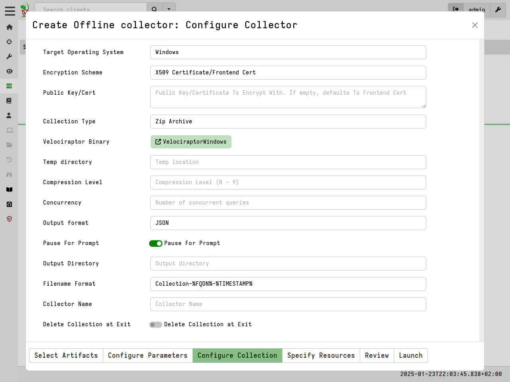

In DFIR Triaging means to quickly collect information about the system
in order to establish its potential relevance to a forensic
investigation.

While many think of triage as collecting files (perhaps as an
alternative to full disk acquisition), in Velociraptor, there is no
real difference between collecting files or other non-volatile
artifacts: Everything that Velociraptor collects is just a VQL
Artifact.

We like to think of triage as simply capturing machine state - where
the state may be bulk files (like the `$MFT` or registry hives) or any
other volatile data, such as process information, network connections
etc.

### Collecting files

Being able to efficiently and quickly collect and preserve evidence is
important for being able to capture machine state at a point in
time. It is also useful to be able to use these collected files with
other forensic tools that might be able to handle the file formats
involved.

One of the most commonly used artifact is the
`Windows.KapeFiles.Targets` artifact. This artifact is automatically
built from the open source
[KapeFiles](https://github.com/EricZimmerman/KapeFiles) repository.

While originally developed to support the non-opensource Kape tool,
this repository contains many types of files which might be relevant
to collect in a triage scenario. Each Kape "Target" is essentially a
glob expression with a name.

In Velociraptor `Windows.KapeFiles.Targets` is the most popular
artifact for mass file collection.  It does no analysis but simply
collects a bunch of files based on the targets specified.

Start by selecting the artifact from the "New Collection" wizard


Next we need to select the "Targets" in the "Configure Parameters"
step. Many targets are simply collections of other targets. For
example the `_BasicCollection` target automatically includes a number
of other useful targets.


The `Windows.KapeFiles.Targets` artifact can transfer a large quantity
of data from the endpoints, and take a long time to run. We therefore
often need to update the resource control of the collection.


Once the collection is launched, we can monitor progress in the "Artifact Collection" tab.


{}

Velociraptor is very careful about the performance and resource impact
on endpoints. When collecting many files if it is often hard to
determine in advance how much data will be collected or how long it
will take. For safety, Velociraptor allows limits to be set after
which the collection is cancelled. You can also interactively cancel
the collection by clicking the "Stop" button.

Be aware that a lot of data can be collected which might fill up the
VM disk.

> Math is a harsh mistress:
> Collecting 100Mb  from 10,000 endpoints = 1Tb
>
> Note that typically $MFT is around 300-400Mb so collecting the $MFT
> from many endpoints is going to be huge!


{}

## Offline collections

We have seen previously how to collect many files using the
`Windows.KapeFiles.Targets` artifact in the usual client/server
mode. But what if we are unable to deploy Velociraptor on a new
network in client/server mode? With Velociraptor not installed on the
endpoint, how shall we collect and triage artifacts?

Velociraptor is just a VQL engine!  All we need is Velociraptor to be
able to collect the VQL artifacts into a file, and then we can
transport the file ourselves for analysis.  Velociraptor does not
really need a server...

Often we rely of an external helper (such as a local admin) to
actually perform the collection for us. However, these helpers are
often not DFIR experts. We would like to provide them with a solution
that performs the required collection with minimal intervention - even
to the point where they do not need to type any command line
arguments.

The `Offline collector` aims to solve this problem. Velociraptor
allows the user to build a specially configured binary (which is
actually just a preconfigured Velociraptor binary itself) that will
automatically collect the artifacts we need.

Velociraptor allow us to build such a collector with the GUI using an
intuitive process.


Select the offline collector builder from the `Server Artifacts`
page. The artifacts selection page and the parameters page are exactly
the same as previously shown.


Next select the collector configuration page.



Here we get to choose what kind of collector we would like:

* Target Operating System: This specifies the specific version of the
  Velociraptor binary that will be packed.
* Password: It is possible to specify a password to encrypt the zip
  file that Velociraptor will create. Note that when specifying a zip
  password, Velociraptor will create a second zip file called
  `data.zip` inside the output zip file. This is done because Zip
  password protection does not extend to the directory listing, so
  Velociraptor will hide the content of the zip by storing the data in
  an embedded zip.

* Collection Type: This controls where the collection is stored.

    * Zip Archive: The collection will be stored in a zip file in the
      same directory the collector is launched from.

    * Google Cloud Bucket: The zip file will be uploaded to a cloud
      bucket. When selecting this you can provide GCP credentials to control
      the upload bucket.

    * AWS Bucket: The zip file will be uploaded to a cloud
      bucket. When selecting this you can provide AWS credentials and
      details to control the upload bucket.

    * SFTP: This allows the collector to upload the file to an SFTP
      server using a private key.

The `Offline Collector Builder` is simply a GUI wrapper around the
`Server.Utils.CreateCollector` server artifact. Once it is collected,
the artifact will automatically upload the pre-configured collector it
created into the collection and the file will be available for
download from the "Uploads" tab. Simply click on the link to get the
collector.


Once the collector is run without command line arguments, the
collection will automatically start. No need for the user to enter
command line parameters, although they do need to be running in an
elevated administrator shell.


The collector creates a zip file containing the collected files as
well as an optional report.


### Customizing the execution of the offline collector

You can see the embedded configuration of the offline collector using
the `config show` command:

```
C:\Users\Administrator\Downloads>Collector_velociraptor.exe config show
autoexec:
  argv:
  - artifacts
  - collect
  - Collector
  - --logfile
  - Collector_velociraptor.exe.log
  - -v
  - --require_admin
  artifact_definitions:
  - name: Collector
    parameters:
    - name: Artifacts
      default: |-
        [
         "Demo.Plugins.GUI"
        ]
      type: json_array
    - name: Parameters
      default: '{}'
      type: json
```

The autoexec parameters are run when no other command line options are
specified. The default command line simply collects a special custom
artifact which collects the specified artifacts in the Artifacts
parameter specified as a JSON list.

The primary use of the offline collector is to be able to run it
without any needed command line options, which is why the
configuration file specifies the full list of required artifacts to
collect. However, sometimes it is useful to slightly tweak the
collector from the command line. We do this by adding the `--` flag
which introduces other command line options to the default autoexec
array specified in the configuration.

You can use this to change the list of collected artifacts on the fly
by providing a new JSON encoded artifacts list to the collector:

```
Collector_velociraptor.exe -- --args Artifacts="["""Generic.Client.Info""","""Windows.Sys.Users"""]"
```

NOTE: The windows command interpreter (`cmd.exe`) uses an eclectic
escaping scheme with each quote character encoded into three
quotes. The same command using bash looks like:

```
Collector_velociraptor -- --args Artifacts='["Generic.Client.Info"]'
```

### Include third party binaries

Sometimes we want to collect the output from other third party
executables. It would be nice to be able to package them together with
Velociraptor and include their output in the collection file.

Velociraptor fully supports incorporating external tools. When
creating the offline collection, Velociraptor will automatically pack
any third party binaries it needs to collect the artifacts specified.

### Collecting across the network

By having a single executable collector, all we need is to run it
remotely. We can use another EDR solution that allows remote execution
if available. Alternatively, we can use Window's own remote management
mechanisms (such as PsExec or WinRM) to deploy our binary across the
network.  Simply, copy our collector binary across the network to C$
share on the remote system and use, e.g. `wmic` to launch our binary
on the remote host.


## Importing collections into the GUI

We can use the offline collector to fetch multiple artifacts from the
endpoint. The results consist of bulk data as well as JSON file
containing the result of any artifacts collected.

You can re-import these collection into the GUI so you can use the
same notebook port processing techniques on the data. It also allows
you to keep the results from several offline collections within the
same host record in the Velociraptor GUI.

> Offline collection + Import is very similar to client/server except
> that instead of the client connecting over the internet, the data is
> delivered via sneakernet!

Importing an offline collection can be done via the
`Server.Utils.ImportCollection` artifact. This artifact will inspect
the zip file from a path specified on the server and import it as a
new collection (with new collection id) into either a specified client
or a new randomly generated client.


{}

Offline collections are typically very large, this is why we do not
have a GUI facility to upload the collection zip file into the
server. You will need to use an appropriate transfer mechanism (such
as SFTP or SCP) to upload to the server itself.

{}

# Local collection considerations

Local collection can be done well without a server and permanent agent
installed. A disadvantage is that we do not get feedback of how the
collection is going and how many resources are consumed.

Offline collections are typically planned in advance and it is a bit
more difficult to pivot and dig deeper based on analysis results to
search for more results. For this reason offline collections tend to
err on the side of collecting more data rather than being more
targeted and focused on answering the investigative questions.
