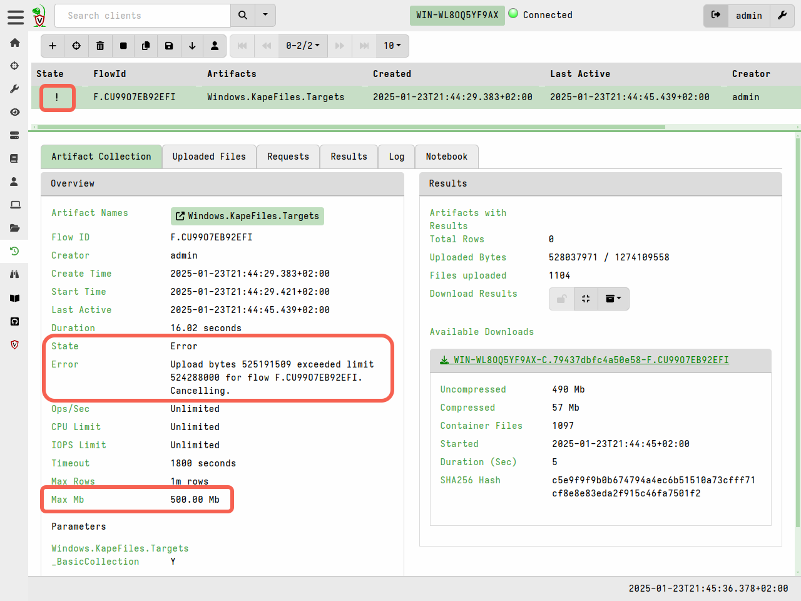

In DFIR Triaging means to quickly collect information about the system
in order to establish its potential relevance to a forensic
investigation.

While many think of triage as collecting files (perhaps as an
alternative to full disk acquisition), in Velociraptor, there is no
real difference between collecting files or other non-volatile
artifacts: Everything that Velociraptor collects is just a VQL
Artifact.

We like to think of triage as simply capturing machine state - where
the state may be bulk files (like the `$MFT` or registry hives) or any
other volatile data, such as process information, network connections
etc.

### Collecting files

Being able to efficiently and quickly collect and preserve evidence is
important for being able to capture machine state at a point in
time. It is also useful to be able to use these collected files with
other forensic tools that might be able to handle the file formats
involved.

One of the most commonly used artifact is the
`Windows.KapeFiles.Targets` artifact. This artifact is automatically
built from the open source
[KapeFiles](https://github.com/EricZimmerman/KapeFiles) repository.

While originally developed to support the non-opensource Kape tool,
this repository contains many types of files which might be relevant
to collect in a triage scenario. Each Kape "Target" is essentially a
glob expression with a name.

In Velociraptor `Windows.KapeFiles.Targets` is the most popular
artifact for mass file collection.  It does no analysis but simply
collects a bunch of files based on the targets specified.

Start by selecting the artifact from the "New Collection" wizard

Next we need to select the "Targets" in the "Configure Parameters"
step. Many targets are simply collections of other targets. For
example the `_BasicCollection` target automatically includes a number
of other useful targets.

The `Windows.KapeFiles.Targets` artifact can transfer a large quantity
of data from the endpoints, and take a long time to run. We therefore
often need to update the resource control of the collection.

Once the collection is launched, we can monitor progress in the "Artifact Collection" tab.

{}

Velociraptor is very careful about the performance and resource impact
on endpoints. When collecting many files if it is often hard to
determine in advance how much data will be collected or how long it
will take. For safety, Velociraptor allows limits to be set after
which the collection is cancelled. You can also interactively cancel
the collection by clicking the "Stop" button.

Be aware that a lot of data can be collected which might fill up the
VM disk.

> Math is a harsh mistress:
> Collecting 100Mb  from 10,000 endpoints = 1Tb
>
> Note that typically $MFT is around 300-400Mb so collecting the $MFT
> from many endpoints is going to be huge!

{}

## Offline collections

We have seen previously how to collect many files using the
`Windows.KapeFiles.Targets` artifact in the usual client/server
mode. But what if we are unable to deploy Velociraptor on a new
network in client/server mode? With Velociraptor not installed on the
endpoint, how shall we collect and triage artifacts?

Velociraptor is just a VQL engine!  All we need is Velociraptor to be
able to collect the VQL artifacts into a file, and then we can
transport the file ourselves for analysis.  Velociraptor does not
really need a server...

Often we rely of an external helper (such as a local admin) to
actually perform the collection for us. However, these helpers are
often not DFIR experts. We would like to provide them with a solution
that performs the required collection with minimal intervention - even
to the point where they do not need to type any command line
arguments.

The [Offline collector]()
aims to solve this problem. Velociraptor allows you to build a specially
configured binary (which is actually just a preconfigured Velociraptor binary
itself) that will automatically collect the artifacts we need.

