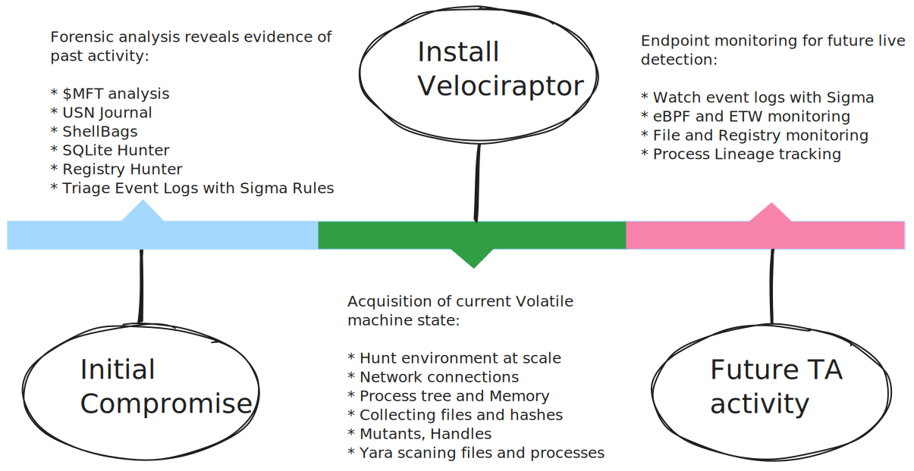

+++
title = "Velociraptor Overview"
date = 2021-06-09T02:33:37Z
weight = 5
chapter = false
+++

Velociraptor is a unique, advanced open-source endpoint monitoring,
digital forensic and cyber response platform. Velociraptor covers the
entirety of the attack life cycle, providing responders a powerful
capability to address past, present and future events.

## The incident response timeline

The attack timeline consists of 3 general times; The initial attack,
the time of response and future attacker activities.

### The initial attack

If Velociraptor is not already deployed as a standard part of the
environment, the initial attack is likely to have occurred at a prior
time before Velociraptor's installation. This time could range from
hours to weeks or months.

Velociraptor's digital forensic capability provides a lens into these
past activities: By utilizing the latest state of the art digital
forensic artifacts and analysis technology, Velociraptor can reveal
important clues of the initial vector of compromise.

### The present time

Once Velociraptor is installed in the environment, the primary goal is
to quickly identify compromised assets. Velociraptor's powerful
triaging artifacts can identify anomalies quickly and at scale. By
scaling triage analysis to the entire environment (In Velociraptor's
terminology: `Hunting the environment`) we are able to zero in on
compromised assets quickly.

Once identified, triaged assets can be analyzed in detail, preserving
important volatile information such as processes, network connections
and memory. These collections can be made with minimal endpoint
impact, using Velociraptor's sophisticated control of endpoint
resource usage.

Additionally, Velociraptor can be used for remediation at scale. This
makes recovering from incidents or securing systems against future
attacks faster and more efficient.

### Detecting future attacks

Once installed in the environment, Velociraptor's client monitoring
capability allows for live, realtime detection of malicious
activity. By tapping into live event sources, such as Event Tracing
for Windows (`ETW`) or `eBPF` on Linux, and utilizing `Sigma` rules,
Velociraptor's detection engine can identify suspicious activity in
real time.

Velociraptor's real time monitoring can also ensure future compliance
and detect when an endpoint falls out of compliance (either
maliciously or accidentally). For example by changing configuration to
weaken endpoint security.

## VQL - the Velociraptor difference

Velociraptor's power and flexibility comes from the Velociraptor Query
Language (VQL). VQL is a framework for creating highly customized
**artifacts**, which allow you to collect, query, and monitor almost
any aspect of an endpoint, groups of endpoints, or an entire
network. It can also be used to create continuous monitoring rules on
the endpoint, as well as automate tasks on the server.

Unlike other tools, VQL allows users to customize Velociraptor: From
updating existing artifacts or adding entirely new artifacts, to fully
automating post processing and system administration. Velociraptor's
VQL enables an open system, adaptable to any environment or
requirement with ease.

## The Velociraptor Philosophy

Traditional DFIR procedures typically follow these high level phases:

1. `Acquisition`: In this phase the investigator collects all the raw
   data for example, memory or disk images.
2. `Post Processing`: In this phase the investigator runs various
   scripts and tools to extract high level information from the raw
   data.
3. `Analysis and Reporting`: In this phase the investigator looks
   through the data reported in the previous step and extract
   information relevant to the specific case.

When experienced DFIR professionals are first introduced to
Velociraptor, they proceed to use it this traditional
workflow. However, they soon find out that this process simply does
not scale and it is not effective. For example, acquiring a basic
triage collection (`$MFT`, event logs, USN Journal etc) might be
several Gb in size. This size is manageable for one or a few hosts,
but collecting these across 100,000 hosts is simply not viable!

Velociraptor's philosophy is different: We treat the source of truth
as the actual endpoints. We then pose targeted queries of these
endpoints aiming to directly progress the investigation.

> Rather than collecting all the data into a central location and then
> running queries on that, we push the queries to the endpoints and
> parse artifacts directly on the endpoint itself.

When reading the rest of the documentation on this site, bear in mind
the following:

1. Queries should be targeted and return high value data if possible.
   * E.g. instead of collecting all event logs, use targeted
     Sigma rules to highlight only important events.

2. Aim to reduce the amount of post processing on the server as much
   as possible.
   * E.g. Instead of parsing the `$MFT` on the endpoint and then
     filtering it on the server for the time range of interest,
     directly time box the MFT on the endpoint to only deliver
     relevant files.

3. Think about why you want to collect a certain artifact, not what
   the artifact is and how to parse it.

## How to get started with Velociraptor

For a new user with no prior knowledge of Velociraptor, we recommended that you
follow this learning path:

1. Start by understanding what Velociraptor is and its purpose as a DFIR and
   endpoint monitoring tool. Learn about its core function of collecting
   endpoint information using VQL (the Velociraptor Query Language). Training
   videos and initial documentation provide this foundational knowledge.

2. Learn how to install and set up Velociraptor, starting with a simple local
   deployment, perhaps on a Windows VM for familiarity. The documentation,
   especially our Quickstart Guide, and training sessions cover installation and
   deployment basics.

3. Become familiar with the Velociraptor GUI. Learn about Artifacts and get
   familiar with using the Artifact Collector flow in the GUI to run some of the
   many built-in artifacts on a single host. This demonstrates the tool's
   capabilities and how to gather data without immediately needing to write
   queries. Explore the artifact documentation to understand the different
   artifact types and capabilities.

4. Once you are comfortable running existing artifacts, dive into the
   Velociraptor Query Language (VQL). This is a crucial step to unlock the
   tool's full potential. Resources like the VQL Fundamentals documentation and
   dedicated training videos are recommended. Practicing with simple examples in
   a notebook is a good way to learn. Becoming familiar with the "VQL mindset"
   is an important aspect.

5. After building a foundation in VQL, explore more advanced topics. This
   includes writing custom artifacts, understanding the client/server
   architecture in more depth, learning about enterprise deployment
   considerations (performance, resources), client monitoring, hunting, incident
   response features like quarantine, and how to integrate with other tools. The
   VQL reference documentation and community discussions offer insights into
   specific functions and plugins. Throughout this learning journey, you are
   encouraged to consult the extensive documentation available on the
   Velociraptor website, including the main documentation pages, the VQL
   reference, the knowledge base, the blog, and training materials. Engaging
   with the community, such as on Discord, is also a valuable source of help and
   examples.
