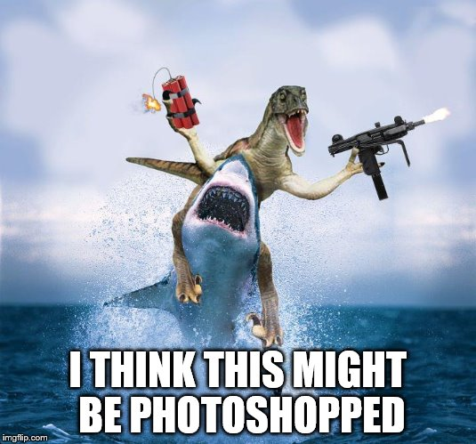

+++
title = "Velociraptor Overview"
date = 2021-06-09T02:33:37Z
weight = 5
chapter = false
+++

Velociraptor is a unique, advanced open-source endpoint monitoring,
digital forensic and cyber response platform.

It was developed by Digital Forensic and Incident Response (DFIR) professionals who needed a
powerful and efficient way to hunt for specific artifacts and monitor activities across
fleets of endpoints. Velociraptor provides you with the ability to more effectively respond to a wide range of digital
forensic and cyber incident response investigations and data breaches:

* Reconstruct attacker activities through digital forensic analysis
* Hunt for evidence of sophisticated adversaries
* Investigate malware outbreaks and other suspicious network activities
* Monitory continuously for suspicious user activities, such as files
  copied to USB devices
* Discover whether disclosure of confidential information occurred outside the network
* Gather endpoint data over time for use in threat hunting and
  future investigations

## VQL - the Velociraptor difference

Velociraptor's power and flexibility comes from the Velociraptor Query
Language (VQL). VQL is a framework for creating highly customized
**artifacts**, which allow you to collect, query, and monitor almost
any aspect of an endpoint, groups of endpoints, or an entire
network. It can also be used to create continuous monitoring rules on
the endpoint, as well as automate tasks on the server.

## The Velociraptor Philosophy

Traditional DFIR procedures typically follow the following high level
phases:

1. `Acquisition`: In this phase the investigator collects all the raw
   data for example, memory or disk images.
2. `Post Processing`: In this phase the investigator runs various
   scripts and tools to extract high level information from the raw
   data.
3. `Analysis and Reporting`: In this phase the investigator looks
   through the data reported in the previous step and extract
   information relevant to the specific case.

When experienced DFIR professionals are first introduced to
Velociraptor, they proceed to use it this traditional
workflow. However, they soon find out that this process simply does
not scale and it is not effective. For example, acquiring a basic
triage collection (`$MFT`, event logs, USN Journal etc) might be
several Gb in size. This size is manageable for one or a few hosts,
but collecting these across 100,000 hosts is simply not viable!

Velociraptor's philosophy is different: We treat the source of truth
as the actual endpoints. We then pose targeted queries of these
endpoints aiming to directly progress the investigation.

> Rather than collecting all the data into a central location and then
> running queries on that, we push the queries to the endpoints and
> parse artifacts directly on the endpoint itself.

When reading the rest of the documentation on this site, bear in mind
the following:

1. Queries should be targeted and return high value data if possible.
   * E.g. instead of collecting all event logs, use targeted
     Sigma rules to highlight only important events.

2. Aim to reduce the amount of post processing on the server as much
   as possible.
   * E.g. Instead of parsing the `$MFT` on the endpoint and then
     filtering it on the server for the time range of interest,
     directly time box the MFT on the endpoint to only deliver
     relevant files.

3. Think about why you want to collect a certain artifact, not what
   the artifact is and how to parse it.

## Documentation overview

The site is divided into the following parts

- [Deployment]() where you will learn the different deployment options.

- [GUI Tour]() provides a tour of the user interface.

- [VQL Fundamentals]() provide a deep dive into VQL and how to write your own artifacts and queries.
