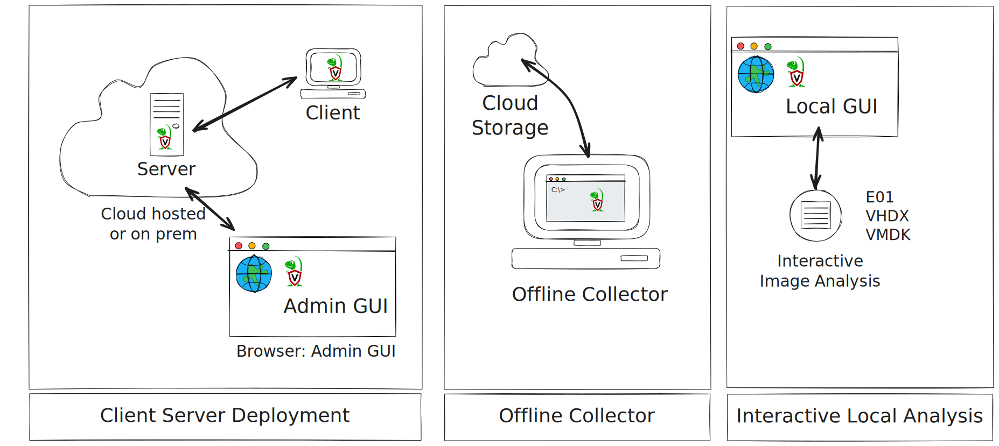

+++
title = ""
menutitle = "Velociraptor Overview"
date = 2021-06-09T02:33:37Z
weight = 5
chapter = false
+++

{}

Velociraptor is a unique, enterprise grade, open-source platform for
endpoint monitoring, digital forensic and cyber response. Velociraptor
covers the entirety of the attack life cycle, providing responders a
powerful capability to address past, present and future events.

{}

## The incident response timeline

The attack timeline consists of 3 general times; The initial attack,
the time of response and future attacker activities.

* **The initial attack**: If Velociraptor is not already deployed as a
  standard part of the environment, the initial attack is likely to
  have occurred at a prior time before Velociraptor's
  installation. This time could range from hours to weeks or months.

  Velociraptor's digital forensic capability provides a lens into
  these past activities: By utilizing the latest state of the art
  digital forensic artifacts and analysis technology, Velociraptor can
  reveal important clues of the initial vector of compromise.

* **The present time**: Once Velociraptor is installed in the
  environment, the primary goal is to quickly identify compromised
  assets. Velociraptor's powerful triaging artifacts can identify
  anomalies quickly and at scale. By scaling triage analysis to the
  entire environment (In Velociraptor's terminology: `Hunting the
  environment`) we are able to zero in on compromised assets quickly.

  Once identified, triaged assets can be analyzed in detail,
  preserving important volatile information such as processes, network
  connections and memory. These collections can be made with minimal
  endpoint impact, using Velociraptor's sophisticated control of
  endpoint resource usage.

  Additionally, Velociraptor can be used for remediation at
  scale. This makes recovering from incidents or securing systems
  against future attacks faster and more efficient.

* **Detecting future attacks**: Once installed in the environment,
  Velociraptor's client monitoring capability allows for live,
  realtime detection of malicious activity. By tapping into live event
  sources, such as Event Tracing for Windows (`ETW`) or `eBPF` on
  Linux, and utilizing `Sigma` rules, Velociraptor's detection engine
  can identify suspicious activity in real time.

  Velociraptor's real time monitoring can also ensure future
  compliance and detect when an endpoint falls out of compliance
  (either maliciously or accidentally). For example by changing
  configuration to weaken endpoint security.

## How can you use Velociraptor?

Velociraptor can be used in many ways depending on your requirements.

* **Client Server deployment**: This is the most common way to use
  Velociraptor. The agent (In Velociraptor terminology `client`) is
  deployed as a service on all endpoints. The Velociraptor server may
  be deployed in the cloud or on premises. Clients connect back to the
  server using a persistent connection, ready to be tasked by the
  Velociraptor investigator to collect artifacts, hunt etc.

  This deployment method allows you to rapidly iterate through the
  investigative process, collecting evidence, analysing and
  recollecting rapidly.

* **Offline collector**: If the Velociraptor client can not be
  installed on the endpoint, Velociraptor allows the creation of
  `Offline Collectors`. These are preconfigured binaries, set to
  collect specific artifacts into a local encrypted ZIP file. The
  collections can be automatically uploaded to a central repository
  such as a cloud storage service.

  Collections can be subsequently imported into the server for
  analysis, just like the client server model above.

* **Interactive analysis**: Velociraptor can be used for analysis of
  raw disk images. Using remapping rules, a `virtual client` can be
  launched which uses the disk image to collect the same VQL
  artifacts. This allows disk images to be analysed using the same
  procedure.

## The Velociraptor ecosystem

Velociraptor was designed to be an open system, allowing many other
tools to interact and utilize Velociraptor as a platform.

* **Collection**: Apart from the usual Client/Server model,
  Velociraptor can also leverage existing EDR or Remote Management
  Tools (e.g. Group Policy) to remotely launch the offline
  collector. The collection can be automatically uploaded to the cloud
  then re-imported into the GUI. This is used by e.g. [Lima
  Charlie](https://docs.limacharlie.io/docs/ext-velociraptor).

  Velociraptor can also push third party tools to the endpoint,
  executing them remotely and transferring their results back to the
  server. This allows third party tools to be deployed safely at scale
  and orchestrated using Velociraptor in wide ranging Hunts. Examples
  include [Nextron
  Thor](https://www.nextron-systems.com/2023/11/03/integration-of-thor-in-velociraptor-supercharging-digital-forensics-and-incident-response/),
  [Cyber
  Triage](https://www.cybertriage.com/blog/scope-with-velociraptor-analyze-with-cyber-triage/)
  and [Hayabusa]()

* **Analysis**: Velociraptor offers a powerful interactive notebook
  environment for collaborative analysis. However, it is also possible
  to export collected data to other common platforms, such as
  [Timesketch]().

* **Exports**: Collected data can be conveniently exported to archives
  such as Zip file, automatically [backed up the cloud]() or exported
  in real time to data lakes such as [Splunk]() or
  [Elastic]().

* **Automation**: Velociraptor can be fully automated using a `gRPC`
  based API. The API allows Velociraptor to be controlled from many
  languages, including Python, Go, Java and even Shell Scripts.

  Using the API it is possible to both read collected data and control
  further collection, thereby implementing a flexible SOAR capability
  and enhancing interoperability with other systems.

## VQL - the Velociraptor difference

Velociraptor's power and flexibility comes from the Velociraptor Query
Language (VQL). VQL is a framework for creating highly customized
**artifacts**, which allow you to collect, query, and monitor almost
any aspect of an endpoint, groups of endpoints, or an entire
network. It can also be used to create continuous monitoring rules on
the endpoint, as well as automate tasks on the server.

Unlike other tools, VQL allows users to customize Velociraptor: From
updating existing artifacts or adding entirely new artifacts, to fully
automating post processing and system administration. Velociraptor's
VQL enables an open system, adaptable to any environment or
requirement with ease.

## The Velociraptor Philosophy

Traditional DFIR procedures typically follow these high level phases:

1. `Acquisition`: In this phase the investigator collects all the raw
   data for example, memory or disk images.
2. `Post Processing`: In this phase the investigator runs various
   scripts and tools to extract high level information from the raw
   data.
3. `Analysis and Reporting`: In this phase the investigator looks
   through the data reported in the previous step and extract
   information relevant to the specific case.

When experienced DFIR professionals are first introduced to
Velociraptor, they proceed to use it this traditional
workflow. However, they soon find out that this process simply does
not scale and it is not effective. For example, acquiring a basic
triage collection (`$MFT`, event logs, USN Journal etc) might be
several Gb in size. This size is manageable for one or a few hosts,
but collecting these across 100,000 hosts is simply not viable!

Velociraptor's philosophy is different: We treat the source of truth
as the actual endpoints. We then pose targeted queries of these
endpoints aiming to directly progress the investigation.

> Rather than collecting all the data into a central location and then
> running queries on that, we push the queries to the endpoints and
> parse artifacts directly on the endpoint itself.

When reading the rest of the documentation on this site, bear in mind
the following:

1. Queries should be targeted and return high value data if possible.
   * E.g. instead of collecting all event logs, use targeted
     Sigma rules to highlight only important events.

2. Aim to reduce the amount of post processing on the server as much
   as possible.
   * E.g. Instead of parsing the `$MFT` on the endpoint and then
     filtering it on the server for the time range of interest,
     directly time box the MFT on the endpoint to only deliver
     relevant files.

3. Think about why you want to collect a certain artifact, not what
   the artifact is and how to parse it.

## Velociraptor is a mature enterprise grade DFIR framework

The DFIR world moves quickly! There are many threats, vulnerabilities,
forensic artifacts and detection techniques discovered and reported on
daily. Many researches release small tools or scripts to showcase
their work.

However, it is difficult to scale these ad hoc, small scale tools to an
enterprise network. Most ad hoc tools are missing enterprise features,
such as strong auditing, two factor authentication, machine readable
output, a powerful API that facilitates automation and easy
integration with other systems, and many other features critical to a
successful enterprise deployment.

Velociraptor's goal is to provide the enterprise level platform which
enables leveraging novel techniques. Velociraptor's mature enterprise
features are suitable for high security installations. At the same
time, Velociraptor's VQL language provides the building blocks to
develop powerful detection, hunting and analysis techniques easily -
all built in a solid foundation. It is usually trivial to implement
novel one shot detection tools in VQL leveraging the safety and
security that comes with Velociraptor.

For example, imagine new threat is discovered which requires a scan of
all assets. A researcher publishes a python script to perform this
scan which works on their systems.

However, deploying this ad hoc python script widely, perhaps using
standard system management software, we find excessive CPU use, false
positives, and potential security vulnerabilities introduced by the
script itself or additional dependencies. Python or other dependencies
may not be installed on all assets causing many systems to fail to run
this tool. The output from the tool may also not be machine readable
leading to time consuming manual analysis.

Re-implementing the same functionality in VQL allows the same scan to
proceed safely with CPU limits, resource controls, tracking which
endpoints are clean, proper auditing and a secure
deployment. Additionally we have machine readable output which can be
easily fed to other systems like SIEM.

If you do no have the time to reimplement in VQL - no problem! You can
also deploy the same ah hoc tool with Velociraptor to leverage some of
the above benefits quickly.

## Who are these documentation pages for?

The documentation on this site is therefore split into several types
of audience:

1. Enterprise deployment documentation discusses the many features
   that make Velociraptor a powerful enterprise platform:
   - Security, Auditing and Deployment documentation
   - How to integrate Velociraptor with other platforms. Build
     pipelines and automation.
   - Maintaining the deployment in the long term - backup,
     provisioning etc.
   - Managing Multi-tenancies and user permissions, ACLs etc

2. Developing new artifacts and forensic capability. This audience is
   more interested in VQL syntax, how to develop novel parsers,
   detection rules and generally enhance the capability of
   Velociraptor.

3. Those practitioners on the front-line of incident response are more
   interested in what kind of artifacts they should be hunting for, in
   which situation and what information can these provide to the
   ongoing response process.

   These are covered by the [playbooks]({}), and artifact references.

These aspects are complimentary - without a secure and well
maintained enterprise deployment is it difficult to widely deploy
Velociraptor in an enterprise. Similarly without solid technical
capabilities to hunt and detect new threats there is no point in
Velociraptor at all! This is our core mission.

## How to get started with Velociraptor

For a new user with no prior knowledge of Velociraptor, we recommended that you
follow this learning path:

1. Start by understanding what Velociraptor is and its purpose as a DFIR and
   endpoint monitoring tool. Learn about its core function of collecting
   endpoint information using VQL (the Velociraptor Query Language). Training
   videos and initial documentation provide this foundational knowledge.

2. Learn how to install and set up Velociraptor, starting with a simple local
   deployment, perhaps on a Windows VM for familiarity. The documentation,
   especially our Quickstart Guide, and training sessions cover installation and
   deployment basics.

3. Become familiar with the Velociraptor GUI. Learn about Artifacts and get
   familiar with using the Artifact Collector flow in the GUI to run some of the
   many built-in artifacts on a single host. This demonstrates the tool's
   capabilities and how to gather data without immediately needing to write
   queries. Explore the artifact documentation to understand the different
   artifact types and capabilities.

4. Once you are comfortable running existing artifacts, dive into the
   Velociraptor Query Language (VQL). This is a crucial step to unlock the
   tool's full potential. Resources like the VQL Fundamentals documentation and
   dedicated training videos are recommended. Practicing with simple examples in
   a notebook is a good way to learn. Becoming familiar with the "VQL mindset"
   is an important aspect.

5. After building a foundation in VQL, explore more advanced topics. This
   includes writing custom artifacts, understanding the client/server
   architecture in more depth, learning about enterprise deployment
   considerations (performance, resources), client monitoring, hunting, incident
   response features like quarantine, and how to integrate with other tools. The
   VQL reference documentation and community discussions offer insights into
   specific functions and plugins. Throughout this learning journey, you are
   encouraged to consult the extensive documentation available on the
   Velociraptor website, including the main documentation pages, the VQL
   reference, the knowledge base, the blog, and training materials. Engaging
   with the community, such as on Discord, is also a valuable source of help and
   examples.
