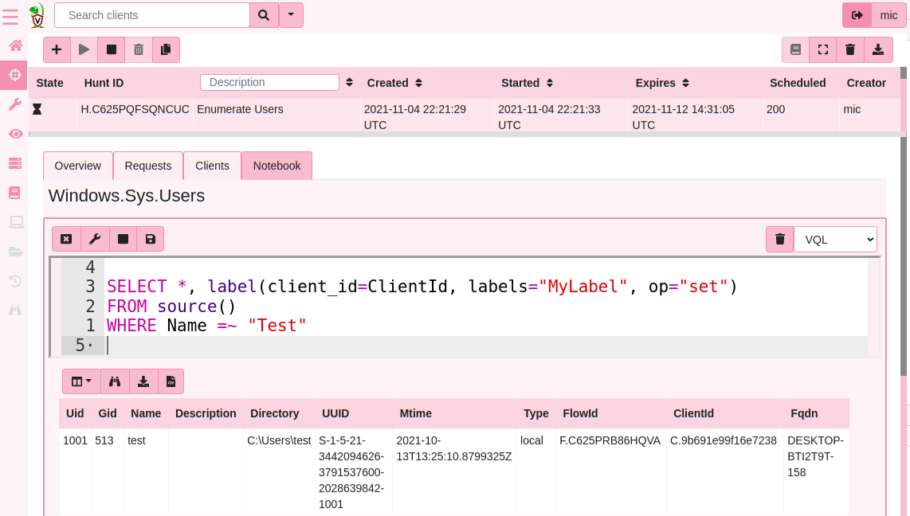

Velociraptor's unprecedented flexibility arises from the power of
VQL. We have seen how VQL can be used to collect artifacts on the
endpoint, but VQL can be used on the server too.

Running VQL queries on the server allows for tasks on the server to be
automated. In this page we will see how server artifacts can be used
to customize server behaviour.

Before we discuss server automation we need to clarify some of the
terms used when discussing the server.

* **Client**: A Velociraptor instance running on an endpoint. This is
  denoted by client_id and indexed in the client index.

* **Flow**: A single artifact collection instance. Can contain
  multiple artifacts with many sources each uploading multiple files.

* **Hunt**: A collection of flows from different clients. Hunt results
  consist of the results from all the hunt's flows

## Running server queries

The easiest way to run VQL queries on the server is simply using a
notebook. Since notebook cells are evaluated within the server
context, the query will be run directly on the server and therefore
have access to all server information, make server configuration
changes etc.

Practically notebook queries timeout after a 10 min period. Currently
this limit can not be increased (It is set in the configuration
file). If you find that the 10 min limit is insufficient, simply
create a server artifact from the query you wish to run and launch it
within the server artifacts screen. Server artifacts may be collected
with increased time limits.

{}

Although it is possible to run any VQL queries on the command line
using the `velociraptor query` command, VQL plugins that change server
state should not be run this way.

This is because many administrative VQL plugins
(e.g. `collect_client()`) will change the underlying data store but
the running server will not be aware that these changes are made.

It is only supported to run administrative VQL plugins using the
following methods:

1. The notebooks
2. Server Artifacts
3. Using the [Velociraptor API]({})

{}


## Enumerating all clients

You can enumerate all clients using the `clients()` plugin. This
plugin provides basic information about each client on the system,
including its client id and labels assigned to it.

{}

If you do not provide any parameters to the `client()` plugin,
Velociraptor will iterate over all the clients. This may result in a
lot of rows. You can provide a `search` parameter, that uses the
client index to find clients by label or hostname very quickly (This
is the same mechanism used in the GUI search bar).

```sql
-- Use this
SELECT * FROM clients(search="MyHostname")

-- Rather than this
SELECT * FROM clients()
WHERE os_info.fqdn =~ "MyHostname"

-- Use this
SELECT * FROM clients(search="label:MyLabel")

-- Rather than this
SELECT * FROM clients()
WHERE labels =~ "MyLabel"
```

{}

An example of a client record can be seen here

```json
  {
    "client_id": "C.04b2307000dfdf7a",
    "agent_information": {
      "version": "2021-06-30T22:38:41Z",
      "name": "velociraptor",
    },
    "os_info": {
      "system": "windows",
      "release": "Microsoft Windows 10 Enterprise Evaluation10.0.19041 Build 19041",
      "machine": "amd64",
      "fqdn": "DESKTOP-8B08MEV-2",
      "install_date": 0,
    },
    "first_seen_at": 1625214706,
    "last_seen_at": 1625236655282715,
    "last_ip": "127.0.0.1:53786",
    "last_interrogate_flow_id": "F.C3FCU0R46JK6S",
    "labels": []
  }
```

The `first_seen_at` and `last_seen_at` times are given in ns and
seconds since the epoch. You can use the `timestamp()` function to
convert those to a timestamp.

For example here is a query to return all clients currently connected:

```vql
-- Find clients that were last seen less than 10 min ago.
SELECT * FROM clients()
WHERE timestamp(epoch=last_seen_at) > now() - 600
```

### Exercise - label clients

Labels are used within Velociraptor to group certain hosts
together. This is useful for example when targeting a hunt, or to
specify a set of clients to run monitoring queries.

You can change a client's label using the `label()` VQL function.

### Exercise - Label all windows machines with a certain local username.

To find out all the users on each endpoint, run a hunt for
`Windows.Sys.Users`. Then simply run the following query in the hunt's
notebook.

```vql
SELECT label(client_id=client_id, op='set', labels="MyLabel"), client_id
FROM source()
WHERE Name =~ "Mike"
```




{}

Remember that VQL queries are lazy. This means that the label()
function will only be evaluated on rows that pass the condition `Name
=~ "Mike"`. Rows that do not include this name will be eliminated
without evaluating the `label()` function, and therefore will not
cause the client to be labeled.

The `source()` simply reads all the rows that were collected. It is
context aware, so if invoked within a hunt notebook, the plugin
generates all rows from all collected clients within the hunt. If
evaluated within a collection notebook it generates all rows in this
collection etc. You can also specify the exact hunt ID explicitly if
needed.

{}

Using selective hunting and post processing can be used to label hosts
based on any property of grouping that makes sense (e.g. installed
software, geolocation etc).

With suitable label groups it is possible to target our hunts on only
these machines.
