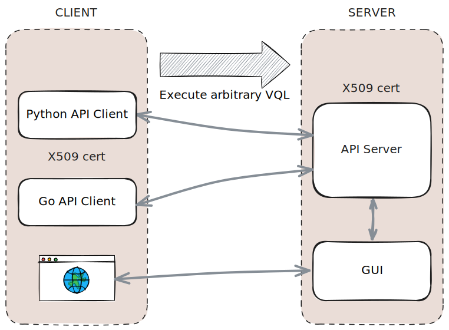
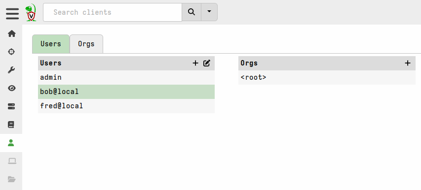
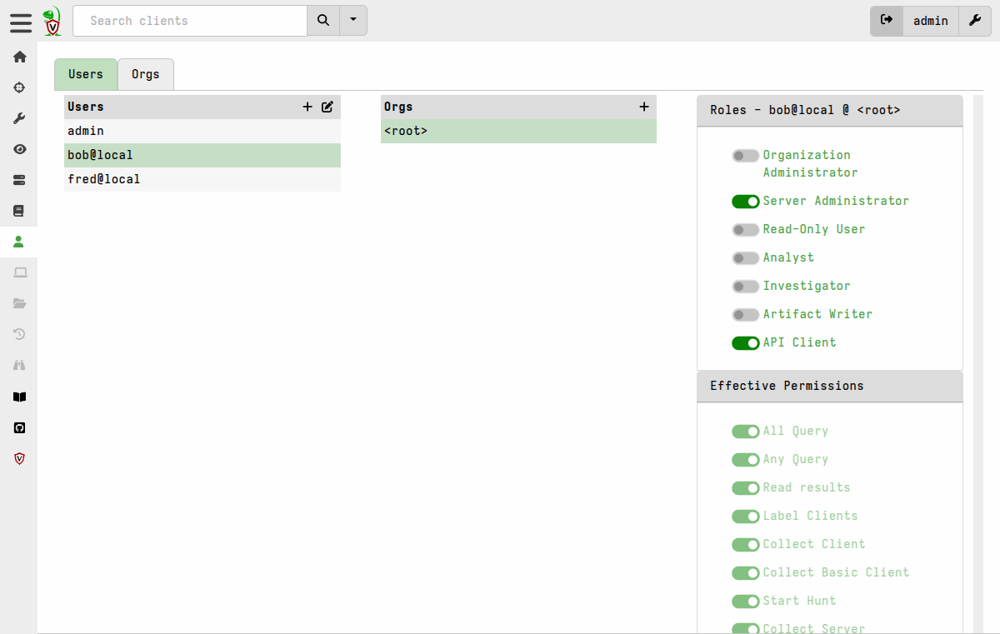
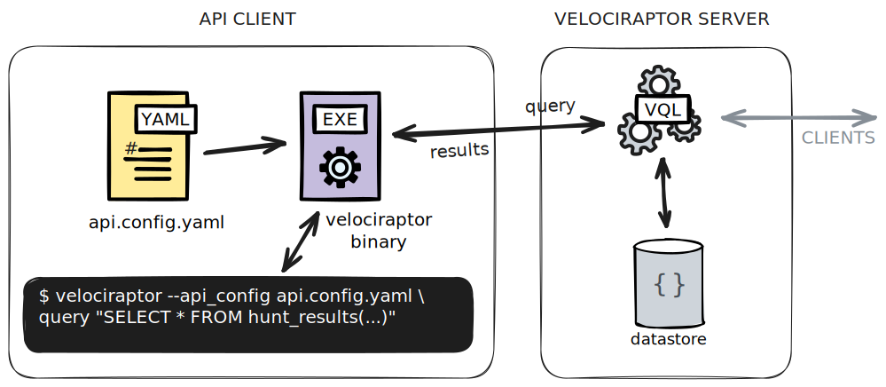

Velociraptor can be fully controlled by external programs using the
Velociraptor API. In this page you will learn how to connect to the
server using the API and control it using a Python script to schedule
collections on hosts and retrieve the results of those collections.

{}

Connecting an external program to Velociraptor via the API can enable
a `SOAR` like workflow, automating the launching and reading or
artifact data.

This can increase the attack surface of the system, as compromise of
the API keys can enable an attacker to act on the Velociraptor server
with the permissions given to the key.

Please, be aware of the implications of allowing automated collection on
endpoints and review the information in [Artifact Security]() carefully.

{}

## Why an API?

Modern threat detection and DFIR work consists of many different products and
tools all working together. In reality Velociraptor is just a part of a larger
ecosystem consisting of network detections, SIEM or other tools. It is therefore
important to ensure that Velociraptor integrates well with other tools.

Generally there are two main requirements for Velociraptor integration:

1. Velociraptor can itself control other systems. This can be achieved
   using VQL and the execve() or http_client() plugins (See [Extending VQL]() for an example)

2. Velociraptor can be controlled by external tools. This allows
   external tools to enrich and automate Velociraptor using an
   external API

## API Server

The Velociraptor API is exposed over a streaming gRPC server. The gRPC
protocol allows encrypted and streaming communications between API
clients (i.e. calling external programs) and Velociraptor itself.

The communication is encrypted and protected using mutual certificate
authentication verified by the built in Velociraptor CA. This means
that callers are identified by their client certificates which must be
issued by the Velociraptor CA.



The Velociraptor API itself is very simple, yet extremely powerful! It
simply exposes a method called `Query`. Callers are able to run
arbitrary VQL queries and stream the results over the single API call.

Since VQL allows for many tasks, from server administration, post
processing of collection results and scheduling of new collections,
the API is extremely flexible and powerful.

### Protecting the API

The API is extremely powerful so it must be protected! The whole point
of an API is to allow a client program (written in any language) to
interact with Velociraptor. Since we use certificates to authenticate
callers, the client program must present a certificate as part of its
connection (This mechanism is built into gRPC).

The server can mint a certificate for the client program to use. This
allows it to authenticate and establish a TLS connection with the API
server.


By default the API server only listens on 127.0.0.1 - this allows
scripts on the local machine to call into the API, but if you want to
use an external caller you can change the server's configuration file
by setting the `bind_address` field under the `API` section to
`0.0.0.0` allowing the API to bind on all interfaces. Following is the
relevant excerpt from the configuration file.

```yaml
API:
  hostname: www.example.com
  bind_address: 0.0.0.0
  bind_port: 8001
  bind_scheme: tcp
  pinned_gw_name: GRPC_GW
```

After this change the server will report on the logs that the API
server is now listening on all interfaces.

```text
[INFO] 2021-11-07T01:57:26+10:00 Starting gRPC API server on 0.0.0.0:8001
```

### Creating an API client configuration

You can create a new client api config file which includes a client certificate
that allows the client program to identify itself with the server. The server
will verify that the certificate is signed by the Velociraptor CA prior to
accepting connections. The produced YAML file contains private keys, public
certificates, the CA's certificate, and connection parameters.

Example:
```
$ velociraptor --config server.config.yaml config api_client --name Mike --role administrator api.config.yaml
```

This command can be broken into:
1. `--config server.config.yaml`: load the server config which contains
   the CA private keys needed to sign a new minted certificate. This also allows
   the CLI command to create a new user in the server's datastore.

2. `config api_client`: generate an api_client configuration, including client
   certificate.

3. `--name Mike`: Certificates represent user identities. The name of the
   certificate will be used to identify the caller and enforce ACLs on it. If
   the user does not exist then it will be created in the datastore and the
   server will need to be restarted for it to recognize the new user.

4. `--role administrator`: This option will also assign a role to the new
   identity. The role is used to test permissions of what the caller may do. If
   `--role` is specified then the user will be created on the server if it does
   not already exist. In the example above the user is granted the role
   `administrator` which includes all the permissions of the minimal API role
   `api` - see note below.

The API connection string included in the API config is constructed from the
values `API.hostname` and `API.bindaddress` in the server configuration, so you
should ensure that these are set correctly before generating the API config
file.

#### Managing API roles

The Velociraptor GUI contains a User Management screen where you can inspect all
the currently issued API users as well as GUI users. There is inherently no
difference between API users and GUI users other than the fact that API users
are authenticated with certificates.



The API client certificate is valid for 1 year. Before expiry you should create
a new API client configuration file, containing a new client certificate, to
avoid being impacted by the certificate expiry.

##### Granting roles

For an API user to be able to connect it must have at least the `api` role. This
is the minimum role to allow external connections to the API. In addition the
API user will need roles granted that provide it with the permissions that you
need it to have. The roles and permissions should be appropriate for your
specific use case. Note that the `administrator` role is very powerful and we
recommend that external programs NOT be given this role. Instead consider
carefully what permission the external program requires on the server and select
the appropriate role for it based on "least permissions" principles.


##### Inspecting roles

At any time you can inspect the roles given to the user using the `acl show`
command.

```
$ velociraptor --config server.config.yaml acl show bob@local
{"roles":["administrator","api"]}
```

Or you can view the roles and effective permissions in the GUI's User Management
screen:



Or you can query the roles using VQL:

```vql
SELECT * FROM gui_users() WHERE name = "bob@local"
```

##### Changing roles

Roles can be easily added or removed in the GUI's User Management screen.

On the command line you can change the permissions of an existing
user by granting a different role using the `acl grant` command. The `acl grant`
command _replaces_ the existing roles - it does not add to them.

```
$ velociraptor --config server.config.yaml acl grant Mike --role investigator,api
```

Note that role role changes made from the CLI require a service restart. You
will see a message recommending this after running the `acl grant` command.
Changes made in the GUI or VQL do not require a service restart.

##### Removing roles

If an API client's credentials are compromised you can remove all its roles
using the `acl grant` command. This prevents the credentials from being used on
the server at all.

```
$ velociraptor --config server.config.yaml acl grant Mike --role ""
```

In the GUI this can be achieved by deselecting all roles from the user in all
orgs.


## Python bindings

The Velociraptor API uses gRPC which is an open source, high
performance RPC protocol compatible with many languages. The
Velociraptor team officially supports python through the
`pyvelociraptor` project, but since gRPC is very portable, many other
languages can be used including C++, Java etc. This document will
discuss the python bindings specifically as an example.

### Install the python bindings

For python we always recommend a virtual environment and
Python 3. Once you have Python3 installed, simply install the
pyvelociraptor package using pip.

```
pip install pyvelociraptor
```

In order to connect to the gRPC port, check the connection string
setting in the api configuration file. If you want to connect to the
api from a different host you will need to update the connection
string to include the correct IP address or hostname.

```yaml
api_connection_string: www.example.com:8001
name: Mike
```

To test the API connection you can use the `pyvelociraptor`
commandline tool (which was installed via pip above). Let's run a
simple query:

```sh
$ pyvelociraptor --config api_client.yaml  "SELECT * FROM info()"
Sun Nov  7 02:16:44 2021: vql: Starting query execution.
Sun Nov  7 02:16:44 2021: vql: Time 0: Test: Sending response part 0 415 B (1 rows).
[{'Hostname': 'devbox', 'Uptime': 1290254, 'BootTime': 1634925150, 'Procs': 410, 'OS': 'linux', 'Platform': 'ubuntu', 'PlatformFamily': 'debian', 'PlatformVersion': '21.04', 'KernelVersion': '5.11.0-37-generic', 'VirtualizationSystem': '', 'VirtualizationRole': '', 'HostID': '4e7cbddb-e949-4fb9-876a-f4e3e85c9eb4', 'Exe': '/usr/local/bin/velociraptor.bin', 'Fqdn': 'devbox', 'Architecture': 'amd64'}]
Sun Nov  7 02:16:44 2021: vql: Query Stats: {"RowsScanned":1,"PluginsCalled":1,"FunctionsCalled":0,"ProtocolSearch":0,"ScopeCopy":4}
```

The above query uses the api config file to load the correct key
material then sends the query over the network to the API port,
forwarding the resulting query logs and result set to print them on
the console.

The example is just a [sample python program](https://github.com/Velocidex/pyvelociraptor/blob/master/pyvelociraptor/client_example.py) which you can modify as required.


## Schedule an artifact collection

Since VQL is already a powerful and flexible language, we do not need
any other API handlers to be exposed. In the following section we
discuss how VQL can be used to schedule a collection on a client, and
relay back the results as a typical example of using the API to
control Velociraptor artifact collections.

The trick here is that scheduling a collection on a client in
Velociraptor is asynchronous. This makes sense because the client may
not even be online at the moment. Scheduling a collection simply
returns a `flow_id` by which we can reference the flow to check on its
status later.

For this example, say we want to schedule a `Generic.Client.Info`
collection. We will start off by calling the `collect_client()` VQL
function which returns the flow id of the new collection.

```vql
LET collection <= collect_client(
    client_id='C.cdbd59efbda14627',
    artifacts='Generic.Client.Info', env=dict())
```

We can not access the flow's results immediately though because it
might take a few seconds for the client to actually respond. Therefore
we need to wait for the flow to complete.

Velociraptor has a server eventing framework that allows VQL to watch
for changes in server state using the `watch_monitoring()`
plugin. This plugin is an event plugin (i.e. it blocks and simply
returns rows as events occur).

In this example we simply wish to wait until the flow we launched
above is complete. When flows complete, an event is sent on the
`System.Flow.Completion` event queue. You can watch this to be
notified of flows completing

```
LET _ <= SELECT * FROM watch_monitoring(artifact='System.Flow.Completion')
WHERE FlowId = collection.flow_id
LIMIT 1
```

The above query simply begins watching the queue and each flow that is
completed on the system will send an event to the query. We are
looking for a specific flow though which was stored in the
`collection` variable above. Therefore we filter the events by the
WHERE condition.  Finally we wish to quit the query once a single row
is found so we specify a LIMIT of 1 row.

{}
  Note the `LET _ <=` statement. This tells VQL to materialize the query and store the result in a dummy variable. This statement causes VQL to pause and wait for the query to complete before evaluating the next query. See [Materialized LET expressions]() for more about this.
{}

After this query exits we know the collection is complete. This may
take a few seconds if the machine is online or it could take days or
week (or even eternity) to wait for the machine to come back online.

The final step is to read the results of the collection. We can do so
in VQL using the `source()` plugin. This plugin reads collected json
result sets from the server and returns them row by row.

```vql
SELECT * FROM source(
   client_id=collection.request.client_id,
   flow_id=collection.flow_id,
   artifact='Generic.Client.Info/BasicInformation')
```

Note that if an artifact contains multiple sources we need to specify
the exact source we want using the full notation `artifact
name/artifact source`

## Putting it all together

We can string all these queries together (note VQL does not require ; at the end of a statement like SQL).

```sh
$ pyvelociraptor --config api_client.yaml  "LET collection <= collect_client(client_id='C.cdc70ff1039db48a', artifacts='Generic.Client.Info', env=dict())   LET _ <= SELECT * FROM watch_monitoring(artifact='System.Flow.Completion') WHERE FlowId = collection.flow_id LIMIT 1  SELECT * FROM source(client_id=collection.request.client_id, flow_id=collection.flow_id,artifact='Generic.Client.Info/BasicInformation')"

Sun Nov  7 11:32:29 2021: vql: Starting query execution.
Sun Nov  7 11:32:29 2021: vql: Time 0: Test: Sending response part 0 334 B (1 rows).
[{'Name': 'velociraptor', 'BuildTime': '2021-11-07T01:49:52+10:00', 'Labels': None, 'Hostname': 'DESKTOP-BTI2T9T', 'OS': 'windows', 'Architecture': 'amd64', 'Platform': 'Microsoft Windows 10 Enterprise Evaluation', 'PlatformVersion': '10.0.19041 Build 19041', 'KernelVersion': '10.0.19041 Build 19041', 'Fqdn': 'DESKTOP-BTI2T9T', 'ADDomain': 'WORKGROUP'}]
Sun Nov  7 11:32:29 2021: vql: Query Stats: {"RowsScanned":2,"PluginsCalled":2,"FunctionsCalled":2,"ProtocolSearch":0,"ScopeCopy":9}
```

{}

The above query demonstrates a common use case for the API - notifying
an external script of an event occurring on the server. For example
external python scripts can be notified when a specific artifact is
collected, inspect its results, and upload them to further processing
to an external system or escalate alerts for example.

The API connection will simply block until an event occurs allowing
you to create a fully automated pipeline based off Velociraptor
collections, hunts etc.

{}


## Using the shell for automation

You don't have to use a powerful language like Python to connect to
the API. It is possible to write simple shell scripts that use the
Velociraptor API using bash or powershell by leveraging the
velociraptor binary itself.

Velociraptor offers the `query` command which allows you to run any
VQL query. When provided with the `--api_config` flag, Velociraptor
will use that api configuration file to connect remotely to the API
server and run the query there.

Running VQL queries through the API client is equivalent to running them in a
[notebook]() on the server.

This can be chained to other tools and automation orchestrated with a
simple bash script:

```
velociraptor --api_config api.config.yaml query "SELECT * FROM info()" --format jsonl | jq
```


