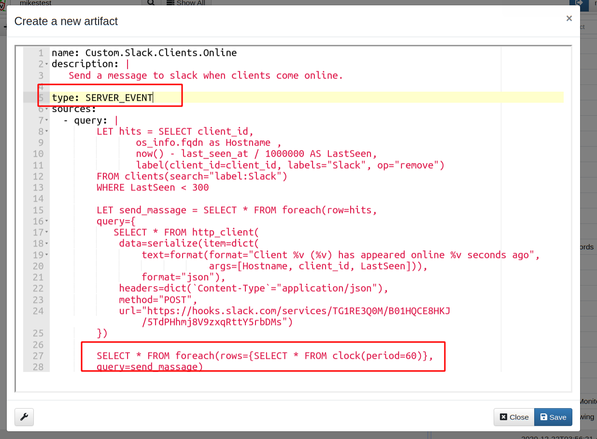
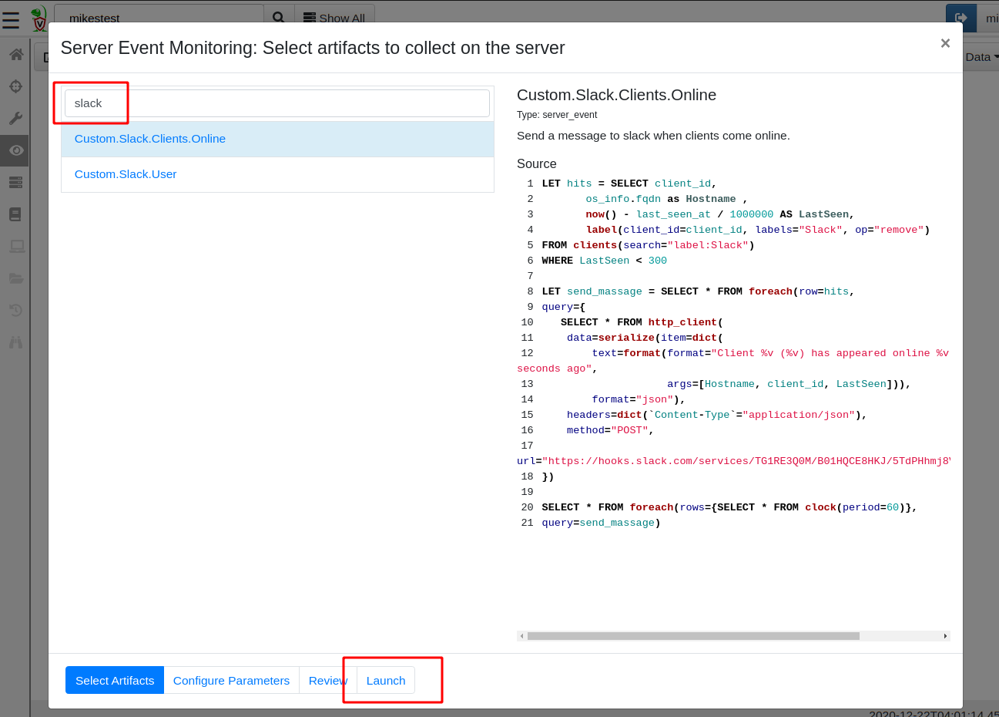
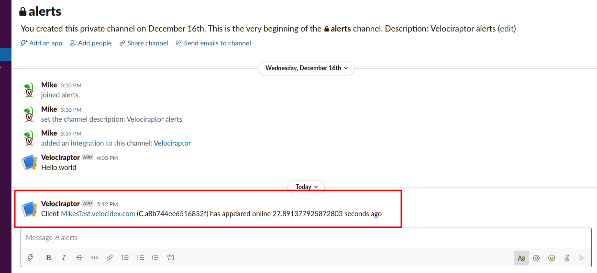
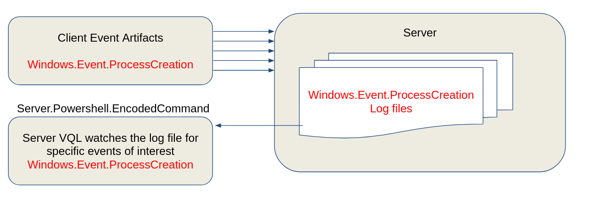
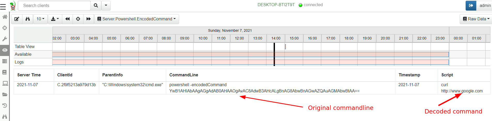

## Server Monitoring

We have previously seen the VQL [Event Queries]() are simply VQL queries that never terminate,
generating a row for each event that occurs. We also saw how these
event queries can be used to collect real time telemetry from endpoint
with [Client Monitoring]().

In this section we describe how event queries can be used to
monitoring server events and perform real time post processing on
forwarded client events.

## Watching for new clients to come online

As an example for server monitoring queries, we describe a common use
case:

1. Check every minute the status of some clients we are interested in
   investigating.

2. When a particular client appears online, send a slack message to a
   predefined channel.

The full description of how to set up slack to receive messages from
Velociraptor can be found in our blog post [Slack and
Velociraptor](), but
here we cover the high level details.

### Step 1: Checking a group of clients for online status

Typically when we want to group clients we use a label. So we will
apply the Slack label to the clients we are interested in coming back
online.

Our query will therefore search for all clients with that label and
compare their last seen time to ensure it is more recent than a few
minutes ago.

```vql
LET hits = SELECT client_id,
       os_info.fqdn as Hostname ,
       now() - last_seen_at / 1000000 AS LastSeen,
       label(client_id=client_id, labels=LabelGroup, op="remove")
FROM clients(search="label:" + LabelGroup)
WHERE LastSeen < 300
```

Once we report on a client once, we will remove the label from the
client to prevent it from reporting the same client again.

### Step 2: Sending a message to Slack

To send a message to a slack channel all we need do is to make a HTTP
Post request to the Slack API using a token. The details are described
in the Slack API docs but the below query simply sends a slack message
reporting the client id and hostname of the client that came back
online.

```vql
LET send_massage = SELECT * FROM foreach(row=hits,
query={
   SELECT client_id, Hostname, LastSeen, Content, Response
   FROM http_client(
        data=serialize(item=dict(
        text=format(format="Client %v (%v) has appeared online %v seconds ago",
                    args=[Hostname, client_id, LastSeen])),
        format="json"),
    headers=dict(`Content-Type`="application/json"),
    method="POST",
    url=token_url)
})
```

### Step 3: Putting it all together.

So far the previous queries were not event queries. We now simply
perform those queries on a schedule to turn the query into an event
query.

```vql
// Check every minute
SELECT * FROM foreach(
   row={SELECT * FROM clock(period=60)},
   query=send_massage)
```

### Step 4: Creating a monitoring artifact

Next I package the query into a complete artifact. I go to the “View
Artifacts” sidebar and then click the “Add an artifact” button. Do not
forget to mark the artifact as `type: SERVER_EVENT`



The two main differences here are that this is a SERVER_EVENT artifact — i.e. it is running on the server continuously. I then use the clock() plugin to trigger the previous query to run every minute and scan for new clients coming online (line 27: **foreach** **clock** event, run the **send_message** query).

### Step 5: Install the artifact

To install the artifact on the server, I will go to the Server Monitoring screen, and add it in the search view by clicking the “update server monitoring table” toolbar button.



Now I can add the label to any client I am interested in and within a minute of it coming back online I will receive an alert in my slack channel



## Alerts and escalations

The above example demonstrates how a server event query can automate
response for specific conditions on the server. Once started, the
event query simply monitors the server for a specific condition and
when met, the query automatically escalates by making direct REST API
access to an external system (e.g. Slack). Although the query will
also emit a row (which will be stored on the server), in this case we
are most interested in the side effect of making a REST
call. Similarly we could escalate via a mail (using the `mail()`
plugin) or push rows to Elastic or Splunk (using the
`upload_elastic()` or `upload_splunk()` plugin).

## Responding to client events

I previously described how client event queries can be used to collect
real time telemetry from endpoint with [Client Monitoring](). However, we also saw that
Velociraptor simply writes the resulting events to storage. How can we
post process or escalate based on client events that occur on the
endpoint?

Server monitoring artifacts can also be written to respond to client
events using the `watch_monitoring()` plugin.

### Example - enrich encoded powershell process execution logs

Powershell is a commonly used offensive tool in the wild. Powershell
has a feature that allows a script to be passed to it using an
obfuscated base64 encoded commandline.

This means that typical process execution logs will display commands such as

```sh
powershell -encodedCommand ZABpAHIAIAAiAGMAOgBcAHAAcgBvAGcAcgBhAG0AIABmAGkAbABlAHMAIgAgAA==
```

Making it difficult to visually inspect the commandline.

In this example we wish to decode such a command on the server to
present a small subset of decoded powershell command lines.

{}
 Alternatively we can decode the commandline on the endpoint itself and forward the enriched event (including the decoded command line)
{}

Consider the `Server.Powershell.EncodedCommand` artifact:

```vql
SELECT ClientId, ParentInfo, CommandLine, Timestamp, utf16(
   string=base64decode(
      string=parse_string_with_regex(
         string=CommandLine,
         regex='-((?i)(en|enc|encode|encodedCommand)) (?P<Encoded>[^ ]+)'
      ).Encoded)) AS Script
FROM watch_monitoring(artifact='Windows.Events.ProcessCreation')
WHERE CommandLine =~ '-(en|enc|encode|encodedCommand)'
```

The artifact watched for any rows returns from the client artifact
`Windows.Events.ProcessCreation` (originating from any client), and
applies a regular expression filter to the command line to identify
the encoded command lines. The artifact then extract the base64 blob
and decodes it.

Here is a high level overview diagram.



1. First we configure Velociraptor to collect the
   `Windows.Events.ProcessCreation` from all clients (using the Client
   Events configuration screen). These events will be collected from
   all clients and written to the server.

2. Next we configure a server artifact (from the `Server Events`
   screen) to monitor all client events and identify the encoded
   powershell commands.

3. The encoded PowerShell commands will be generated as rows from the
   `Server.Powershell.EncodedCommand` server artifact.


Now we are able to decode encoded powershell command lines


