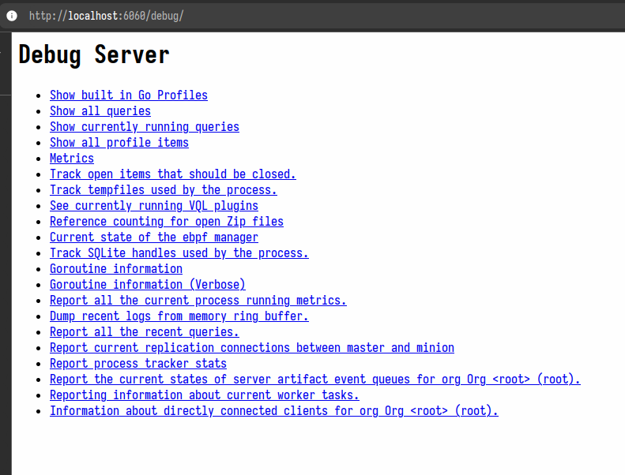
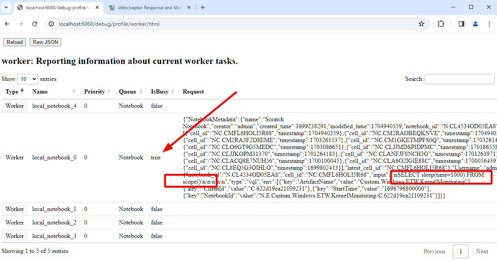
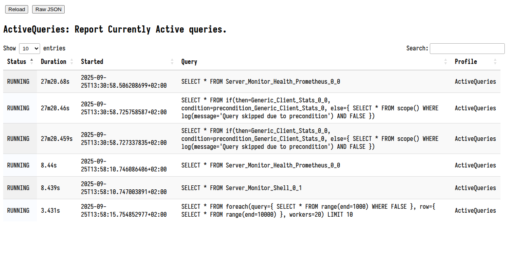

Like any piece of software, Velociraptor makes a number of engineering
tradeoffs, and may encounter some error conditions or even bugs. When
faced with the prospect of an unresponsive server or client, or high
CPU load, users often ask *"What is Velociraptor doing right now?"*

To see the inner workings of Velociraptor we can collect `profiles` of various
aspects of the program. These profiles exist regardless of if Velociraptor is
used in as a client or server or even an offline collector.

You can read more about profiling in
[Profiling the Beast]({}).

## Profiles

Without appropriate ways to ask Velociraptor what is happening
internally, one would need to attach a debugger to understand what is
happening. To help users see into the black box of Velociraptor, we
have implemented extensive `Debugging Profiles` which allow us to
inspect the state of the various sub-systems inside the program.

Making Velociraptor's inner workings transparent helps to explain to
users how it actually works, what tradeoffs are made and why the
program is may not be behaving as expected.

`Profiles` are views into specific aspect of the code. You can collect
profiles from the local server using the `Server.Monitor.Profile`
artifact or from remote clients using `Generic.Client.Profile`.

Collecting these artifacts gives a snapshot or a dump of all profiles
in an instant in time.


{}

If you encounter an issue that requires more thorough inspection, you
can seek assistance from the community on Discord or the mailing
list. In this case, you will probably be asked to attach a profile to
your request. This helps the developers to understand issues within
the system.

Simply collect the relevant artifact (either from the server with
`Server.Monitor.Profile` or a client with `Generic.Client.Profile`)
and export the collection into a zip file from the GUI. You can then
send us the Zip file for analysis.

{}

The below pages provide specific details on each profile type. It is instructive
to read about each profile item to understand how Velociraptor works internally,
the tradeoffs made and how to get the best of Velociraptor in the real world.

{}


### The Debug Console

While collecting profiles using an artifact is useful to take a
snapshot of the current process status, it is not very convenient when
we want to see how the process evolved over time.

To help with this, Velociraptor has a `Debug console` GUI that assists
in accessing a live view of debugging profiles.

On the server, you can access the debug console from the main welcome
page.


Which links to a main page leading to specific profiles.




The debug console has a number of different profiles and new ones will
be introduced, so below we just cover some of the most useful profiles
you can view.

It is also possible to collect the profile from the server without the use of
the `--debug` flag using the `Server.Monitor.Profile` artifact. This is the
server equivalent of the `Generic.Client.Profile` artifact.

#### Notebook workers

Notebooks are very useful feature of the server allowing for complex
postprocessing of collected data. Sometimes these queries are very
large and take a long time to run. To limit the amount of resources
the queries can take on the server, Velociraptor only creates a
limited number of notebook workers (by default 5).



#### Currently running queries

This view shows the queries currently running in this process. For
example queries will run as part of the notebook evaluation, currently
installed event queries or in the case of the offline collector,
currently collecting artifacts.



You can also see all recent queries (even the ones that have completed
already). This helps to understand what exactly the client is doing.

#### ETW Subsystem

This profile shows the current state of the ETW subsystem on
Windows. We can see what providers Velociraptor is subscribed to, how
many queries are currently watching that provider, and how many events
were received from the provider.


#### Go profiling information

For even more low level view of the program execution, we can view the
`Built in Go Profiles` which include detailed heap allocation,
goroutine information and can capture a CPU profile for closer
inspection.

This type of information is critical for developers to understand what
the code is doing, and you should forward it in any bug reports or
discussions to help the Velociraptor developer team.

### Starting the debug console on clients

On clients, by default, the debug console is not enabled for security reasons.

When debugging a client issue you can start the debug console by adding the
`--debug` flag (You may need to stop the service first with `sc.exe stop
velociraptor`):

```
velociraptor.exe --config "C:/Program Files/Velociraptor/client.config.yaml" -v --debug client
```

This will cause the debug console to be served over the localhost interface (by
default `http://localhost:6060/` )

When provided with the `--debug` flag, Velociraptor will start the debug console
on port 6060 (use `--debug_port` to change it). By default the debug console
will only bind to localhost so you will need to either tunnel the port or use a
local browser to connect to it.


### Debugging the offline collector

The offline collector is a one shot collector which simply runs,
collects several preconfigured artifacts into a zip file and
terminates.

Sometimes the collector may take a long time or use too much
memory. In this case you might want to gain visibility into what its
doing.

You can start the offline collector by adding the `--debug` flags to
its execution in a similar way to above.

```sh
Collector_velociraptor-v0.74.1-windows-amd64.exe -- --debug --debug_port 6061
```


Note that the additional `--` is required to indicate that the
additional parameters are not considered part of the command line (the
offline collector requires running with no parameters).

The above will start the debug console on port 6061. You can then
download goroutine, heap allocation and other profiles from the debug
server and forward these to the Velociraptor team to resolve any issues.


