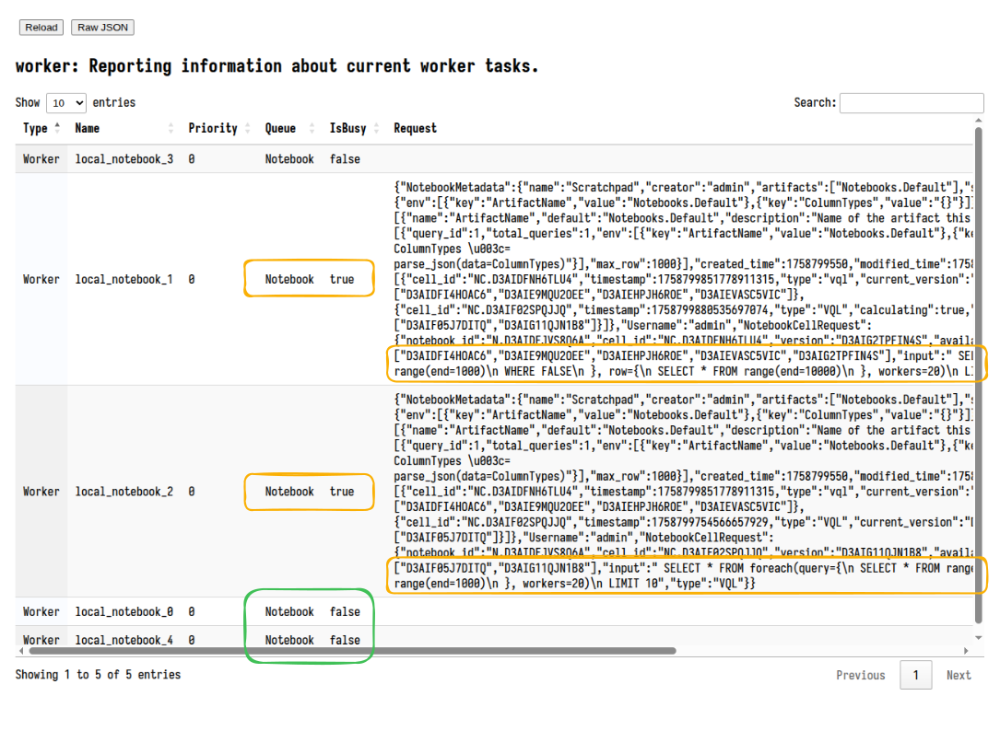

Like any piece of software, Velociraptor makes a number of engineering
trade-offs, and may encounter some error conditions or even bugs. When
faced with the prospect of an unresponsive server or client, or high
CPU load, users often ask: *"What is Velociraptor doing right now?"*

To see the inner workings of Velociraptor we can collect **profiles** of various
aspects of the program. These profiles exist regardless of whether Velociraptor
is being run as a client or server or even an offline collector.

You can read more about profiling in our blog article
[Profiling the Beast]({}).

## Collecting Profiles

Without appropriate ways to ask Velociraptor what is happening
internally, one would need to attach a debugger to understand what is
happening. To help users see inside the 'black box' of Velociraptor, we
have implemented extensive **Debugging Profiles** which allow us to
inspect the state of the various sub-systems inside the program.

Making Velociraptor's inner workings transparent helps to explain to
users how it actually works, what trade-offs are made and why the
program might not be behaving as expected.

**Profiles** are views into specific aspect of the code. You can collect
profiles from the local server using the `Server.Monitor.Profile`
artifact or from remote clients using `Generic.Client.Profile`.

Collecting these artifacts gives a snapshot or a dump of all profiles
at a specific instant in time.


{}

If you encounter an issue that requires more thorough inspection, you
can seek assistance from the community on Discord or the mailing
list. In this case, you will probably be asked to attach a profile to
your request. This helps the developers to understand issues within
the system.

Simply collect the relevant artifact (either from the server with
`Server.Monitor.Profile` or a client with `Generic.Client.Profile`)
and export the collection into a zip file from the GUI. You can then
send us the Zip file for analysis.

{}


### The Debug Console

While collecting profiles using an artifact is useful to take a
snapshot of the current process status, it is not very convenient when
we want to see how the process evolved over time.

To help with this, Velociraptor has a **Debug Console** GUI that provides a live
view of the debugging profiles.

On the server the Debug Console is always available by default. You can access
it from the main Welcome page. For clients and offline collectors please see the
[sections below]()
which explain how to enable it in those modes of operation.


This link opens the main page of the Debug Console.


### Starting the Debug Console on clients

Unlike on the server, on clients the Debug Console is not enabled by default for
security reasons.

To allow debugging of a client issue you can start the Debug Console by adding
the `--debug` flag to the service's command line. If the client is installed as
a service then you will need to stop the service first, and then run it manually
from the command line as follows:


{}
```sh
sudo systemctl stop velociraptor_client.service
/usr/local/bin/velociraptor_client --config /etc/velociraptor/client.config.yaml client -v --debug
```
{} {}
```sh
sc.exe stop velociraptor
velociraptor.exe client --config "C:/Program Files/Velociraptor/client.config.yaml" -v --debug
```
{}
{}
```sh
sudo launchctl unload /Library/LaunchDaemons/com.velocidex.velociraptor.plist
sudo /usr/local/sbin/velociraptor client --config /usr/local/sbin/velociraptor.config.yaml -v --debug
```
{}


When provided with the `--debug` flag, Velociraptor will start the Debug Console
on port 6060 (use `--debug_port` to change it). By default the Debug Console
will only bind to localhost so you will need to either tunnel the port or use a
local browser to connect to it.


### Debugging the offline collector

The offline collector is a one shot collector which simply runs,
collects several preconfigured artifacts into a zip file and
terminates.

Sometimes the collector may take a long time or use too much
memory. In this case you might want to gain visibility into what its
doing.

You can start the offline collector by adding the `--debug` flags to
its execution in a similar way to above.

```sh
Collector_velociraptor-v0.74.1-windows-amd64.exe -- --debug --debug_port 6061
```


Note that the additional `--` is required to indicate that the
additional parameters are not considered part of the command line (the
offline collector requires running with no parameters).

The above will start the Debug Console on port 6061. You can then
download goroutine, heap allocation and other profiles from the debug
server and forward these to the Velociraptor team to resolve any issues.

### Profile types

The following pages provide specific details on each profile type. It is
instructive to read about each profile item to understand how Velociraptor works
internally, the trade-offs made, and how to get the best of Velociraptor in the
real world.

{}


### Frequently useful profiles

The Debug Console has a number of different profiles and new ones may be added
in future, so below we will just cover some of the most useful profiles that you
can view.


#### Notebook workers

Notebooks are very useful feature of the server allowing for complex
postprocessing of collected data. Sometimes these queries are very
large and take a long time to run. To limit the amount of resources
the queries can take on the server, Velociraptor only creates a
limited number of notebook workers (by default 5).

The workers can be inspected by selecting the `worker` profile
(`Global` -> `Services` -> `worker`).



The raw data can also be viewed in JSON format by switching to the `Raw JSON`
view.


#### Currently Active queries

This view shows the queries currently running in this process. For example
queries will run as part of notebook evaluation, currently installed event
queries, or currently collecting artifacts (in the case of the offline
collector).

This can be accessed via the link: `Global` -> `VQL` -> `ActiveQueries`.


In the `VQL` profile category there are also profiles to show all recent queries
(even ones that have completed already). This helps us to understand what
exactly the client was recently doing.


#### ETW Subsystem

This profile shows the current state of the ETW subsystem on Windows. We can see
what providers Velociraptor is subscribed to, how many queries are currently
watching that provider, and how many events were received from the provider.

This can be accessed via the link: `Global` -> `VQL` -> `Plugins` -> `ETW`.


