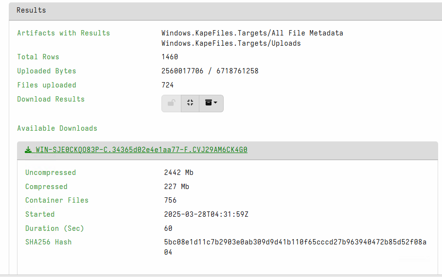
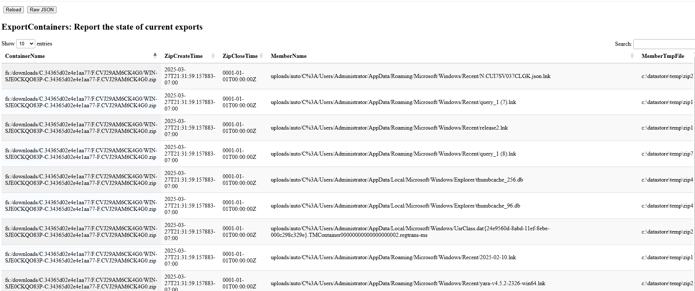

The Velociraptor GUI allows exporting collections from Flows or Hunts
into a Zip file. If the collection is very large this can take some
time. While the GUI shows some progress information:

The profile shows a lot more information:

As indicated by the profile, Velociraptor uses multiple threads to
compress many files into the zip file at the same time. These files
are typically written in temporary files then merged into the final
Zip files (this is the way to utilize multiple cores when preparing a
Zip file).

However, when you have a single very large file (e.g. a memory image)
the compression might pause for a while the large file is compressed,
leading for the progress to appear to have stalled. In that case you
can verify the progress using the Export Progress Profile.
