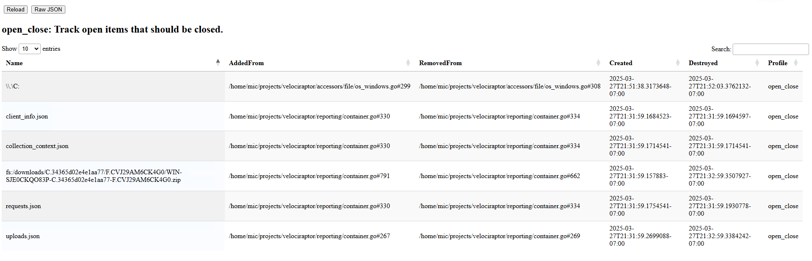

Similarly to tempfiles, it is important to know what files we have opened that
should be closed. This is tracked by the `Open Close Tracker`. The tracker does
not only track operating system files but other abstract objects within
Velociraptor that need to be closed.

We typically want to see all files being suitably closed unless they
are used currently. Some files are held open for a short time after
use, to avoid needing to re-open them if accessed soon after.

The above example shows we recently opened the raw `C:` device and
some more files used during a flow export operation.
