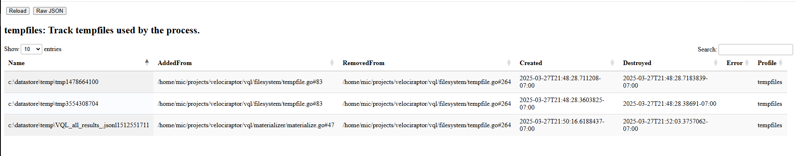

Velociraptor uses temporary files for a variety is purposes. It is
important to ensure that whenever we create a temporary file, we
suitably remove it.

The Tempfile tracker keeps track of temporary files we used.

The profile indicates:

1. Which temporary files were used.
2. Where they were created from (gives an idea why we created these files).
3. When the file was created and removed

In the above example, we see two temporary files created from the VQL
`tempfile()` function and one created by the VQL engine during a
materialize operation (e.g. expanding a `LET` ). All files were
suitably closed as determined by the non zero destroyed time.
