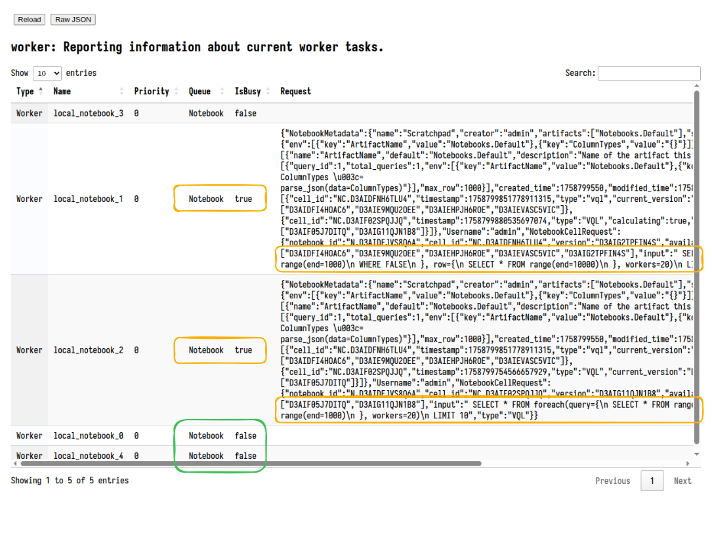

Notebooks are very useful feature of the server allowing for complex
postprocessing of collected data. Sometimes these queries are very
large and take a long time to run. To limit the amount of resources
the queries can take on the server, Velociraptor only creates a
limited number of notebook workers (by default 5).

