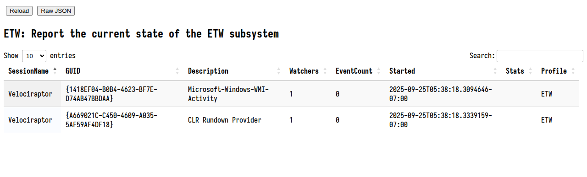

This profile shows the current state of the ETW subsystem on Windows. We can see
what providers Velociraptor is subscribed to, how many queries are currently
watching that provider, and how many events were received from the provider.

Event Tracing For Windows (ETW) is a powerful source of system
information available on Windows. Velociraptor allows subscribing to
the ETW streams using the `watch_etw()` plugin.

The ETW profile helps us understand what ETW streams Velociraptor is
subscribed to. When a VQL query calls `watch_etw()`, it subscribes to
an internal ETW session manager service. Rather than creating an ETW
session for each specific invocation of `watch_etw()`, Velociraptor
multiplexes watchers onto the same internal ETW stream.

This means that multiple `watch_etw()` calls to the same ETW provider
do not cost any more than a single watcher. Each event is passed to
all watchers in turn.

This can be seen in the profile example above: The `NT Kernel Logger`
has a single watcher, but the `Microsoft-Windows-Sysmon/Operational`
stream has 3 different watchers (i.e. 3 different queries are
processing the same ETW stream).

Some ETW streams require further internal processing. For example, the
`NT Kernel Logger` stream requires Velociraptor to keep track of
various objects across events, use rundown streams and other methods
to actually make the ETW stream useful for consumers. Velociraptor
uses this processing to enrich the ETW events with important
information, such as full file paths, full registry keys or enriching
backtrace information with function names.

These post processing stats are also shown in the tracker as well. We
can see that the current consumer is interested in file events
(`options: File`), and that requires us to post process the ETW file
events by using a cache.

Another important metric to look at is the total number of ETW events
processed. The `NT Kernel Logger` returned about 2 million events vs
the Sysmon provider's 2500 events. Using an ETW provider emitting many
events will increase CPU requirements. You may be able to tune the ETW
provider using the any/all keyword parameter. However some ETW
providers produce too many events to be practical to use for
detection.
