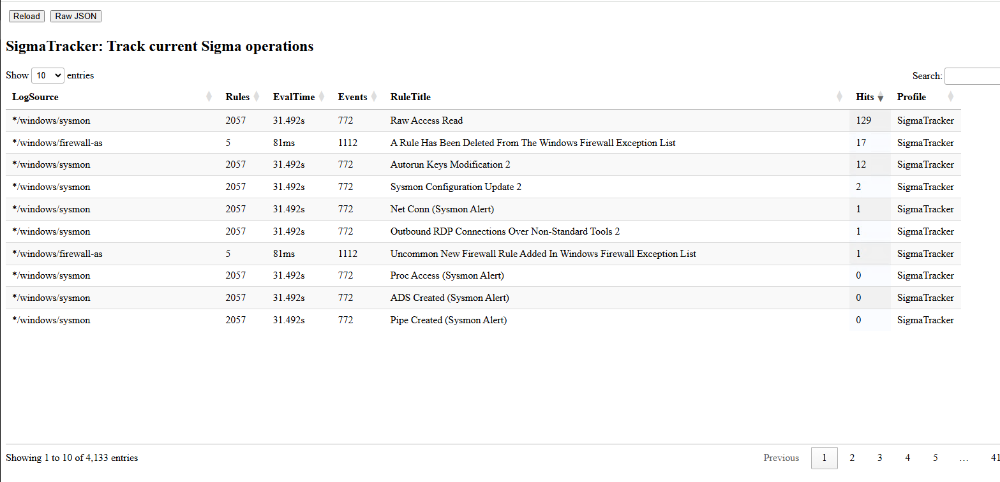

Velociraptor has a built in Sigma rule evaluator, implemented with the `sigma()`
plugin. Sigma is an open standard for writing detection rules, with the
[Velociraptor implementation described here]().

Sigma rules rely on a `log source`, which in Velociraptor is a VQL
query. The rules also define detection clauses which apply on the
events emitted from the log source.

When a Sigma artifact is collected, the rules are loaded into the
sigma evaluator, and all log sources referred to by the rules are
started.

If multiple rules use the same log source, the Sigma plugin evaluates
each event emitted from the log source against all the rules using
that log source. This means that adding more detection rules to the
same log source pose no additional processing requirement since all
the rules are evaluated against the same log source.

Only by adding rules that refer to other log sources, does the sigma
plugin start new queries. This way it is pretty efficient to load
thousands of rules at the same time.

The Sigma profile shows this relationship clearly. The above example
was taken on a system that is running the live Sigma rules using the
`Windows.Hayabusa.Monitoring` artifact.

We see that the Sigma engine has 4133 rules loaded. The `Sysmon` log
source has 2057 rules following it. During the life of the process,
772 events were evaluated through those 2057 rules in 31 seconds (This
works out to about 20us per rule). The artifact was running for 4.5
hours at this time, so 31 seconds amortized over this time is
reasonable. Note also that different log sources are evaluated on
different cores so on multi core systems, the performance impact is
minimal.

We also see the `Raw Access Read` rule fired 129 times. This might
indicate that the rule requires tuning, perhaps to add an allow list,
since it seems to have a lot of false positives.
