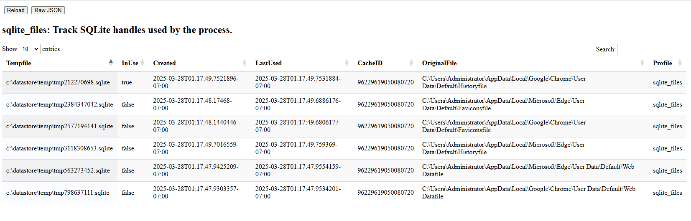

SQLite files are used widely to store data in a structured file. We
parse SQLite files using the Golang SQLite library.

Usually SQLite files implement file locking to coordinate multiple
processes accessing the same file. This poses a problem for
Velociraptor, which needs to read files currently opened by other
applications (e.g. a currently running browser).

When Velociraptor attempts to open the SQLite file with the library,
the open may fail if the file is locked. Similarly if Velociraptor
opens a file which is in use by another application, the other
application may fail to open it. Additionally, due to locking
semantics access to the SQLite file while another application is
trying to use it may be slow as rows and tables are locked and
unlocked.

To avoid these complications, by default Velociraptor makes a copy of
the SQLite file and opens that copy file. This ensures we have
exclusive access to the file, even if it is currently in use and
locked. In practice this turns out to be a lot faster than using the
original file, more than compensates for the overheads of making the
initial copy.

Since making a temporary copy is a slightly expensive operation we try
to cache the file for a duration, so that if the same file is opened
again, we can access our temporary copy immediately.

This algorithm can be seen in the `SQLite tracker`

