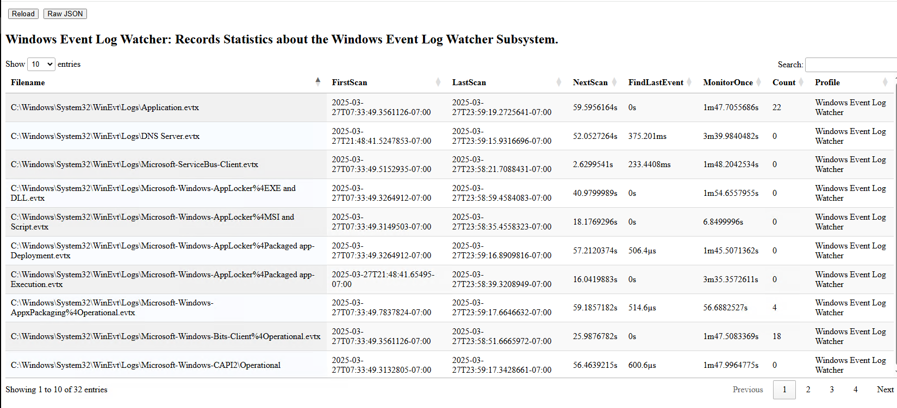

The Windows Event Logs contain windows events from various
sources. Velociraptor implements a parser to dump out all events from
a Windows event log file, but the `watch_evtx()` plugin can be used to
follow the log file as events are written to it.

This allows Velociraptor to analyze events in near real time, as they
are flushed into the log file. For example, the
`Windows.Hayabusa.Monitoring` artifact uses this functionality to
apply sigma rules on events in near real time.

How does Velociraptor follow the event log? The algorithm requires
Velociraptor to periodically check the last message in the file, then
parse the message between the last parsed message until the latest event.

This process is illustrated by inspecting the `Windows Event Log
Tracker`. The example above shows that Velociraptor is currently
watching 32 different event log files.

Each file is scanned periodically (by default every 60 seconds). We
can see the last scan time of the file, and when we plan to scan the
file again. Important to note that the scan time is somewhat
randomized to avoid Velociraptor processing all files at the same time
(This is called the [Thundering Herd Problem](https://en.wikipedia.org/wiki/Thundering_herd_problem#) ).

The two major operations are `Find Last Event` which scans the event
log file to find the last event, and `Monitor Once` which parses all
the events since the last checkpoint and emits those into the output
of the plugin (Note that this time may be increased due to delays
introduced by the plugin consumer).

Note that `watch_evtx()` is fairly cheap to run as the work of
scanning and parsing the event log file may be amortized across longer
times. For example, even if the event log contains millions of events,
we only parse the last written events which were written in the last
minute. The total CPU load is amortized over the frequency of
checking - scanning the file less frequently will result in less
average CPU utilization. It is also suitable to restrict CPU limits
for `watch_evtx()` based queries. If the plugin is paused due to
average CPU limits being above the limit, the plugin will just catch
up at a later time when the CPU load is lower.
