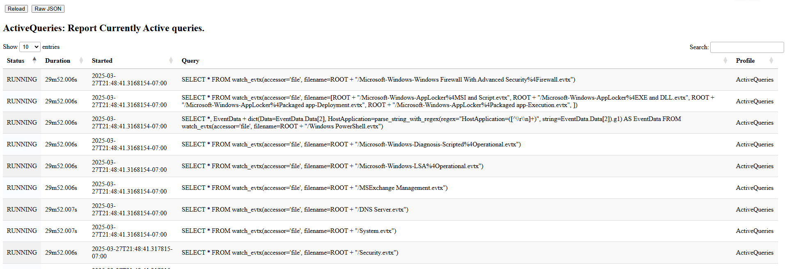

This view shows the queries currently running in this process. For example
queries will run as part of notebook evaluation, currently installed event
queries, or currently collecting artifacts (in the case of the offline
collector).

The above example shows a number of queries watching a variety of
event logs on the endpoint. This is because this endpoint is running
the `Windows.Hayabusa.Monitoring` artifact, which evaluate many Sigma
rules, many referring to different log sources. Each log source relies
on parsing the event logs.

