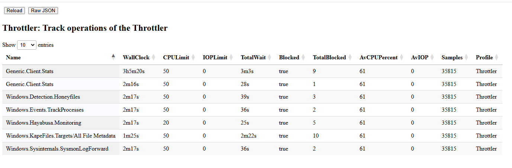

An important criteria for Velociraptor is to ensure the impact on
endpoint performance is limited. This helps in cases when we need to
perform intensive tasks on the endpoint. We want to make sure the end
system is still usable and reduce our impact on the end user.

Velociraptor achieves this by implementing a `Throttler`. This
mechanism is able to pause query execution when the process's average
CPU utilization exceeds some limit.

To understand how throttlers work we can inspect the `Throttler
Profile`

This view shows the state of various throttlers in the program
(Typically throttlers are attached to queries).

In the above example we see the client monitoring queries are
throttled to 50% while the `Windows.Hayabusa.Monitoring` artifact is
limited to 20%

The current average CPU limit is 61% which means that all throttlers
will block their respective query execution, until the average falls
below 50%.

We see also that a `Windows.KapeFiles.Targets` artifact is currently
being collected with a 50% CPU limit as well. It is also blocked from
proceeding until the average CPU limit falls below 50%.

In this way the process pauses until the CPU utilization falls
sufficiently to proceed, then queries are resumed.

Note that the query limited to 20% may never get to run! There are
many other queries which are limited to 50% and they will run before
it, as the average CPU utilization drops below 50%. If those queries
use CPU resources, they will push the CPU usage up and it may never
get to 20%.

In recent versions of Velociraptor a global CPU limit may apply if
Velociraptor detects it is running on a particularly low resource
endpoint (e.g. with only a single core).

{}

While we always aim to have as little CPU impact as possible on the
endpoint, it is not appropriate to collect artifacts with artificially
low CPU utilization limits. A low CPU limit means that the query is
paused more often and takes longer to complete - it is a trade off
between how long the query takes to complete and overall impact on the
endpoint.

Client artifact collections have a time limit as well (by default 10
minutes), so reducing the CPU limit may cause the query to exceed to
the time limit, causing collection to fail.

Similarly, Client Monitoring queries may not get to run when heavier
collections are proceeding (pushing CPU use above threshold). This may
cause them to miss events, increasing detection latency or even
failing to detect important events.

{}
