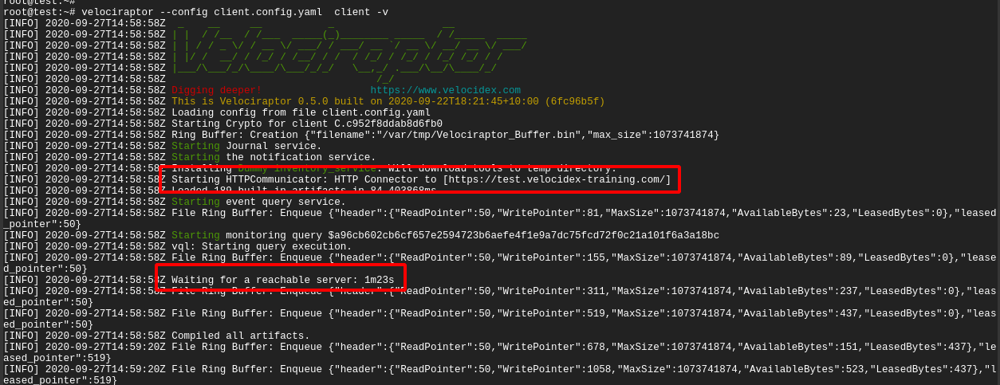
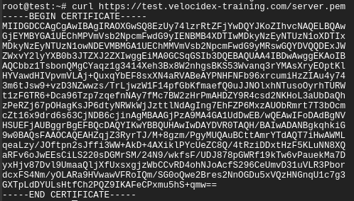

{}

The steps in this section assume you are troubleshooting a client that _is not_
already enrolled and actively communicating with the server.

If you need to troubleshoot issues with a client that is communicating with the
server - that is an online client - then please see the section
[Troubleshooting Remote Client Issues]().

{}


### Client fails to start



{}
```sh
sc query velociraptor
```
{}
{}
```sh
```
{}
{}
```sh
$ sudo systemctl status velociraptor_client.service
[sudo] password for user:
● velociraptor_client.service - Velociraptor client
     Loaded: loaded (/etc/systemd/system/velociraptor_client.service; enabled; vendor preset: enabled)
     Active: activating (auto-restart) (Result: exit-code) since Fri 2025-09-05 12:24:18 SAST; 1min 2s ago
    Process: 767 ExecStart=/usr/local/bin/velociraptor_client --config /etc/velociraptor/client.config.yaml client --quiet (code=exited, status=1/FAILURE)
   Main PID: 767 (code=exited, status=1/FAILURE)
        CPU: 131ms
```
{}


#### Running the client in a terminal

If the client fails to start, you can try to start it manually in a terminal
with the `-v` (verbose) flag to see if it reports any errors or issues.


{}
```sh
"C:\Program Files\Velociraptor\Velociraptor.exe"  --config "C:\Program Files\Velociraptor\client.config.yaml" service run -v
```
{}
{}
```sh
```
{}
{}
```sh
$ sudo /usr/local/bin/velociraptor_client --config /etc/velociraptor/client.config.yaml client -v
```
{}



### Client communications issues

#### Test that the server is reachable on the expected port


curl

```sh
$ nc -vz 127.0.0.1 8000
Connection to 127.0.0.1 8000 port [tcp/*] succeeded!
```


#### Test

If the client does not appear to properly connect to the server, the
first thing is to run it manually (using the `velociraptor --config
client.config.yaml client -v` command):



In the above example, I ran the client manually with the -v switch. I
see the client starting up and immediately trying to connect to its
URL (in this case `https://test.velocidex-training.com/`) However
this fails and the client will wait for a short time before retrying
to connect again.


A common problem here is network filtering making it impossible to
reach the server. You can test this by simply running curl with the
server’s URL.

Once you enable connectivity, you might encounter another problem


The **Unable to parse PEM** message indicates that the client is
trying to fetch the **server.pem** file but it is not able to validate
it. This often happens with captive portal type of proxies which
interfere with the data transferred. It can also happen if your DNS
setting point to a completely different server.

We can verify the **server.pem** manually by using curl (note that
when using self-signed mode you might need to provide curl with the -k
flag to ignore the certificate errors):



Note that the **server.pem** is always signed by the velociraptor
internal CA in all deployment modes (even with lets encrypt). You can
view the certificate details by using openssl:

```bash
curl https://test.velocidex-training.com/server.pem | openssl x509 -text
```

If your server certificate has expired, the client will refuse to
connect to it. To reissue the server certificate simply recreate the
server configuration file (after suitably backing up the previous
config file):

```bash
velociraptor config reissue_certs --validity 365 --config server.config.yaml > new_server.config.yaml
```

Depending on which user invoked the Velociraptor binary, you may need
to alter the permissions of the new server configuration file.

For example:

```bash
chmod 600 new_server.config.yaml
chown velociraptor:velociraptor new_server.config.yaml
```

From here, you will need to move the updated server configuration into
the appropriate location.

{}

The above step was able to use the internal Velociraptor CA to reissue
the server certificate (which is normally issued for 1 year), allowing
us to rotate the certificate.

Currently there is no way to update the CA certificate without
redeploying new clients (the CA certificate is embedded in the client
config file). When generating the config file initially, the CA
certificate is created with a 10 year validity.

{}

