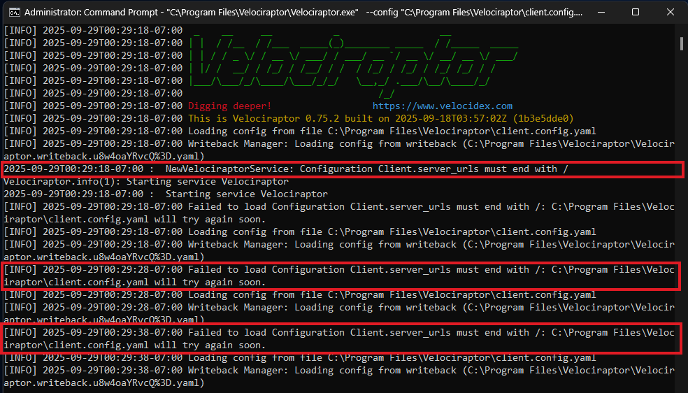
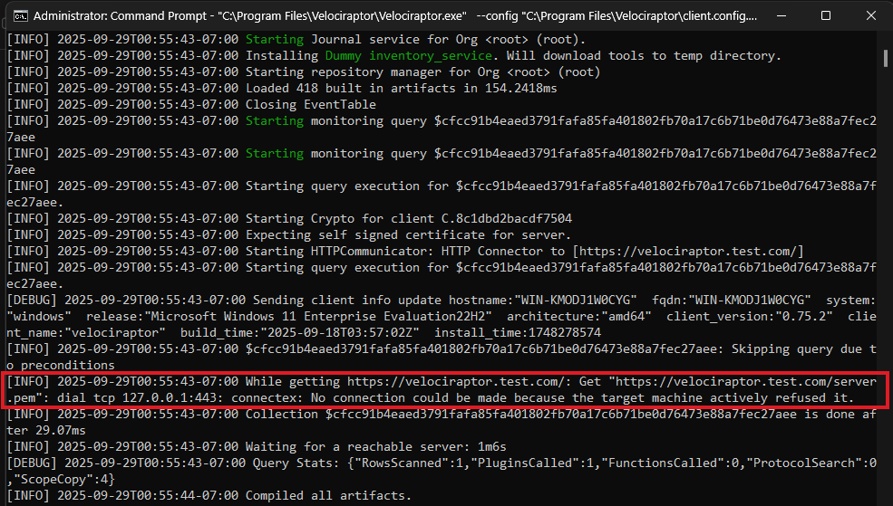
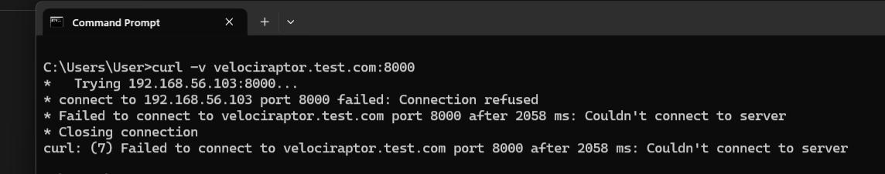
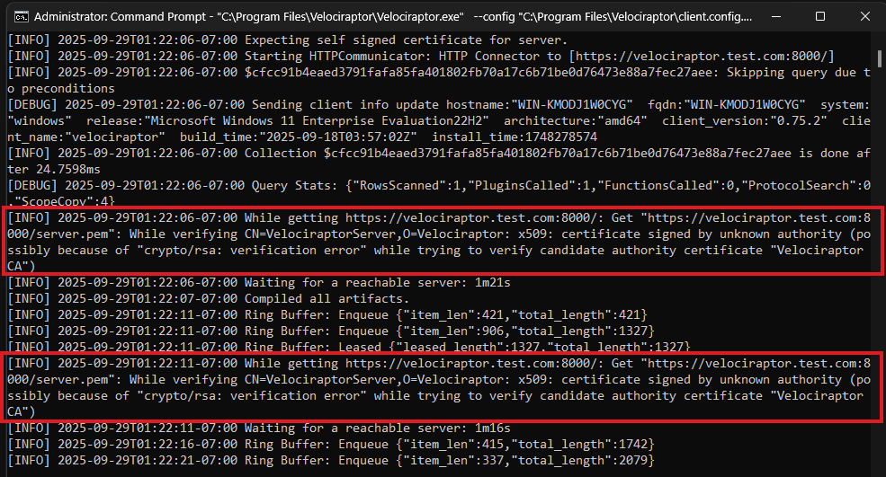
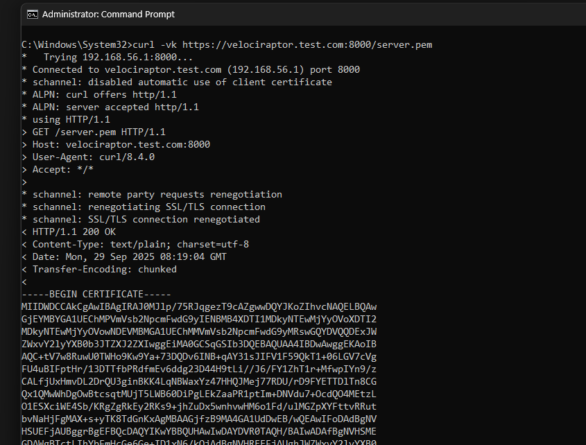

{}

The steps in this section assume you are troubleshooting a client that _is not_
already enrolled and actively communicating with the server.

If you need to troubleshoot issues with a client that is communicating with the
server - that is an online client - then please see the section
[Troubleshooting Remote Client Issues]().

{}


### Client fails to connect to server

Velociraptor clients will start even if there are issues with the configuration.
This is by design since a new or updated configuration may be delivered via
separate management tools _after_ the client is installed. For example, the
official MSI does not contain a valid configuration but users may want to
nevertheless use it to install the client and then supply the configuration as a
second step.

If there are configuration problems then the client will log error messages to
Stderr and will continue to re-read the config file periodically in case it
changes. However when installed as a service these messages are not visible to
the user, and service status commands (e.g. `sc query velociraptor`) will report
the service as "running" even though the client is not fully started and not
connecting to the server.

#### Running the client in a terminal

You can try to start the client manually in a terminal with the `-v` (verbose)
flag to see if it reports any errors or issues.

If installed as a service you should stop the service before starting the client
manually.


{}
```sh
sc.exe stop velociraptor
"C:\Program Files\Velociraptor\Velociraptor.exe"  --config "C:\Program Files\Velociraptor\client.config.yaml" service run -v
```
(as administrator)
{}
{}
```sh
sudo launchctl unload /Library/LaunchDaemons/com.velocidex.velociraptor.plist
sudo /usr/local/sbin/velociraptor client --config /usr/local/sbin/velociraptor.config.yaml -v
```
{}
{}
```sh
sudo systemctl stop velociraptor_client.service
/usr/local/bin/velociraptor_client --config /etc/velociraptor/client.config.yaml client -v
```
{}






#### Test that the server is reachable on the expected port

If running the client in a terminal indicates a problem connecting to the server
then you can test the connection using `curl`:



Note that it is important that you specify the server's Frontend port, as this
is the port that the client connects to.

If you encounter client-server connectivity issues when deploying your first
client then it's possible that there's a misconfiguration on the server. In that
case it's best to confirm that the Frontend port is reachable locally on the
server before testing from remote hosts. The testing steps would be similar to
those described
[here]()
for testing access to the server GUI.

#### Certificate retrieval and validation issues

If connectivity succeeds, you might still encounter other problems related to
certificate retrieval or validation.



The error message above indicates that the client is able to fetch the
**server.pem** file but that it is not able to validate it. This often happens
with captive portal type of proxies which interfere with the data transferred.
It can also happen if your DNS settings point to a completely different server.

We can verify the **server.pem** manually by using curl (note that
when using self-signed mode you might need to provide curl with the -k
flag to ignore the certificate errors):



Note that the **server.pem** is always signed by the velociraptor
internal CA in all deployment modes (even with Let's Encrypt).

You can view the certificate details by using openssl, for example:

```bash
curl -k https://velociraptor.test.com:8000/server.pem | openssl x509 -text
```

If your server certificate has expired, the client will refuse to
connect to it. To reissue the server certificate simply recreate the
server configuration file (after suitably backing up the previous
config file):

```bash
velociraptor config reissue_certs --validity 365 --config server.config.yaml > new_server.config.yaml
```

Depending on which user invoked the Velociraptor binary, you may need
to alter the permissions of the new server configuration file.

For example:

```bash
chmod 600 new_server.config.yaml
chown velociraptor:velociraptor new_server.config.yaml
```

From here, you will need to move the updated server configuration into
the appropriate location.

{}

The above step was able to use the internal Velociraptor CA to reissue
the server certificate (which is normally issued for 1 year), allowing
us to rotate the certificate.

Currently there is no way to update the CA certificate without
redeploying new clients (the CA certificate is embedded in the client
config file). When generating the config file initially, the CA
certificate is created with a 10 year validity.

{}

### Debugging

For debugging more advanced issues the client provides a Debug Console, which is
a local web-based UI that exposes many aspects of the clients internal
operations. The Debug Console is not enabled by default on clients.

To learn how to enable and access it please see
[Starting the Debug Console on clients]().
