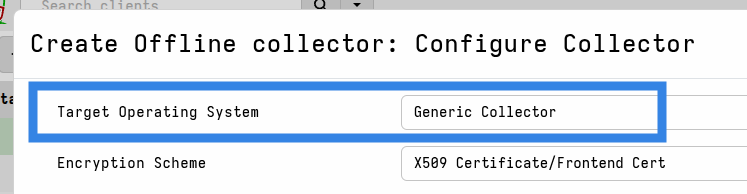

### Config file is too large to embed

Embedded configs use approximately 80KB of pre-allocated space in the binary.
Although we do compress the config it may be too large to fit in this space,
especially if you attempt to include some combination of the larger artifacts.

In that case the offline collector creation process will fail and log the error
`client_repack: config file is too large to embed.`

To cater for configs of unlimited size we provide the
[Generic Collector]().

Note that bundled tools are not stored in the embedded space. Bundled tools are
appended to the binary or the generic collector file, and therefore do not need
to be factored into the ~80KB limit.

### Unable to import an offline collector zip

If you are attempting to import the zip from an offline collector into the
server and receive the error `import_collection: unable to load collection
context...` or something similar, then it's likely that the offline collector is
using an old binary. This is sometimes the case because offline collectors are
rarely upgraded as often as the server is, which means that very old offline
collectors may persist in the responder's toolkit. However the collection
archive format that the server supports may need to change over time to support
new features.

Ideally all offline collectors should be rebuilt whenever the server is upgraded
to benefit from new features and bugfixes, but also to maintain full
compatibility with the server for the purpose of importing collections.

### Debugging

For debugging more advanced issues, the offline collector also provides the same
Debug Console that is available on the server and clients.
To learn how to enable and access it please see
[Debugging the offline collector]().
