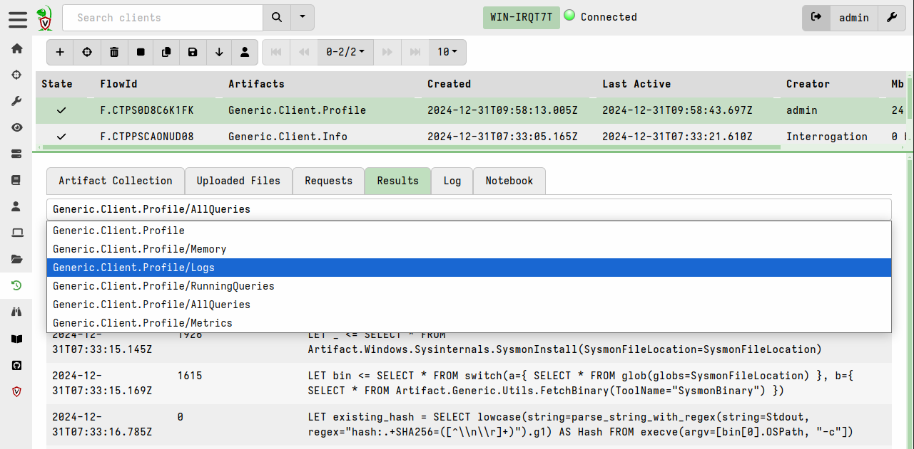
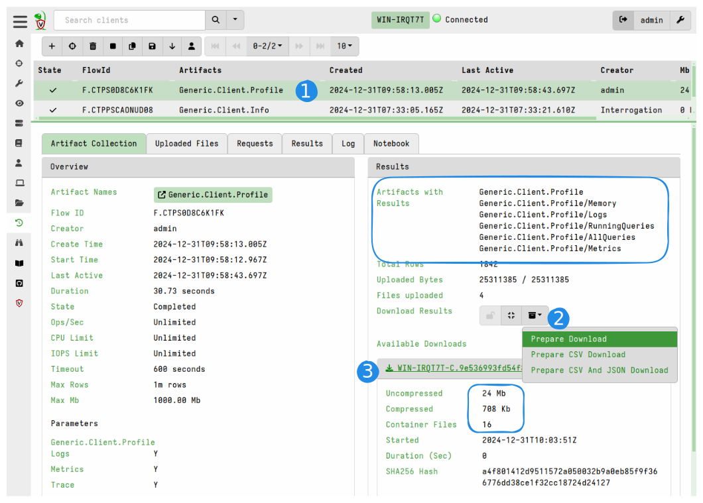
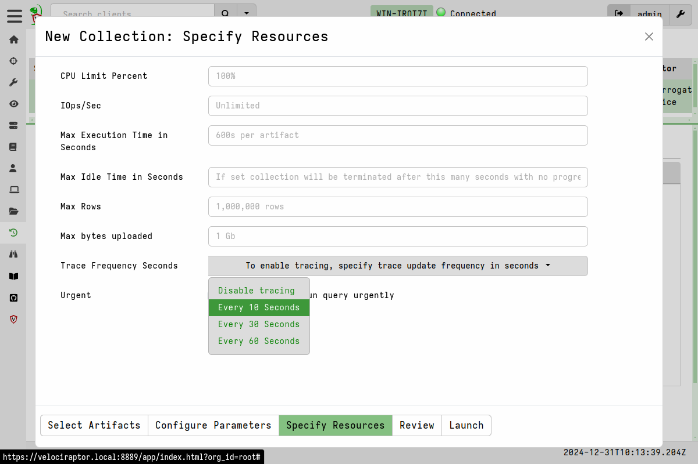
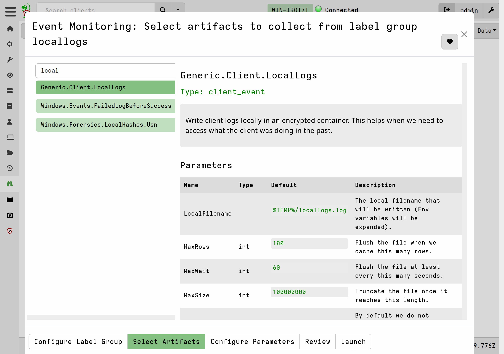
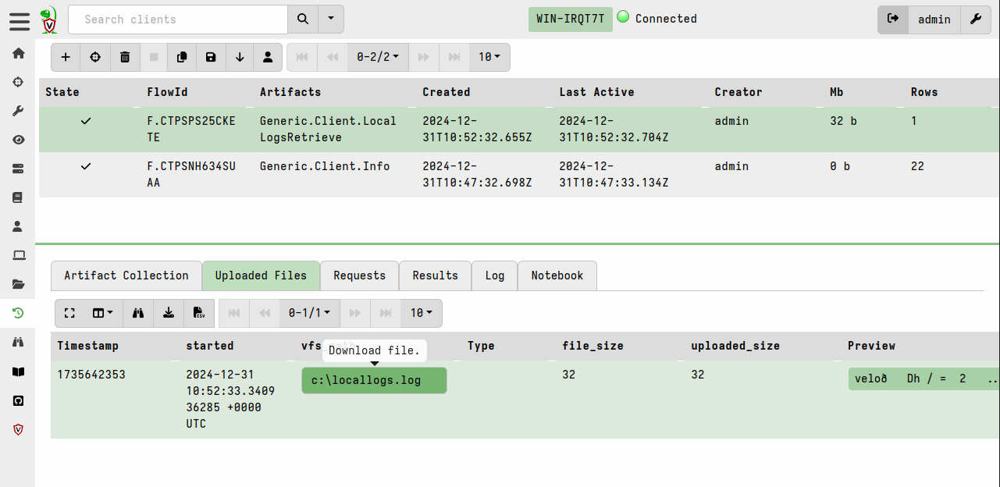
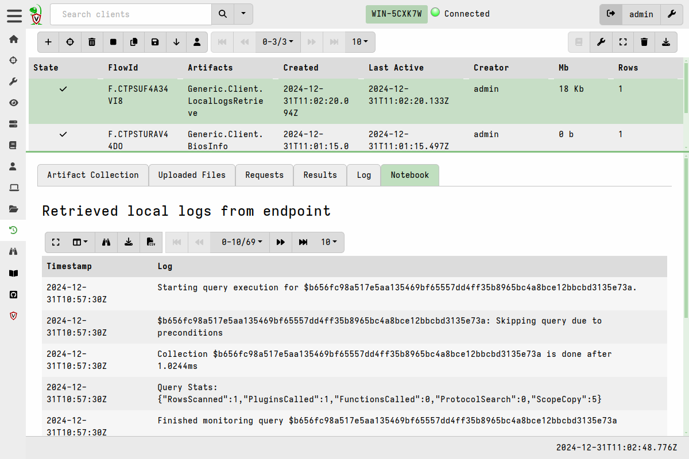

{}

The steps in this section assume you are troubleshooting a client that has
already enrolled and is actively communicating with the server.

If you are having problems with a client that is not communicating with the
server, or that has never connected to the server, or is failing to start then
please see the section
[Client communications issues]()
within the Deployment Troubleshooting section.

{}

### Debugging a remote client

In the
[Deployment troubleshooting section]()
we explain how to bring up the debug server by providing the `--debug` flag on
the command line. However clients are often remote and it's therefore not always
possible to debug the client by starting it with this flag. Often we are also
trying to troubleshoot an issue that happens while collecting an artifact from a
remote client and we want to see what is actually happening in the client
process itself.

We can debug the client while it is running without starting the debug server
using the artifact `Generic.Client.Profile`. This artifact has access to the
same data exposed through the debug server, but does not require the debug flag
to be enabled in advance.

By default the artifact collects the most useful information
developers require, but you can customize the artifact parameter to
collect more detailed information if required.

You can share the result of the collection by exporting it to a zip
file and sharing with the development team on Discord or GitHub
issues.

### Enabling a trace

While collecting the profile at any time is useful, it is sometimes
hard to catch the problem on the client at just the right moment. For
example, if a particular query causes a memory leak or performance
issues, by the time you can schedule the `Generic.Client.Profile`
artifact, the client may have already restarted or is too busy to
actually collect the artifact.

In this case it is useful to enable a trace during the collection of
another artifact. This setting will cause the client to take profile
snapshots at specified intervals during query execution and
automatically upload them to the server.

This setting will upload a zip file containing critical profile
information every 10 seconds during query execution. This information
is useful to see the memory and resource footprint as the query
progresses as well as the logs from the client.

### Inspecting a remote client's log

One of the first troubleshooting steps for client-related issues is to run the
client manually from the command line with the `-v` flag which prints client
logs to the screen. This helps to identify startup issues or transient network
issues. This is often impractical or impossible when the client is remote and we
have means of access to it other than Velociraptor itself.

We could use the Velociraptor client to collect it's own plaintext logs from
disk, however the client, by default, does not write its logs to disk. This is
done to prevent information leakage risks - the client's log may contain
sensitive information such as collected artifacts.

To overcome this, it is possible to tell the client to log to an encrypted local
storage file. This allows us to collect the file from the client later and
decrypt it on the server while not creating any information leakage risk.

To enable local client logging, you create a new label group
(e.g. `logged`) and then assign the `Generic.Client.LocalLogs` client
monitoring artifact to this group. This allows you to begin logging on
any client by labeling it so that it joins the group.

Logs will be written continuously into the specified file on the
endpoint. The file is encrypted and can only be decrypted on the
server but the client can append logging information, even after a
reboot.

When we want to inspect the log file, we simply collect it from the
endpoint using the `Generic.Client.LocalLogsRetrieve` artifact.

The notebook tab will automatically decrypt the logs and display them
in a results table.

### Debugging client crashes (Windows only)

On Windows, the client usually runs as a service. If a crash occurs while
Velociraptor is running as a Windows service the traceback of the error is
printed to Stderr, however these messages are not visible nor stored anywhere.
This means that if Velociraptor crashes we cannot see the panic backtrace which
is extremely useful for debugging the reason for the crash. In addition the
Windows service recovery settings will cause the client to restart automatically
after a crash which might make it hard to detect that a crash has occurred.

The Windows binary accepts the setting `Client.panic_file` in the client config
file. By default this setting is not present but can be added to the config on
selected clients where there is a reproducible issue resulting in the client
crashing. Adding this setting to the config will require local or remote access
to the client's filesystem.

This setting allows us to specify a path to a log file on the client where
Velociraptor will write Stdout and Stderr in the event of a crash. A value of
`$Temp/panic.log` will cause the log to be written to the Velociraptor client's
temp directory which by default should be `C:\Program Files\Velociraptor\Tools`.

This feature is currently not implemented for non-Windows platforms where
this setting will have no effect.

Please submit this file, along with any additional information about what user
actions might have caused the crash, to our developer team by
[opening a new issue on GitHub](https://github.com/Velocidex/velociraptor/issues/).
