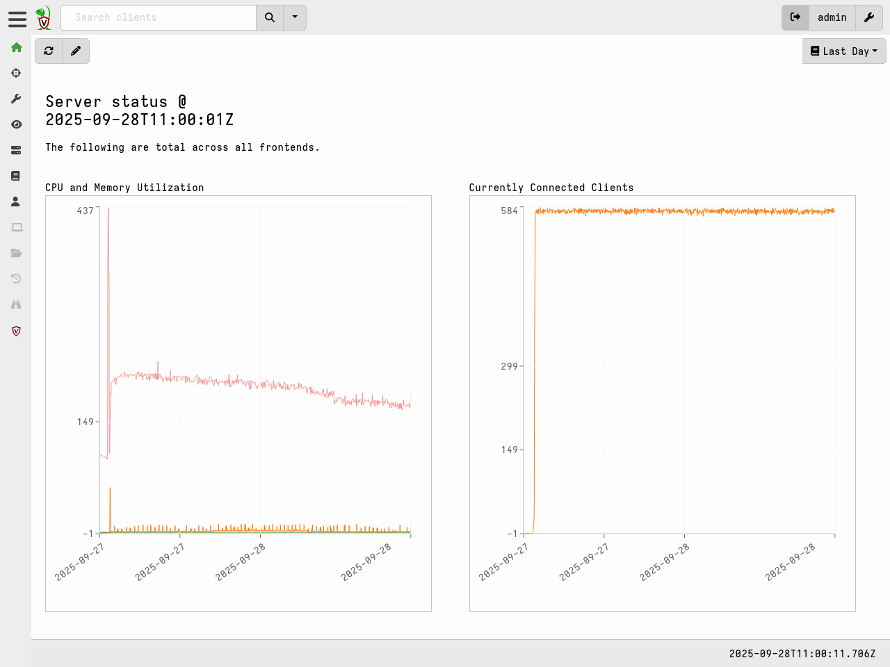

{}

The steps in this section assume your server has previously been operating
correctly and is now encountering an unexpected issue.

If you are having problems during server deployment then please see the section
[Server Deployment Issues]()
within the Deployment Troubleshooting section.

{}

### Server crashes

Although we've do our best to prevent it, it's always a possibility that bugs or
unusual VQL operations can cause the server to crash. Velociraptor has the
ability to record the stacktrace to a log file if such conditions occur.
This feature is enabled by default for the server.

Crashes should result in a "panic log" file being written to the `logs`
directory in the server datastore. This log file will include the time and date
in the file name, for example `panic-2025-09-27T20_53_06+02_00.log`.

Please submit this file, along with any additional information about what user
actions might have caused the crash, to our developer team by
[opening a new issue on GitHub](https://github.com/Velocidex/velociraptor/issues/).

### Performance issues

If you are experiencing poor server performance, we recommend that you review
the
[Deployment > Server Performance and Monitoring]()
page to better understand potential causes of performance issues in general.

If your deployment has grown significantly in size since the initial deployment
then it may simply be a case of inadequate server resources. You could consider
scaling up your server resources or for very large deployments you may decide to
scale your system horizontally by turning it into a
[multi-frontend deployment]().

#### Observing basic performance metrics

Basic CPU and memory metrics for the server are displayed on the Dashboard page
in the GUI.



#### Collecting performance metrics

When Velociraptor is run in production it is often necessary to integrate with
3rd-party performance monitoring apps to monitor the server's performance
characteristics, such as memory user, requests per second etc.

Velociraptor exports a lot of important metrics using the standard
[Prometheus](https://prometheus.io/) library.
This information may be scraped from the
server's monitoring endpoint (by default `http://127.0.0.1:8003/metrics`).

You can change the port and bind address for the metrics server using the
[Monitoring.bind_port ]({}) and
[Monitoring.bind_address ]({}) setting.

You can either manually see program metrics using curl or configure an
external system like [Grafana](https://grafana.com/) or
[DataDog](https://www.datadoghq.com/) to scrape these metrics.

```
curl http://127.0.0.1:8003/metrics | less
```

For more information about setting up Prometheus and Graphana, please see the
[Deployment > Server Performance and Monitoring]()
page.

We recommend that proper monitoring be implemented in production systems.

### Troubleshooting other operational issues

#### Logging

Velociraptor can write server event logs to disk and optionally also forward
these to a remote syslog server. We recommend that you enable logging on
production systems, ideally to a secure remote server, and that you also
implement systems that allow for monitoring these logs and for searching them
should the need arise.

Logging is configured via the server configuration file's
[Logging]({})
section.

#### Debugging

For more complicated issues Velociraptor provides extensive debugging
capabilities for individual operational aspects. For more information about
debugging, please see the [Debugging]()
section.