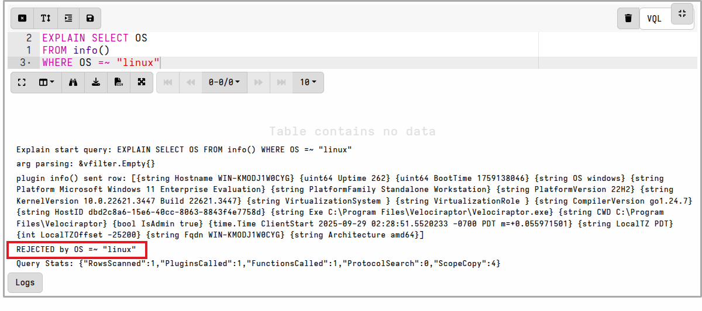
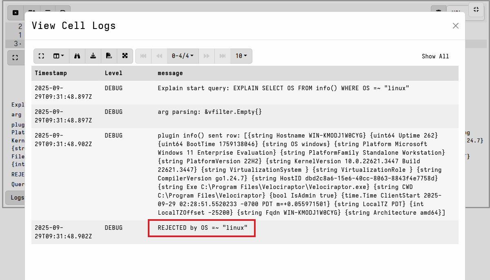
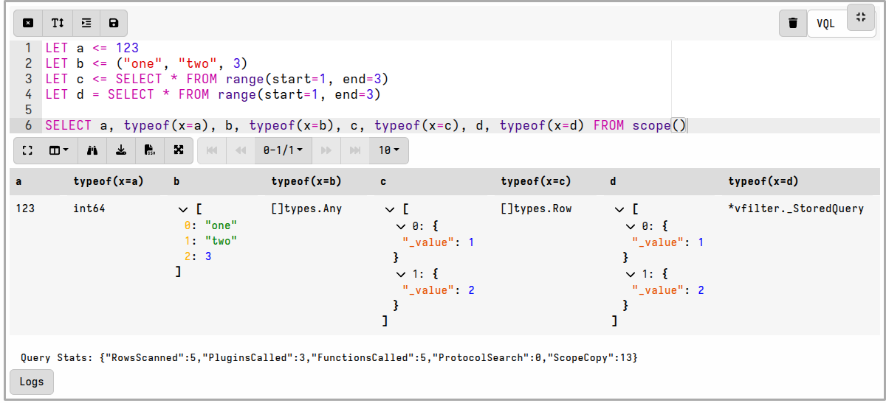
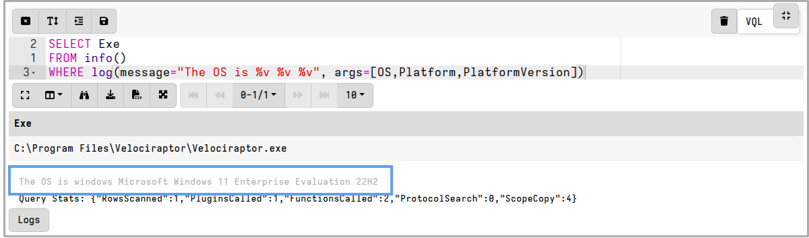

## General troubleshooting advice

1. We recommend that you develop your new queries in a
   [Velociraptor notebook]()
   before testing or deploying them in artifacts. If you need to develop queries
   for a specific operating system then
   [Instant Velociraptor]()
   is perfect for this, as it allows you to run notebooks directly on the target
   operating system.

   We provide a recommended artifact development workflow
   [here]().

2. If you're having problems or unexpected outcomes then try to reduce your VQL
   to it's simplest form. If possible, try to isolate the problematic part of
   the VQL query and test it in a notebook cell.

3. For issues concerning plugins and functions, always refer to the
   [VQL Reference]()
   and ensure that you're supplying all the required parameters, and that their
   data types are correct (see the section on
   [Inspecting Data types](#inspecting-data-types) below).

## Use EXPLAIN to debug your queries

VQL has a special `EXPLAIN` directive which you can add to any `SELECT`
statement (a.k.a query). This enables detailed logging for the query, as you can
see in the following example.

`EXPLAIN` is specifically intended to aid in VQL query development, so you
should remove these from your final artifact to avoid excessive logging in
production.

## Inspecting data types

VQL supports several data types, for example strings, integers, arrays and
dicts. Users who are new to VQL often run into problems when the data type of an
variable that they are trying to perform an operation on isn't actually what
they expected it to be.

To make it easier to identify data types during development, VQL has a special
`typeof()` function, which you can read about
[here]().

Notice in the example above that the variables `c` and `d` are different data
types due to one being defined by a
[materialized expression]()
and the other not.

## Add helpful log messages to your VQL

In most programming languages developers can add `print` statements to the code
aid with debugging. In VQL we can do this too using the `log()` function, which
you can read about
[here]().

The `log()` function always evaluates as `TRUE` so it can be added to `WHERE`
clause without affecting the rows that are emitted by the query.

If your query emits multiple rows then log message deduplication will likely
apply. This may be desirable in production but sometimes it's not helpful during
development when you want to see all the log messages. To disable log
deduplication add the argument `dedup=-1` to your `log` function.