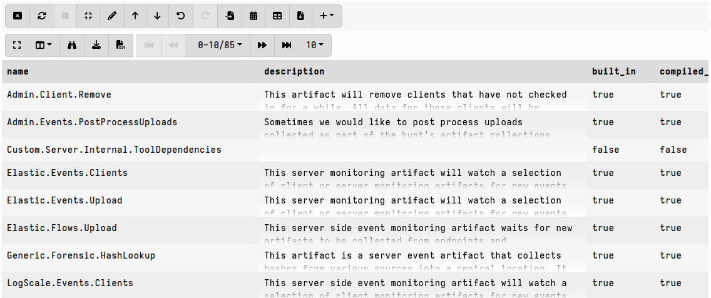

## Working with the internal artifact repository in VQL

The Velociraptor server maintains an internal artifact repository that includes
both built-in and custom artifacts.

On server startup, all compiled-in artifacts are loaded from the binary and
additional artifacts are loaded from
[several possible locations]().
Artifacts loaded from these locations are deemed "built-in" and cannot be
modified or deleted during runtime. Only custom artifacts loaded from the
datastore can be modified or deleted.

Most often artifacts are viewed and managed in the GUI's
["View Artifact" screen](),
however artifacts can also be managed from VQL using the plugins and functions
described in this section. Since the artifacts repository is maintained on the
server, these VQL functions and plugins can only be used on the server - that
is, in server artifacts or notebooks.

### Accessing artifacts in other orgs

The artifact-related VQL queries described in this section apply only to the
[org]() that your user is currently working
in.

As explained [here](),
artifacts from the root org are propagated to non-root orgs, while custom
artifacts created in non-root orgs are only visible within that org, and can
potentially "mask" custom artifacts that are inherited from the root org.

If you wish to work with artifacts in a different org _without switching to that
org_, then you can wrap your queries in the
[query]() plugin which allows you to
target a different org using its `org_id` argument and optionally specify a
different user using its `runas` argument.

For example:

```vql
LET OtherOrgId <= "OCDC0"
LET OtherUser <= "fred"
SELECT name
FROM query(query={ SELECT * FROM artifact_definitions()
                   WHERE built_in = FALSE },
           org_id=OtherOrgId,
           runas=OtherUser)
```


### Viewing and Listing Artifacts

You can view all known artifacts in the current org using the
[artifact_definitions]()
plugin. This plugin returns artifacts in their parsed form, which means you can
easily filter the results using WHERE clauses against the many available
artifact fields.

For example, with this query we can see all `SERVER` type artifacts and also see
whether or not they are considered
[built-in]():

```vql
SELECT name, description, built_in, compiled_in
FROM artifact_definitions() WHERE type =~ "server"
```



If an artifact is
[dependent]()
on other artifacts then you can include those in your results by using the
`deps=TRUE` arg.

For example:

```vql
SELECT * FROM artifact_definitions(names="Windows.Sysinternals.Autoruns", deps=TRUE)
```
will also show the `Generic.Utils.FetchBinary` artifact.

Artifacts are available in their original YAML form in the `raw` field, for
example:

```vql
LET ColumnTypes<=dict(`raw`='nobreak')
SELECT name, raw FROM artifact_definitions(names="Windows.Sysinternals.Autoruns")
```

### Creating and Modifying Custom Artifacts

The [artifact_set]()
function is used to create a custom artifact in the artifact repository.

While the artifact YAML can be read from a file using the `read_file` function,
it is preferable to add artifacts from the filesystem using one of the supported
[loading mechanisms]().
These allow you to add artifacts in bulk from specified locations.

It is therefore more common to see the `artifact_set` function used with
artifacts added from network locations, typically using the `http_client`
plugin. For example:

```vql
SELECT artifact_set(prefix="Custom.", definition=Content) FROM http_client(url=...
```

It is also commonly used to add multiple artifacts from a zip file that has been
downloaded to the server using `http_client`. The artifact
[`Server.Import.ArtifactExchange`]()
provides a good example utilizing this approach.

When you add custom artifacts using `artifact_set` they are written to the
server's datastore. See
[How artifact names translate to file and folder structure on disk]()
for more information.

If a custom artifact with the same name exists in the datastore then
`artifact_set` will overwrite it without warning. This allows you to update
custom artifacts via VQL.

#### Artifact Metadata

Artifacts in the repository have a `metadata` field, which currently supports
three special attributes that provide additional artifact management features
for server administrators: `hidden`, `basic` and `tags`.

The `hidden` attribute controls the artifact's visibility in the GUI. This is
explained in more detail
[here]().

The `basic` attribute is used to designate artifacts that can be collected by
users who have only the `COLLECT_BASIC` (Collect Basic Client) permission. Such
low-privilege users can only collect these specially designated artifacts. This
is explained in more detail
[here]().

The `tags` attribute allows grouping artifacts into distinct groups,
independent of their names. In previous versions we used an artifact name prefix
to distinguish and group artifacts. This is useful for broad artifacts like
Windows, Linux etc. but proved to be problematic for imported artifacts such as
those from the community-contributed [Artifact Exchange](),
particularly when other artifacts need to refer to an artifact by it's original name.

The artifacts screen supports
[searching for tags]().

The metadata attributes are set for new artifacts using the
[artifact_set]()
function, or can be updated for existing artifacts using the
[artifact_set_metadata]()
function.

For example:

```vql
SELECT name, metadata AS OldMetadata, artifact_set_metadata(name=name, hidden=TRUE)
FROM artifact_definitions() WHERE type =~ "internal" OR name =~ "internal"
```
will hide all "internal" type artifacts from the GUI.

The hidden artifacts are of course still there, and you can verify this by
querying the metadata across all artifacts:

```vql
SELECT name, metadata FROM artifact_definitions() WHERE metadata.hidden
```

By default all artifacts, including those created during runtime, have the
`hidden` and `basic` attributes set to `false` That is, they are not hidden and
not "basic" by default. New artifacts have no `tags` set by default.

Artifact tags can be cleared by using and empty list,
for example `artifact_set_metadata(name=...,tags=[])`.

Note that when applying a single tag to artifacts, you must ensure that you
include a trailing comma so that VQL doesn't interpret the list as a string, for
example to apply the single tag "Triage" you would specify:
`artifact_set_metadata(name=...,tags=["Triage",])`.

### Deleting Artifacts

The
[artifact_delete]()
function is used to delete artifacts.
Only custom artifacts in the server's datastore can be deleted.

Artifacts loaded during startup, from locations other than the
`artifact_definitions` folder in the server's datastore, are considered
"built-in" and cannot be deleted. If you need to delete such artifacts then you
should manually remove the corresponding YAML documents from their source
locations, and then restart the server.
