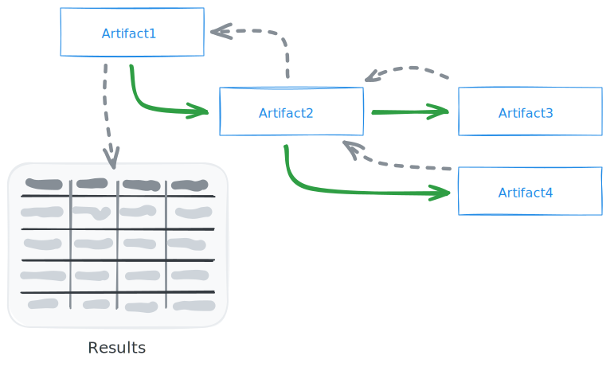
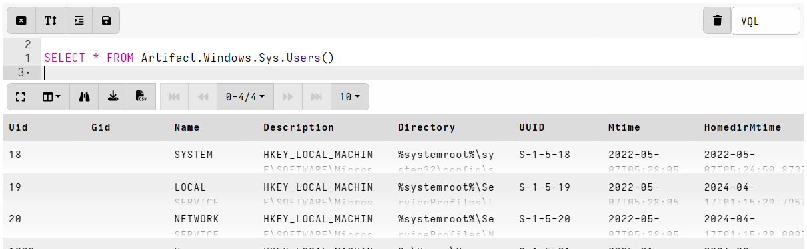

In Velociraptor, artifacts encapsulate VQL queries, making them reusable and
shareable. A key feature is the ability to call one artifact from within the VQL
of another artifact or query. This allows for building modular and composable
collections.

Artifacts can be called directly from other VQL queries as if they were a
VQL plugin. This allows you to chain artifacts together or use one artifact's
results as input for another.

Each called artifact returns it's results to the calling artifact's source.
Ultimately each source in the calling artifact returns all the consolidated
results as a single table.

## Basic syntax

The basic syntax is: `SELECT * FROM Artifact.ArtifactName()`

For example, to call an artifact named `Windows.Sys.Users` from another VQL query,
you would use `SELECT * FROM Artifact.Windows.Sys.Users()`

Args to the `Artifact()` plugin are passed as artifact parameters.

## Sources

If the called artifact has multiple
[sources](),
the `Artifact` plugin

`SELECT * FROM Artifact.ArtifactWithSources(source='Source1')`

## Parameters

When calling artifacts, parameter types are not converted. For example if the
called artifact has a parameter named `StartDate`

Some implicit parameters that are always allowed:

- `source` - see Windows.Registry.Sysinternals.Eulacheck
- `preconditions`

		"SELECT * FROM Artifact.ArtifactWithSourcesAndPreconditions()",
		"SELECT * FROM Artifact.ArtifactWithSourcesAndPreconditions(preconditions=TRUE)",

		// Select a specific source.
		"SELECT * FROM Artifact.ArtifactWithSourcesAndPreconditions(source='Source1')",

		// Should return no results as preconditions is false.
		"SELECT * FROM Artifact.ArtifactWithSourcesAndPreconditions(source='Source1', preconditions=TRUE)",

		service.repository/fixtures/plugin_test.go

## Preconditions

By default, [preconditions]()
in called artifacts are not evaluated. This is a design decision.

`SELECT * FROM Artifact.ArtifactWithPreconditions(preconditions=TRUE)`

